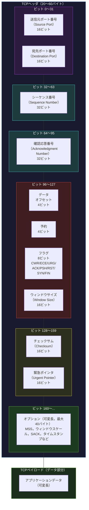
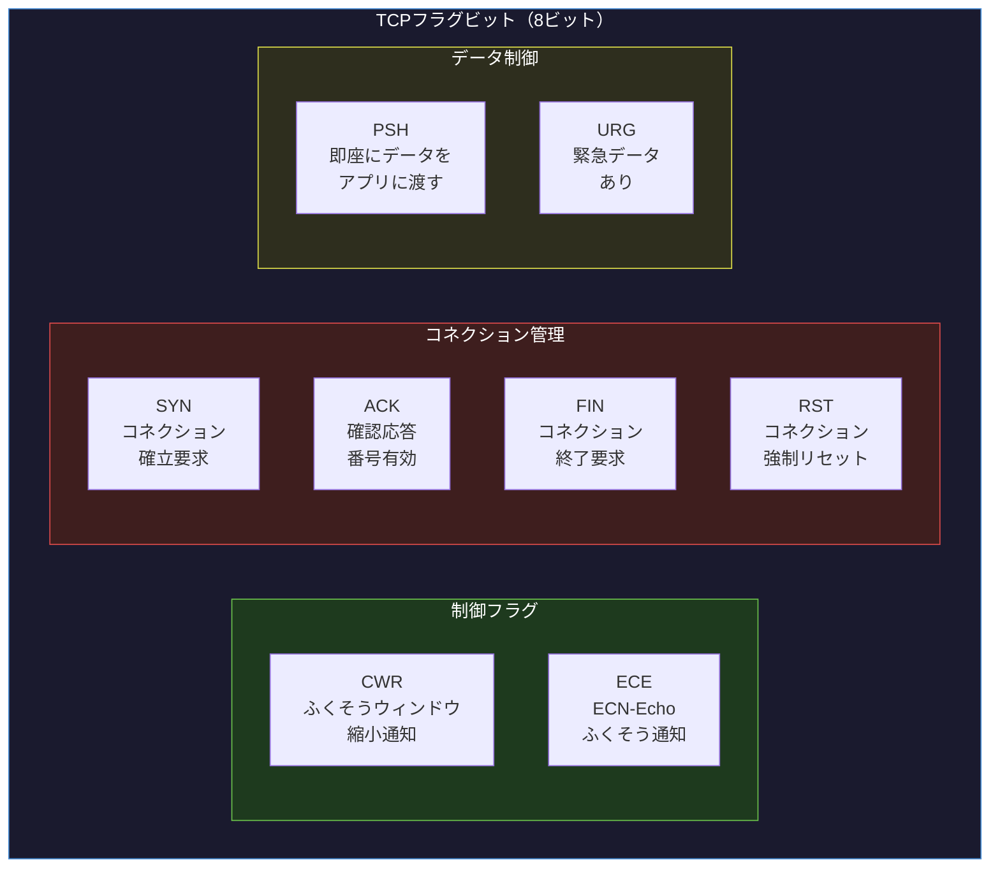

import { Aside } from '@astrojs/starlight/components';

## この節で学ぶこと

TCPヘッダは，UDPヘッダと比較して非常に多くのフィールドを持ちます．最小20バイト，オプションを含めると最大60バイトになり，TCPが提供する信頼性，フロー制御，ふくそう制御などの多彩な機能を実現するための情報が詰まっています．
この節では，TCPヘッダの各フィールドの役割，特にコネクション制御に不可欠なフラグビットについて詳しく学びます．

## TCPヘッダの全体構造

TCPヘッダは最小20バイト（160ビット）で，以下のフィールドで構成されます．

### 各フィールドの詳細

送信元ポート番号（Source Port）: 16ビット

- 送信側アプリケーションのポート番号

宛先ポート番号（Destination Port）: 16ビット

- 受信側アプリケーションのポート番号

シーケンス番号（Sequence Number）: 32ビット

- このセグメントのデータの最初のバイトに割り当てられた番号
- SYNフラグが設定されている場合は初期シーケンス番号（ISN）
- データの順序管理と再送制御に使用される

確認応答番号（Acknowledgment Number）: 32ビット

- 受信側が次に期待するバイトのシーケンス番号
- ACKフラグが設定されている場合にのみ有効
- 累積的確認応答（この番号未満のすべてのバイトを受信済み）

データオフセット（Data Offset）: 4ビット

- TCPヘッダの長さを32ビット（4バイト）単位で示す
- 最小値は5（= 20バイト，オプションなし），最大値は15（= 60バイト）
- この値により，データ部分の開始位置がわかる

予約（Reserved）: 4ビット

- 将来の使用のために予約されたフィールド
- 0に設定される

フラグビット: 8ビット（後述で詳細に説明）

ウィンドウサイズ（Window Size）: 16ビット

- 受信側が受け入れ可能なバイト数（受信ウィンドウ: rwnd）
- フロー制御に使用される
- ウィンドウスケールオプションと組み合わせることで，65535バイトを超えるウィンドウサイズを表現できる

チェックサム（Checksum）: 16ビット

- TCPヘッダとデータの整合性を検証する値
- UDPと同様に擬似ヘッダを含めて計算される
- TCPではチェックサムは必須（省略不可）

緊急ポインタ（Urgent Pointer）: 16ビット

- URGフラグが設定されている場合に有効
- 緊急データの末尾位置をシーケンス番号からのオフセットで示す

オプション（Options）: 可変長（最大40バイト）

- 主なオプション:
  - MSS（Maximum Segment Size）: セグメントの最大サイズ．コネクション確立時に交換
  - ウィンドウスケール（Window Scale）: ウィンドウサイズのスケーリングファクタ
  - SACK（Selective Acknowledgment）: 選択的確認応答の情報
  - タイムスタンプ（Timestamps）: RTT計測とPAWS（Protection Against Wrapped Sequences）に使用

## フラグビットの詳細

TCPヘッダのフラグビットは，セグメントの種類や制御情報を示す8ビットのフィールドです．各ビットの役割は以下のとおりです．

### 各フラグの説明

SYN（Synchronize）:

- コネクション確立の要求を示す
- 3ウェイハンドシェイクの最初の2つのセグメント（SYN，SYN+ACK）で使用される
- このフラグがセットされたセグメントのシーケンス番号は初期シーケンス番号（ISN）として扱われる

ACK（Acknowledgment）:

- 確認応答番号フィールドが有効であることを示す
- コネクション確立後のほぼすべてのセグメントでこのフラグがセットされる
- 最初のSYNセグメント以外は，基本的にACKフラグが常にセットされている

FIN（Finish）:

- コネクション終了の要求を示す
- 送信側が「これ以上送信するデータはない」ことを通知する
- 4ウェイハンドシェイクで双方がFINを送信してコネクションを閉じる

RST（Reset）:

- コネクションの強制的なリセットを示す
- 存在しないコネクションへのセグメントを受信した場合や，異常な状態の回復に使用される
- RSTを受信すると，コネクションは即座に解放される（4ウェイハンドシェイクなし）

PSH（Push）:

- 受信側のTCPに対して，バッファにためずに即座にデータをアプリケーションに渡すよう要求する
- インタラクティブな通信（SSH，Telnetなど）で使用されることが多い

URG（Urgent）:

- 緊急データの存在を示す
- 緊急ポインタフィールドと組み合わせて，緊急データの範囲を指定する
- 現在ではあまり使用されない

CWR（Congestion Window Reduced）:

- 送信側がふくそうウィンドウを縮小したことを通知するフラグ
- ECEフラグによるふくそう通知への応答として使用される

ECE（ECN-Echo）:

- ECN（Explicit Congestion Notification）のエコーフラグ
- ネットワーク上のルーターがふくそうを通知した場合に，受信側から送信側にその情報を伝達する
- コネクション確立時にはECN機能のネゴシエーションにも使用される

### フラグの組み合わせパターン

通信の各場面で使用されるフラグの組み合わせ:

| 場面 | フラグ | 説明 |
|:---|:---|:---|
| コネクション確立（1） | SYN | クライアントからの接続要求 |
| コネクション確立（2） | SYN+ACK | サーバーからの接続受諾 |
| コネクション確立（3） | ACK | クライアントからの確認 |
| データ送信 | ACK+PSH | データを即座に渡す |
| データ確認応答 | ACK | データの受信確認 |
| コネクション終了 | FIN+ACK | 片方向の終了要求 |
| コネクション強制終了 | RST | 異常終了 |
| ふくそう通知 | ACK+ECE | ネットワーク混雑の通知 |
| ふくそう応答 | ACK+CWR | ウィンドウ縮小の通知 |

<Aside type="tip" title="FDE実務での活用">
パケットキャプチャでのTCPフラグ解析は，ネットワーク障害の診断に不可欠なスキルです．tcpdumpやWiresharkでTCPパケットを観察する際，フラグの組み合わせから通信状態を読み取ることができます:

- `[S]`: SYNフラグ → コネクション確立の開始
- `[S.]`: SYN+ACK → サーバーの応答（`.`はACKの略記）
- `[.]`: ACKのみ → 確認応答
- `[P.]`: PSH+ACK → データ送信（即座にアプリに渡す）
- `[F.]`: FIN+ACK → コネクション終了の開始
- `[R]`: RST → コネクションのリセット（異常終了）
- `[R.]`: RST+ACK → リセットと確認応答

例えば，サーバーに接続できないとき，`[S]`（SYN）を送信しても`[R.]`（RST+ACK）が返ってくる場合は，サーバー上でそのポートがリッスンされていないことを示します．`[S]`を送信しても何も返ってこない場合は，ファイアウォールでドロップされている可能性があります．このようにTCPフラグを読み解くことで，問題の切り分けが効率的に行えます．
</Aside>

## TCPヘッダとUDPヘッダの比較

| 項目 | TCP | UDP |
|:---|:---|:---|
| ヘッダサイズ | 20〜60バイト | 8バイト固定 |
| シーケンス番号 | あり | なし |
| 確認応答番号 | あり | なし |
| フラグビット | 8ビット（8種類） | なし |
| ウィンドウサイズ | あり | なし |
| 緊急ポインタ | あり | なし |
| オプション | あり（最大40バイト） | なし |
| チェックサム | 必須 | IPv4:オプション / IPv6:必須 |

TCPヘッダがUDPヘッダの2.5〜7.5倍のサイズを持つのは，信頼性，フロー制御，ふくそう制御などの高度な機能を実現するために必要な情報が含まれているからです．この差がTCPとUDPのオーバーヘッドの差となって現れます．

## まとめ

- TCPヘッダは最小20バイト，最大60バイトの可変長で，送信元/宛先ポート，シーケンス番号，確認応答番号，フラグ，ウィンドウサイズなどのフィールドを含む
- フラグビットは8種類（CWR，ECE，URG，ACK，PSH，RST，SYN，FIN）あり，コネクション管理やデータ制御に使用される
- SYNはコネクション確立，FINはコネクション終了，RSTは強制リセット，ACKは確認応答を示す
- ウィンドウサイズフィールドでフロー制御を実現し，ウィンドウスケールオプションで大きなウィンドウサイズにも対応する
- チェックサムはUDPと同様に擬似ヘッダを含めて計算され，TCPでは必須

## 理解度チェック

Q1: TCPヘッダのシーケンス番号フィールドが32ビットである理由は何ですか？

シーケンス番号はデータの各バイトに番号を割り当てるため，十分に大きな番号空間が必要です．32ビットでは約43億（4,294,967,296）の番号を表現でき，高速ネットワークでも番号が一周するまでに十分な時間を確保できます．番号空間が小さすぎると，短時間で番号が一周して新旧のセグメントが混同される危険があります．なお，非常に高速な通信ではPAWS（Protection Against Wrapped Sequences）オプションでタイムスタンプを併用して番号の一周問題に対処します．

Q2: RSTフラグとFINフラグの違いを説明してください．

FINフラグは正常なコネクション終了で使用され，4ウェイハンドシェイクにより双方が合意してコネクションを閉じます．未送信のデータは送信が完了してからFINが送られます．一方，RSTフラグはコネクションの強制的なリセットで使用され，4ウェイハンドシェイクなしに即座にコネクションが解放されます．存在しないポートへの接続試行に対する応答や，異常状態の回復に使われます．

Q3: PSHフラグはどのような場面で使用されますか？

PSH（Push）フラグは，受信側のTCPに対して，受信したデータをバッファに溜めずに即座にアプリケーションに渡すよう要求する場面で使用されます．例えば，SSHやTelnetのようなインタラクティブな通信では，ユーザーが入力した1文字を即座に相手に伝える必要があるため，PSHフラグが設定されます．PSHフラグがないと，TCPは受信バッファにデータを溜めて効率的にまとめてアプリケーションに渡そうとするため，遅延が発生する可能性があります．

Q4: ウィンドウスケールオプションが必要な理由を説明してください．

ウィンドウサイズフィールドは16ビットのため，最大65535バイト（約64KB）しか表現できません．現代の高速ネットワーク（1Gbps以上）では，帯域遅延積（BDP = 帯域幅 x RTT）が64KBを大幅に超えることがあり，ウィンドウサイズが小さすぎるとスループットが制限されます．ウィンドウスケールオプション（0〜14のスケーリングファクタ）を使うことで，ウィンドウサイズを最大約1GB（65535 x 2^14）まで拡張でき，高速・長遅延のネットワークでも効率的なデータ転送が可能になります．

Q5: tcpdumpでSYNフラグのパケットだけをキャプチャするにはどうすればよいですか？

`tcpdump 'tcp[tcpflags] & (tcp-syn) != 0 and tcp[tcpflags] & (tcp-ack) == 0'`のようにフィルタを指定することで，SYNフラグのみがセットされたパケット（コネクション確立の最初のパケット）をキャプチャできます．より簡潔に`tcpdump 'tcp[13] & 2 != 0'`とも書けます（TCPヘッダの14バイト目=オフセット13のフラグフィールドで，SYNビットは下から2番目）．

