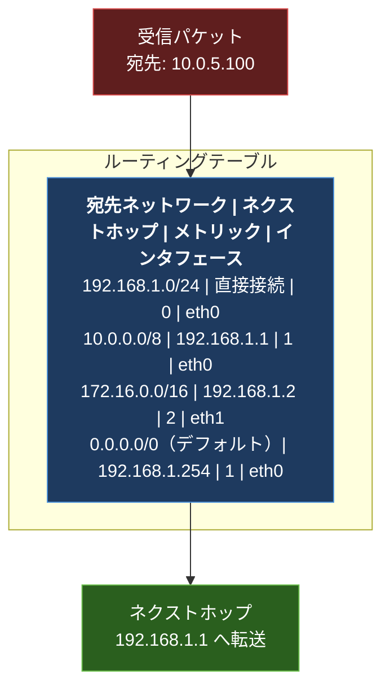
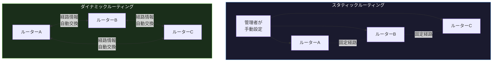

import { Aside } from '@astrojs/starlight/components';

## この節で学ぶこと

ルーティング（経路制御）は，IPパケットを宛先まで正しく届けるためにルーターが行う最も基本的な処理である．
本節では，IPアドレスと経路制御の関係を理解し，スタティックルーティングとダイナミックルーティングそれぞれの特徴を把握する．
さらに，ダイナミックルーティングがどのようにルーティングテーブルを自動的に構築・更新するかの基礎を学ぶ．

## 7.1.1 IPアドレスと経路制御

### ルーティングの基本的な役割

IPネットワークにおいて，パケットは送信元から宛先まで複数のルーターを経由して転送される．
各ルーターは受信したパケットの宛先IPアドレスを確認し，自身のルーティングテーブル（経路制御表）を参照して，次にどのインタフェースへパケットを転送するかを決定する．
この処理を「ルーティング」あるいは「経路制御」と呼ぶ．

### ルーティングテーブルの基本構造

ルーティングテーブルは，宛先ネットワークアドレスと，そのネットワークへパケットを届けるための「次の転送先（ネクストホップ）」の対応を記録した表である．

ルーターは宛先IPアドレスに対して最も具体的に一致するエントリ（ロンゲストマッチ）を選択する．
どのエントリにも一致しない場合は，デフォルトルート（0.0.0.0/0）が使用される．

### ルーティングとフォワーディング

ルーティングとフォワーディングは厳密には異なる概念である:

- ルーティング: ルーティングテーブルを構築・更新するプロセス
- フォワーディング: ルーティングテーブルを参照してパケットを実際に転送するプロセス

ルーティングプロトコルはルーティングテーブルの構築を担当し，パケットの転送処理自体はフォワーディングエンジンが行う．

## 7.1.2 スタティックルーティングとダイナミックルーティング

ルーティングテーブルを構築する方法は，大きく2つに分類される．

### スタティックルーティング（静的経路制御）

ネットワーク管理者が手動でルーティングテーブルにエントリを設定する方法である．
小規模なネットワークや，特定の経路を固定的に使いたい場合に適している．

利点:
- ルーティングプロトコルによるオーバーヘッドが発生しない
- 管理者が経路を完全に制御できる
- セキュリティが高い（意図しない経路変更が起きない）

欠点:
- ネットワーク規模が大きくなると設定作業が膨大になる
- 障害発生時に自動的な経路切り替えができない
- 構成変更のたびに手動で設定を更新する必要がある

### ダイナミックルーティング（動的経路制御）

ルーティングプロトコルを使用して，ルーター同士が自動的に経路情報を交換し，ルーティングテーブルを構築・更新する方法である．

利点:
- ネットワーク構成の変更に自動的に対応できる
- 障害発生時に代替経路へ自動的に切り替わる
- 大規模ネットワークでも管理が容易

欠点:
- ルーティングプロトコルの動作にCPUやメモリ，帯域を消費する
- 設定や設計に専門的な知識が必要
- 不正な経路情報が伝播するリスクがある

### 実際のネットワークではどちらを使うか

実際のネットワークでは，スタティックルーティングとダイナミックルーティングを組み合わせて使うことが多い．
例えば，インターネットへの出口（デフォルトルート）はスタティックで設定し，内部ネットワーク間の経路はダイナミックルーティングで制御するといった構成がよく採用される．

## 7.1.3 ダイナミックルーティングの基礎

### ルーティングプロトコルの動作原理

ダイナミックルーティングでは，各ルーターがルーティングプロトコルを動作させ，以下の処理を繰り返す:

1. 隣接するルーターとの間で経路情報を交換する
2. 受け取った経路情報をもとにルーティングテーブルを更新する
3. ネットワーク構成の変更（リンク障害，新規ネットワークの追加など）を検出する
4. 変更を他のルーターに通知する

### メトリック（コスト）

ルーティングプロトコルは，同じ宛先への複数の経路が存在する場合，メトリック（コスト）と呼ばれる値を用いて最適な経路を選択する．
メトリックの計算方法はプロトコルによって異なる:

- ホップ数: 宛先までに経由するルーターの数（RIPで使用）
- 帯域幅: リンクの速度に基づくコスト（OSPFで使用）
- 遅延: パケットの伝送にかかる時間
- 信頼性: リンクのエラー率

### コンバージェンス

ネットワーク構成が変更された際に，すべてのルーターが最新の正しい経路情報を持ち，ルーティングテーブルが安定した状態になることを「コンバージェンス（収束）」と呼ぶ．
コンバージェンスにかかる時間が短いほど，ネットワークの可用性が高くなる．
ルーティングプロトコルの選定において，コンバージェンス速度は重要な評価基準の一つである．

### デフォルトルートとルーティングテーブルの階層

すべての宛先に対する経路を個別にルーティングテーブルに持つことは，メモリやCPUの観点から非効率である．
そこで，以下の仕組みで効率化が図られている:

- ルート集約: 複数の連続するネットワークアドレスを1つのエントリにまとめる
- デフォルトルート: 明示的なエントリに一致しない宛先に対して使用する「最後の手段」の経路

<Aside type="tip" title="FDE実務での活用">
クラウド環境（AWS，GCP，Azure）では，VPC/VNetのルーティングテーブルを設定する場面が頻繁にある．
例えば，オンプレミスとクラウド間のハイブリッド接続では，VPN Gateway経由のスタティックルートとBGPによるダイナミックルートを組み合わせて構成する．
AIワークロードでGPUインスタンスを複数リージョンに展開する場合，リージョン間のルーティング設計がレイテンシに大きく影響するため，ルーティングの基礎知識は不可欠である．
また，Kubernetesクラスタ内のPod間通信でも，CNI（Container Network Interface）プラグインがルーティングテーブルを自動構成しており，ダイナミックルーティングの概念が応用されている．
</Aside>

## まとめ

- ルーティングとは，ルーターがパケットの宛先IPアドレスに基づいてルーティングテーブルを参照し，適切な転送先を決定する処理である
- ルーティングテーブルは，宛先ネットワーク，ネクストホップ，メトリック，インタフェースの情報を保持する
- スタティックルーティングは手動設定で管理が容易だが，大規模ネットワークや障害対応には不向きである
- ダイナミックルーティングはルーティングプロトコルにより自動で経路を学習・更新し，障害時の自動切り替えが可能である
- メトリックにより最適経路が選択され，コンバージェンスの速さがネットワークの可用性を左右する

## 理解度チェック

Q1: ルーティングとフォワーディングの違いを説明してください．

ルーティングはルーティングテーブルを構築・更新するプロセスであり，ルーティングプロトコルによって経路情報を交換・計算する処理を指す．
一方，フォワーディングは，構築済みのルーティングテーブルを参照して，受信したパケットを実際に適切なインタフェースへ転送する処理である．
ルーティングは「どこへ送るべきかを決める」，フォワーディングは「実際に送る」という役割の違いがある．

Q2: スタティックルーティングが適している場面と，ダイナミックルーティングが適している場面をそれぞれ挙げてください．

スタティックルーティングが適している場面:
- 小規模でトポロジの変更が少ないネットワーク
- インターネットへの出口（デフォルトルート）のように固定的な経路
- セキュリティ上，経路の変更を許容したくない場合

ダイナミックルーティングが適している場面:
- 中〜大規模でルーターの数が多いネットワーク
- 冗長構成により障害時の自動切り替えが必要な場合
- ネットワーク構成の変更が頻繁に発生する環境

Q3: コンバージェンスとは何ですか？コンバージェンス速度が重要な理由を説明してください．

コンバージェンス（収束）とは，ネットワーク構成の変更（リンク障害や新規ネットワークの追加など）が発生した後，すべてのルーターが最新の正しい経路情報を持ち，ルーティングテーブルが安定した状態になることである．

コンバージェンス速度が重要な理由は，収束が完了するまでの間，パケットが正しい経路で転送されない可能性があり，通信の遅延やパケットロスが発生するためである．
コンバージェンス時間が短いほど，障害発生時のサービス中断時間を最小限に抑えることができ，ネットワークの可用性が高まる．

Q4: ルート集約（経路集約）はなぜ必要ですか？

ルート集約が必要な理由は以下の通りである:
1. メモリの節約: 複数のネットワークアドレスを1つのエントリにまとめることで，ルーティングテーブルのサイズを削減できる
2. CPU負荷の軽減: ルーティングテーブルの検索処理が高速化される
3. 経路情報の安定化: 個別のネットワークの変動が集約されたエントリに影響しにくくなるため，ルーティングの安定性が向上する（フラップの抑制）
4. 帯域の節約: ルーティングプロトコルで交換する経路情報の量が減少する

