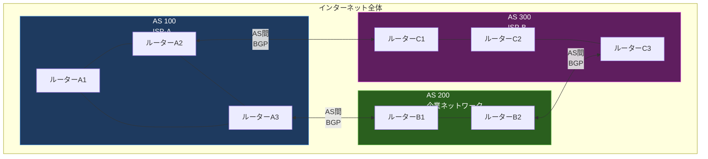
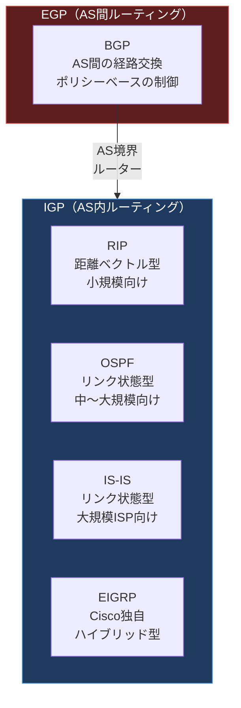

import { Aside } from '@astrojs/starlight/components';

## この節で学ぶこと

インターネットは単一の巨大なネットワークではなく，さまざまな組織が運営するネットワークが相互接続されて構成されている．
本節では，自律システム（AS: Autonomous System）の概念を理解し，AS内部で使われるルーティングプロトコル（IGP）とAS間で使われるルーティングプロトコル（EGP）の違いを学ぶ．
この区分を理解することは，ルーティングプロトコルの全体像を把握する上で不可欠である．

## 7.2.1 インターネットにはさまざまな組織が接続されている

### インターネットの構成要素

インターネットは，ISP（Internet Service Provider），企業，大学，政府機関など，さまざまな組織が運営するネットワークが相互に接続されて成り立っている．
各組織は独自のネットワークポリシー（経路制御方針，セキュリティポリシーなど）を持ち，自組織のネットワークを自律的に運営している．

### なぜ経路制御の範囲を分ける必要があるか

インターネット全体を1つのルーティングプロトコルで管理しようとすると，以下の問題が発生する:

- スケーラビリティの限界: ルーティングテーブルのエントリ数が膨大になり，メモリやCPUの負荷が現実的な範囲を超える
- 管理の複雑さ: 異なるポリシーを持つ組織間で統一的なルーティング設定を行うことが困難
- セキュリティのリスク: ある組織の設定ミスがインターネット全体に影響を及ぼす可能性
- コンバージェンス速度の低下: ネットワーク規模が大きくなるほど収束に時間がかかる

これらの理由から，インターネットのルーティングは「組織内」と「組織間」で異なるプロトコルを使い分ける設計が採用されている．

## 7.2.2 自律システムとルーティングプロトコル

### 自律システム（AS）とは

自律システム（AS: Autonomous System）とは，共通のルーティングポリシーのもとで運用される，1つまたは複数のIPネットワークの集合体である．
各ASにはIANA（Internet Assigned Numbers Authority）によって一意のAS番号（ASN: Autonomous System Number）が割り当てられる．

AS番号は当初16ビット（1〜65535）であったが，ASの増加に伴い，現在では32ビット（1〜4294967295）に拡張されている．

### ASの具体例

- ISP: NTTコミュニケーションズ（AS4713），IIJ（AS2497）
- クラウドプロバイダ: Amazon（AS16509），Google（AS15169），Microsoft（AS8075）
- 大学: 東京大学（AS2500）

### ASの内部と外部

ASの内部では，組織が自由にルーティングプロトコルを選択・運用できる．
一方，AS間の経路交換は，インターネット全体の安定性を維持するために標準化されたプロトコル（BGP）を使用する必要がある．

## 7.2.3 EGPとIGP

### IGP（Interior Gateway Protocol）

IGPは，1つのAS内部で使用されるルーティングプロトコルの総称である．
AS内部のルーター間で経路情報を交換し，AS内のネットワークに対する最適な経路を計算する．

代表的なIGP:
- RIP（Routing Information Protocol）: 距離ベクトル型，小規模ネットワーク向け
- OSPF（Open Shortest Path First）: リンク状態型，中〜大規模ネットワーク向け
- IS-IS（Intermediate System to Intermediate System）: リンク状態型，大規模ISP向け
- EIGRP（Enhanced Interior Gateway Routing Protocol）: Cisco独自プロトコル

### EGP（Exterior Gateway Protocol）

EGPは，異なるAS間で経路情報を交換するためのルーティングプロトコルの総称である．
AS間のルーティングでは，単純な最短経路だけでなく，組織のポリシー（経済的関係，ピアリング契約など）に基づいた経路選択が行われる．

代表的なEGP:
- BGP（Border Gateway Protocol）: 現在のインターネットで標準的に使用されるAS間ルーティングプロトコル

なお，「EGP」はAS間プロトコルの総称としての意味と，かつて使われていた具体的なプロトコル名（EGP: RFC 904）の2つの意味があるので注意が必要である．
現在ではEGPプロトコルは使われておらず，BGPがその役割を担っている．

### IGPとEGPの設計思想の違い

IGPとEGPには根本的な設計思想の違いがある:

| 項目 | IGP | EGP（BGP） |
|------|-----|-----------|
| 適用範囲 | AS内部 | AS間 |
| 最適経路の基準 | メトリック（コスト，帯域幅など） | ポリシー（経済的関係，契約） |
| スケーラビリティ | AS内のルーター数に依存 | インターネット全体の経路数に対応 |
| 収束速度 | 高速（秒〜数十秒） | 比較的低速（分単位） |
| 信頼性の前提 | AS内は信頼できる環境 | AS間は必ずしも信頼できない |

### 経路の再配布

AS境界ルーターでは，IGPで学習した経路情報をEGP（BGP）に，またその逆に情報を受け渡す「経路の再配布（Redistribution）」が行われる．
この際，適切なフィルタリングや属性の設定が不可欠である．設定を誤ると，内部の経路情報が意図せずインターネット全体に広告されたり，不正な経路情報を受け入れてしまったりする危険がある．

<Aside type="tip" title="FDE実務での活用">
クラウドプロバイダは巨大なASを運営している．例えば，AWSのAS16509は世界中のリージョンをカバーし，各リージョン内ではIGP（IS-ISなど）でルーティングが行われている．
AIサービスをマルチクラウドで展開する場合，各クラウドプロバイダのASがBGPで相互接続されていることを理解しておくと，レイテンシの最適化やフェイルオーバー設計に役立つ．
また，Direct ConnectやExpressRouteなどの専用接続サービスでは，顧客のASとクラウドプロバイダのAS間でBGPセッションを構成するため，AS番号やBGPの基礎知識は実務上必須である．
</Aside>

## まとめ

- インターネットはさまざまな組織のネットワークが相互接続されて構成されており，単一のルーティングプロトコルで管理することは現実的でない
- 自律システム（AS）とは，共通のルーティングポリシーで運用されるネットワークの集合体であり，一意のAS番号が割り当てられる
- IGPはAS内部で使用されるルーティングプロトコルであり，RIP，OSPF，IS-ISなどがある
- EGPはAS間で使用されるルーティングプロトコルであり，現在はBGPが標準的に使われている
- IGPはメトリックに基づく最短経路選択，EGP（BGP）はポリシーに基づく経路選択という設計思想の違いがある

## 理解度チェック

Q1: 自律システム（AS）とは何ですか？AS番号の役割を説明してください．

自律システム（AS）とは，共通のルーティングポリシーのもとで運用される1つまたは複数のIPネットワークの集合体である．
ISP，企業，大学などの組織がそれぞれASを構成し，自律的にネットワークを運営する．
AS番号（ASN）はIANAによって各ASに一意に割り当てられる識別番号であり，AS間の経路交換（BGP）において各ASを識別するために使用される．
当初は16ビット（最大65535）であったが，現在は32ビットに拡張されている．

Q2: IGPとEGPの最も大きな違いは何ですか？

IGPはAS内部で使用され，メトリック（ホップ数，帯域幅，遅延など）に基づいて最短・最適な経路を選択するプロトコルである．
一方，EGP（BGP）はAS間で使用され，単純な最短経路ではなく，組織間のポリシー（経済的関係，ピアリング契約，トラフィックエンジニアリング）に基づいて経路を選択する．
つまり，IGPは「技術的に最適な経路」を選び，EGPは「ポリシー的に最適な経路」を選ぶという根本的な設計思想の違いがある．

Q3: インターネット全体を1つのルーティングプロトコルで管理しない理由を3つ挙げてください．

1. スケーラビリティの限界: ルーティングテーブルのエントリ数が膨大になり，ルーターのメモリやCPUの負荷が現実的な範囲を超える
2. 管理ポリシーの違い: 各組織はそれぞれ独自のルーティングポリシーを持っており，統一的な設定を行うことが困難である
3. セキュリティとコンバージェンス: ある組織の設定ミスがインターネット全体に影響を及ぼすリスクがあり，ネットワーク規模が大きくなるほど収束に時間がかかる

Q4: 経路の再配布（Redistribution）とは何ですか？注意点を説明してください．

経路の再配布とは，AS境界ルーターにおいて，IGPで学習した経路情報をEGP（BGP）へ，またはその逆に経路情報を受け渡す処理のことである．
注意点として，適切なフィルタリングや属性の設定を行わないと，内部の経路情報が意図せずインターネット全体に広告されたり，不正な経路情報をAS内部に受け入れてしまったりする危険がある．
特に，フルルートテーブル（インターネットの全経路）をIGPに再配布してしまうと，AS内部のルーターに過大な負荷がかかるため注意が必要である．

