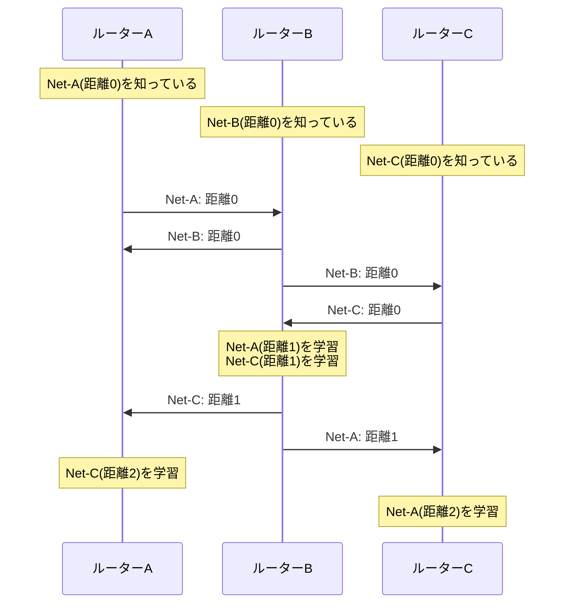
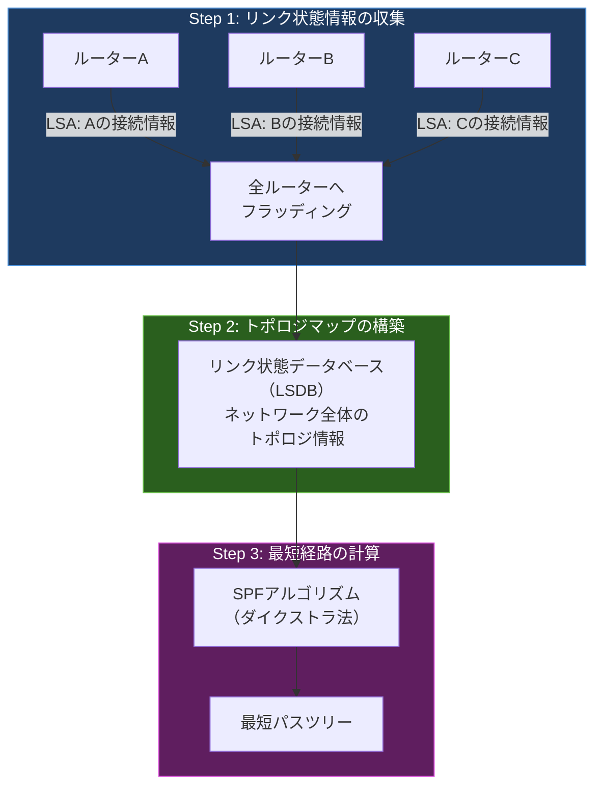
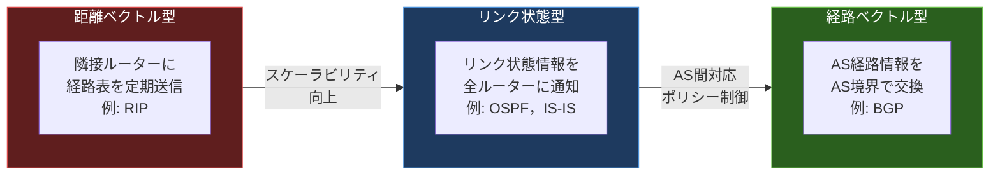

import { Aside } from '@astrojs/starlight/components';

## この節で学ぶこと

ダイナミックルーティングプロトコルは，経路情報をどのように計算するかによって，大きく「距離ベクトル型」と「リンク状態型」に分類される．
本節では，それぞれのアルゴリズムの動作原理，メリット・デメリットを理解し，主要なルーティングプロトコルがどちらに分類されるかを把握する．

## 7.3.1 距離ベクトル型（Distance-Vector）

### 基本的な動作

距離ベクトル型のルーティングプロトコルでは，各ルーターは隣接するルーターに対して，自分が知っている経路情報（宛先ネットワークとその距離）を定期的に通知する．
各ルーターは受け取った情報をもとに，宛先までの「方向（ベクトル）」と「距離（ディスタンス）」を計算してルーティングテーブルを更新する．

このアルゴリズムは，ベルマン・フォード法（Bellman-Ford Algorithm）に基づいている．

### 距離ベクトル型の動作の流れ

1. 各ルーターは初期状態で，直接接続されたネットワークのみを知っている
2. 隣接ルーターに自身のルーティングテーブル全体を定期的に送信する
3. 受信した経路情報の距離に1を加算し，自身のテーブルと比較する
4. より短い距離の経路があれば，テーブルを更新する
5. 一定時間（更新タイマー）ごとにこの処理を繰り返す

### 距離ベクトル型の特徴

利点:
- アルゴリズムが単純で実装が容易
- ルーターに必要なメモリやCPU負荷が少ない
- 小規模ネットワークでは十分な性能を発揮

欠点:
- コンバージェンスが遅い（全ルーターに情報が伝播するまで時間がかかる）
- ルーティングループが発生しやすい
- ネットワーク全体のトポロジを把握できない（隣接ルーターからの情報のみに依存）
- 大規模ネットワークには不向き（ホップ数の上限がある）

## 7.3.2 リンク状態型（Link-State）

### 基本的な動作

リンク状態型のルーティングプロトコルでは，各ルーターが自身のリンク状態（隣接するルーターとの接続情報およびそのコスト）をネットワーク全体のルーターに通知する．
すべてのルーターは同じリンク状態情報を持ち，ネットワーク全体のトポロジマップを構築する．
そのマップに対して最短経路アルゴリズム（SPF: Shortest Path First，ダイクストラ法）を適用し，各宛先への最短経路を計算する．

### リンク状態型の動作の流れ

1. 各ルーターが自身のリンク状態情報（LSA: Link-State Advertisement）を生成する
2. LSAをネットワーク内のすべてのルーターにフラッディング（一斉配布）する
3. すべてのルーターが同一のリンク状態データベース（LSDB）を構築する
4. SPFアルゴリズムを実行して，自身を起点とした最短パスツリーを計算する
5. 計算結果に基づきルーティングテーブルを生成する

### リンク状態型の特徴

利点:
- ネットワーク全体のトポロジを正確に把握できる
- コンバージェンスが高速（変更箇所のLSAのみを伝播）
- ルーティングループが発生しにくい
- 大規模ネットワークに対応できる（エリア分割によるスケーラビリティ確保）

欠点:
- アルゴリズムが複雑で実装が難しい
- ルーターに必要なメモリやCPU負荷が距離ベクトル型より大きい
- 初期のLSAフラッディングにより，ネットワーク帯域を一時的に消費する
- 設計・運用に高度な知識が必要

## 7.3.3 主なルーティングプロトコル

### ルーティングプロトコルの分類表

| プロトコル | 種別 | アルゴリズム | 主な用途 | メトリック |
|-----------|------|------------|---------|-----------|
| RIP | IGP | 距離ベクトル型 | 小規模ネットワーク | ホップ数（最大15） |
| RIPv2 | IGP | 距離ベクトル型 | 小規模ネットワーク | ホップ数（最大15） |
| RIPng | IGP | 距離ベクトル型 | IPv6小規模ネットワーク | ホップ数（最大15） |
| OSPF | IGP | リンク状態型 | 中〜大規模ネットワーク | コスト（帯域幅ベース） |
| OSPFv3 | IGP | リンク状態型 | IPv6ネットワーク | コスト（帯域幅ベース） |
| IS-IS | IGP | リンク状態型 | 大規模ISP | コスト |
| EIGRP | IGP | ハイブリッド型 | Cisco環境 | 帯域幅・遅延の複合 |
| BGP | EGP | 経路ベクトル型 | AS間ルーティング | パス属性（AS_PATHなど） |

### 距離ベクトル型，リンク状態型，経路ベクトル型の比較

### 経路ベクトル型（Path-Vector）

BGPは「経路ベクトル型」に分類される．距離ベクトル型と似ているが，単なる距離ではなく，宛先までに経由するASの一覧（AS_PATH）を経路情報として交換する点が大きく異なる．
AS_PATHに自身のAS番号が含まれている経路を受け取った場合はループと判断して破棄するため，大規模なAS間ルーティングでもループを防止できる．

<Aside type="tip" title="FDE実務での活用">
サービスメッシュ（Istio，Linkerdなど）は，マイクロサービス間の通信を制御するためにルーティングの概念を応用している．
サービスメッシュのサイドカープロキシは，各サービスへのリクエストを「ルーティングルール」に基づいて転送するが，これはIPルーティングにおけるルーティングテーブルの参照と概念的に類似している．
例えば，カナリアデプロイメントでは，トラフィックの一定割合を新バージョンに転送する「重み付きルーティング」が使われるが，これはECMP（Equal-Cost Multi-Path）ルーティングの応用とも言える．
AIモデルのA/Bテストにおいても，サービスメッシュのルーティング制御が活用される．
</Aside>

## まとめ

- 距離ベクトル型は，隣接ルーターとの経路情報交換に基づき，ベルマン・フォード法で最適経路を計算するシンプルなアルゴリズムである
- リンク状態型は，ネットワーク全体のトポロジ情報を各ルーターが保持し，SPFアルゴリズム（ダイクストラ法）で最短経路を計算するアルゴリズムである
- 距離ベクトル型はシンプルだがコンバージェンスが遅く，リンク状態型は高速なコンバージェンスを実現するがリソース消費が大きい
- BGPは経路ベクトル型に分類され，AS_PATHによるループ防止とポリシーベースの経路選択を特徴とする
- プロトコルの選択は，ネットワーク規模，要件，運用体制に応じて適切に判断する必要がある

## 理解度チェック

Q1: 距離ベクトル型アルゴリズムで各ルーターが交換する情報は何ですか？

各ルーターは隣接ルーターに対して，自身のルーティングテーブル全体（宛先ネットワークとその距離）を定期的に送信する．
受信側のルーターは，受け取った距離に1（そのリンクのコスト）を加算し，自身のテーブルにある既存の経路と比較して，より短い距離の経路があればテーブルを更新する．

Q2: リンク状態型アルゴリズムが距離ベクトル型より高速にコンバージェンスできる理由を説明してください．

リンク状態型では，ネットワーク構成が変更された際に，変更が発生したリンクの状態情報（LSA）のみがネットワーク全体にフラッディングされる．
各ルーターはこのLSAを受け取ると即座にリンク状態データベースを更新し，SPFアルゴリズムを再計算する．
一方，距離ベクトル型では，変更情報が隣接ルーターから順に伝播していくため，ネットワークの端まで情報が行き渡るのに時間がかかる．
リンク状態型は変更箇所を直接通知するのに対し，距離ベクトル型は間接的に伝播するため，コンバージェンスに差が生じる．

Q3: 経路ベクトル型（BGP）がループを防止できる仕組みを説明してください．

BGPは経路情報にAS_PATH属性を付加して交換する．AS_PATHには，その経路が経由してきたAS番号の一覧が記録されている．
あるルーターが受け取った経路情報のAS_PATHに自身のAS番号が含まれている場合，その経路はループしていると判断して破棄する．
これにより，AS間のルーティングループを確実に防止できる．

Q4: ネットワーク規模に応じたルーティングプロトコルの選択基準を説明してください．

- 小規模ネットワーク（ルーター数が少なく，トポロジが単純）: RIPが適している．設定がシンプルで，ルーターへの負荷も少ない．ただし，ホップ数の上限が15であるため，大規模には対応できない
- 中〜大規模ネットワーク（企業内ネットワークなど）: OSPFが適している．エリア分割によるスケーラビリティの確保，高速なコンバージェンス，帯域幅ベースのメトリックにより効率的な経路選択が可能
- 大規模ISP: IS-ISがよく使われる．OSPFと同様のリンク状態型だが，ISPの運用に適した拡張性を持つ
- AS間: BGPが唯一の選択肢であり，ポリシーベースの経路制御によりインターネット全体のルーティングを実現する

