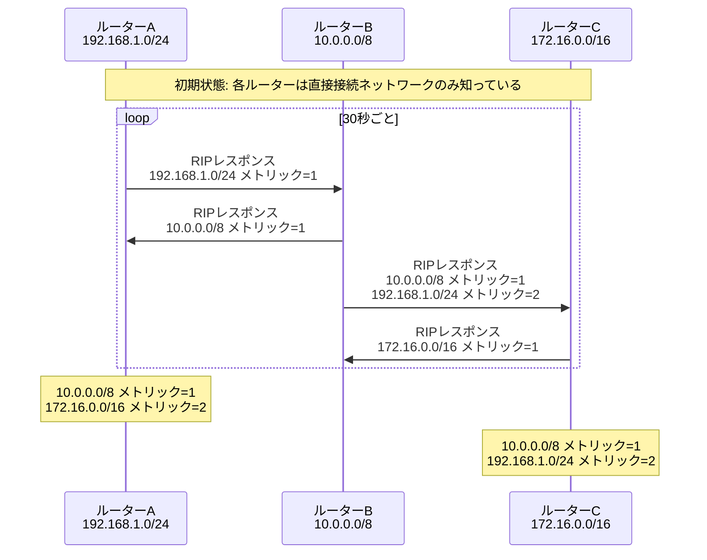
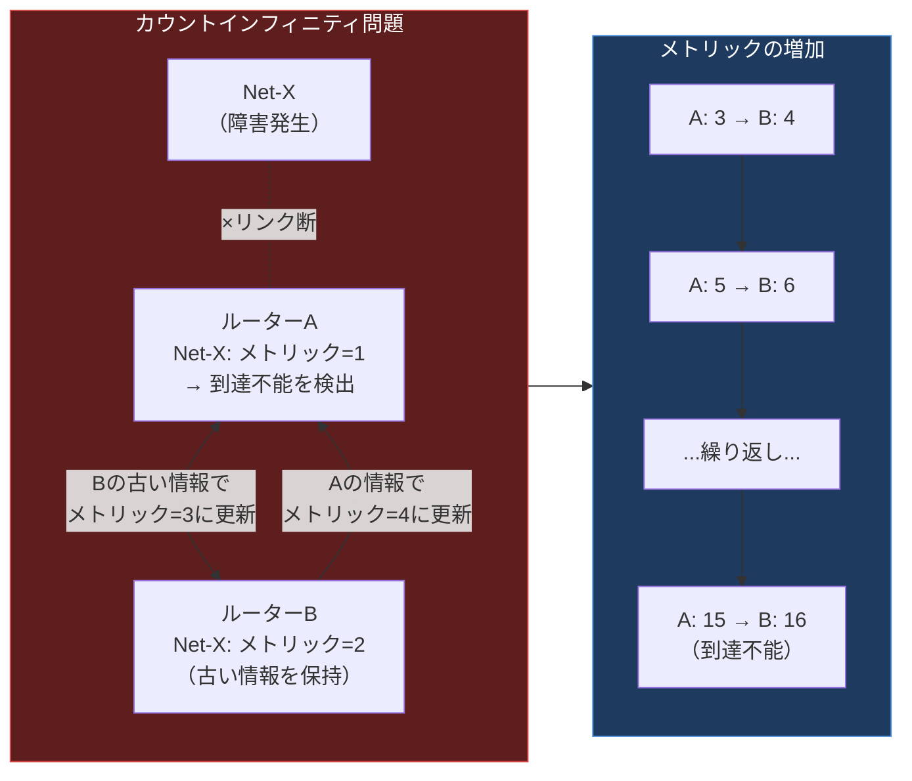

import { Aside } from '@astrojs/starlight/components';

## この節で学ぶこと

RIP（Routing Information Protocol）は，最も歴史が古く，シンプルなダイナミックルーティングプロトコルの一つである．
本節では，RIPがどのように経路情報を交換・決定するか，サブネットマスクの扱い，経路変更時の処理，そしてカウントインフィニティ問題への対策を理解する．
さらに，RIPの改良版であるRIP2で追加された機能を学ぶ．

## 7.4.1 経路制御情報をブロードキャストする

### RIPの基本動作

RIPでは，各ルーターが30秒ごとに自身のルーティングテーブル全体を隣接ルーターにブロードキャスト（またはマルチキャスト）で送信する．
この定期的な経路情報の交換により，ネットワーク全体で経路情報が伝播していく．

### RIPメッセージの形式

RIPのメッセージはUDPのポート520番を使用して送信される．
メッセージには以下の情報が含まれる:

- コマンド: リクエスト（1）またはレスポンス（2）
- バージョン: RIP v1（1）またはRIP v2（2）
- アドレスファミリ: IPの場合は2
- IPアドレス: 宛先ネットワークのアドレス
- メトリック: 宛先までのホップ数（1〜16）

### タイマーの種類

RIPは以下のタイマーで経路情報を管理する:

- 更新タイマー（30秒）: ルーティングテーブルを定期的に送信する間隔
- 無効タイマー（180秒）: 経路情報が更新されない場合にその経路を無効とするまでの時間
- ホールドダウンタイマー（180秒）: 無効になった経路に対する新しい情報を一定時間無視する
- フラッシュタイマー（240秒）: 無効になった経路をルーティングテーブルから完全に削除するまでの時間

## 7.4.2 距離ベクトルにより経路を決定

### ホップ数によるメトリック

RIPは「ホップ数」をメトリックとして使用する．ホップ数とは，宛先ネットワークに到達するまでに経由するルーターの数である．

- 直接接続されたネットワーク: メトリック = 0（送信時は1として広告）
- 1台のルーターを経由: メトリック = 1
- 最大ホップ数: 15（メトリック16は到達不能を意味する）

### 経路選択の仕組み

同じ宛先に対して複数の経路情報を受け取った場合，RIPはメトリック（ホップ数）が最も小さい経路を採用する．
メトリックが同じ場合は，先に学習した経路を優先する（実装によってはロードバランシングを行う場合もある）．

### ホップ数の上限と制限

RIPのメトリック最大値は15であり，16は「到達不能（infinity）」を意味する．
この制限により，RIPは最大でも15台のルーターを経由するネットワーク規模までしか対応できない．
大規模ネットワークでは，この制限がRIPの最大の課題となる．

## 7.4.3 サブネットマスクを利用した場合のRIPの処理

### RIP v1の制限

RIP v1はクラスフル（classful）ルーティングプロトコルであり，経路情報にサブネットマスクを含めない．
そのため，サブネット化されたネットワーク間のルーティングには以下の制限がある:

- 同一メジャーネットワーク（クラスA/B/C）内では，すべてのサブネットが同じサブネットマスクを使用しなければならない
- 異なるメジャーネットワーク境界では，自動的にクラスフルの境界でサマリが行われる
- VLSM（Variable Length Subnet Mask）やCIDRに対応できない

### RIP v2でのサブネットマスク対応

RIP v2ではクラスレス（classless）ルーティングに対応し，経路情報にサブネットマスクを含めるようになった．
これにより，VLSM環境やCIDR環境でも正しくルーティングが行える．

## 7.4.4 RIPで経路が変更されるときの処理

### リンク障害の検出

RIPでは，以下のいずれかの方法でリンク障害を検出する:

- 無効タイマーのタイムアウト: 180秒間経路情報が更新されない場合
- メトリック16の受信: 隣接ルーターから「到達不能」を示すメトリック16を受信した場合
- インタフェースのダウン検出: 直接接続されたリンクの障害を検出した場合

### カウントインフィニティ問題

距離ベクトル型の大きな課題がカウントインフィニティ問題である．
あるネットワークへの経路がダウンした際に，ルーター間で古い経路情報が循環し，メトリックが16（到達不能）に達するまで増加し続ける現象が発生する．

### カウントインフィニティへの対策

RIPでは以下の手法でカウントインフィニティ問題を緩和している:

- スプリットホライズン（Split Horizon）: ある経路を学習したインタフェースに対して，その経路情報を送信しない
- ポイズンリバース（Poison Reverse）: ある経路を学習したインタフェースに対して，その経路のメトリックを16（到達不能）として送信する
- ホールドダウンタイマー: 経路が無効になった後，一定時間その経路に対する新しい情報（メトリックが悪化する情報）を無視する
- トリガードアップデート（Triggered Update）: 経路変更が発生したとき，定期更新を待たずに即座に変更情報を送信する

## 7.4.5 RIP2

### RIP2の改善点

RIP2（RFC 2453）は，RIP v1の制限を改善したバージョンであり，以下の機能が追加されている:

- サブネットマスク情報の追加: 各経路エントリにサブネットマスクを含める（VLSM/CIDR対応）
- マルチキャストの使用: ブロードキャスト（255.255.255.255）の代わりにマルチキャストアドレス（224.0.0.9）を使用し，RIPを使用しないホストへの不要なパケットを減らす
- 認証機能: ルーティング情報の送信元を認証し，不正な経路情報の挿入を防ぐ
- ネクストホップの指定: 経路情報に明示的なネクストホップアドレスを含められる
- ルートタグ: 外部から再配布された経路を識別するためのタグフィールド

### RIPngの概要

RIPng（RIP next generation，RFC 2080）は，IPv6ネットワーク向けのRIPである．
基本的な動作はRIPと同じだが，IPv6アドレスに対応し，UDPポート521を使用する．

<Aside type="tip" title="FDE実務での活用">
RIPは現代の本番環境で使われることはほとんどないが，小規模なラボ環境やテスト環境でルーティングの基礎を学ぶには最適なプロトコルである．
例えば，GNS3やEVE-NGなどのネットワークシミュレータで仮想ルーターを構築し，RIPを設定してルーティングテーブルの変化を観察することで，距離ベクトル型の動作を体感できる．
また，Docker環境で複数のコンテナ間のルーティングを手動設定する際にも，RIPの概念（ホップ数，メトリック）の理解は役立つ．
AIモデルの推論サーバーを複数のサブネットに分散配置する検証環境では，RIPのシンプルさが迅速な環境構築に貢献する場合がある．
</Aside>

## まとめ

- RIPは30秒ごとにルーティングテーブル全体をブロードキャスト（またはマルチキャスト）で交換する距離ベクトル型プロトコルである
- メトリックとしてホップ数を使用し，最大15ホップまでのネットワーク規模に対応する
- RIP v1はクラスフルルーティングであり，サブネットマスク情報を含めないため，VLSM環境には対応できない
- カウントインフィニティ問題に対して，スプリットホライズン，ポイズンリバース，ホールドダウンタイマー，トリガードアップデートで対策する
- RIP2ではサブネットマスク対応，マルチキャスト使用，認証機能などが追加され，RIPの弱点が改善された

## 理解度チェック

Q1: RIPのメトリック最大値が15である理由と，その制限がもたらす影響を説明してください．

RIPではメトリック16を「到達不能（infinity）」として定義している．
これはカウントインフィニティ問題への対策の一つであり，メトリックが16に達した時点でその経路を到達不能と判断することで，メトリックが際限なく増加し続けることを防いでいる．
この制限により，RIPは最大15ホップ（15台のルーターを経由）までのネットワーク規模にしか対応できない．
大規模ネットワークやWAN環境では，この制限のためにRIPは適用できず，OSPFやIS-ISなどのプロトコルが必要となる．

Q2: スプリットホライズンとポイズンリバースの違いを説明してください．

スプリットホライズンは，ある経路を学習したインタフェースに対して，その経路情報を送信しないという手法である．
例えば，ルーターBがルーターA経由でNet-Xへの経路を学習した場合，ルーターAに向けてNet-Xの経路情報を送信しない．

ポイズンリバースは，ある経路を学習したインタフェースに対して，その経路のメトリックを16（到達不能）として送信する手法である．
同じ例で，ルーターBはルーターAに対して「Net-X: メトリック16」という情報を明示的に送信する．

ポイズンリバースの方がスプリットホライズンより確実にループを防止できるが，経路情報の送信量が増えるというトレードオフがある．

Q3: RIP v1とRIP2の主な違いを3つ挙げてください．

1. サブネットマスク情報: RIP v1はサブネットマスクを含めないクラスフルルーティングだが，RIP2は各経路エントリにサブネットマスクを含めるクラスレスルーティングに対応している
2. 送信方式: RIP v1はブロードキャスト（255.255.255.255）を使用するが，RIP2はマルチキャスト（224.0.0.9）を使用し，RIPを使用しないホストへの不要なパケットを減らしている
3. 認証機能: RIP v1には認証機能がないが，RIP2にはルーティング情報の送信元を認証する機能が追加され，不正な経路情報の挿入を防げるようになった

Q4: トリガードアップデートとは何ですか？なぜ必要ですか？

トリガードアップデートとは，経路変更（リンク障害の検出や経路の削除など）が発生した際に，通常の定期更新（30秒間隔）を待たずに，即座に変更された経路情報を隣接ルーターに送信する仕組みである．
これにより，障害情報がネットワーク全体に素早く伝播し，コンバージェンス時間を短縮できる．
トリガードアップデートがなければ，障害発生から最大30秒間は古い経路情報が使われ続け，パケットロスが発生する期間が長くなる．

