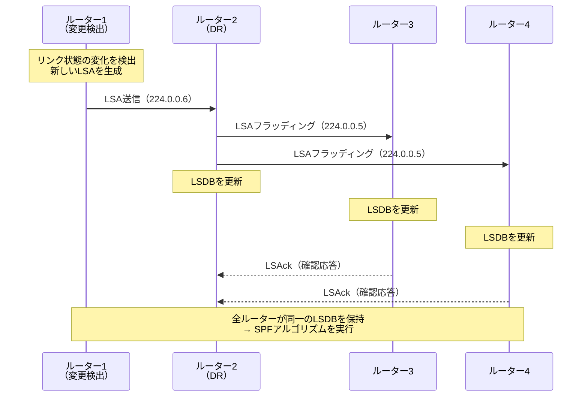
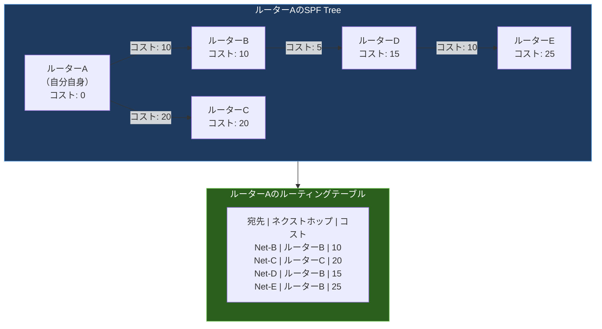
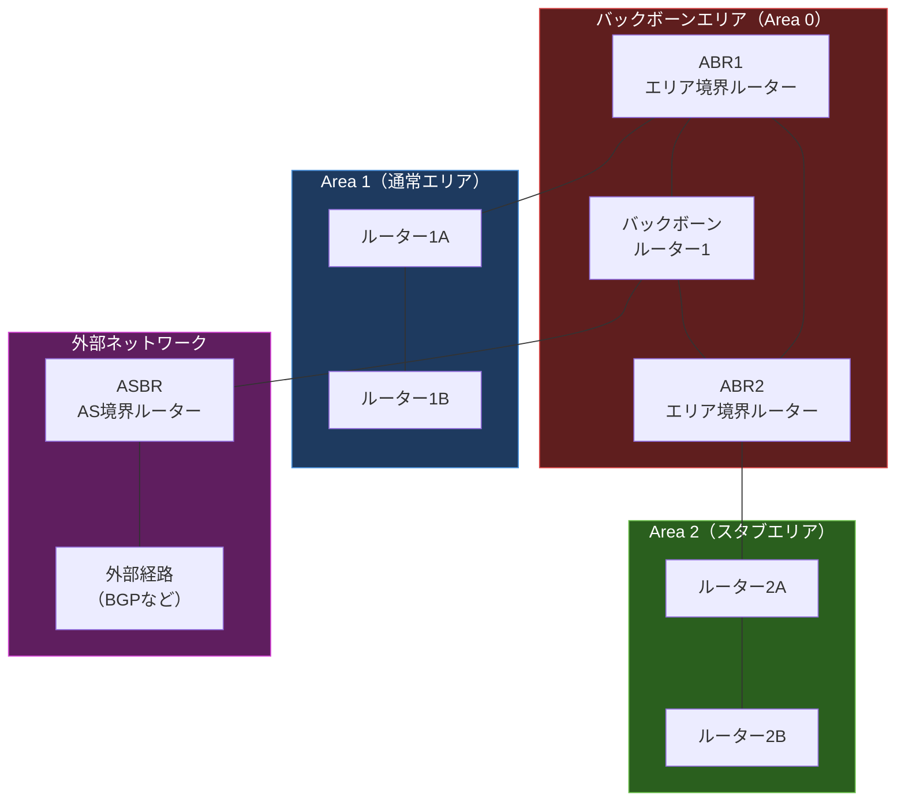

import { Aside } from '@astrojs/starlight/components';

## この節で学ぶこと

OSPF（Open Shortest Path First）は，リンク状態型の代表的なIGPであり，中〜大規模ネットワークで広く採用されている．
本節では，OSPFがリンク状態情報を交換・管理する仕組み，SPFアルゴリズムによる最短経路の計算，そして階層化されたエリア構造によるスケーラビリティの確保について理解する．

## 7.5.1 OSPFはリンク状態型のルーティングプロトコル

### OSPFの概要

OSPFはIETFが標準化したオープンなルーティングプロトコルであり，現在広く使われているバージョンはOSPFv2（RFC 2328，IPv4用）とOSPFv3（RFC 5340，IPv6用）である．

OSPFの主な特徴:
- リンク状態型アルゴリズムを使用
- IPプロトコル番号89を使用（TCPやUDP上ではなく，直接IP上で動作）
- コストをメトリックとして使用（通常は帯域幅に基づく）
- エリアによる階層化が可能
- 認証機能をサポート
- VLSM/CIDRに完全対応

### RIPとOSPFの比較

| 項目 | RIP | OSPF |
|------|-----|------|
| アルゴリズム | 距離ベクトル型 | リンク状態型 |
| メトリック | ホップ数（最大15） | コスト（帯域幅ベース） |
| 更新方式 | 定期更新（30秒） | 変更時のみ（イベント駆動） |
| 交換情報 | ルーティングテーブル全体 | リンク状態情報（LSA） |
| コンバージェンス | 遅い（分単位） | 速い（秒単位） |
| ネットワーク規模 | 小規模 | 中〜大規模 |
| 階層化 | なし | エリアによる階層化 |

## 7.5.2 OSPFの基礎知識

### コストの計算

OSPFのメトリック（コスト）は，通常，リンクの帯域幅から以下の式で計算される:

コスト = 基準帯域幅 / インタフェースの帯域幅

デフォルトの基準帯域幅は100Mbps（10^8 bps）である．

例:
- 100Mbps（Fast Ethernet）: コスト = 10^8 / 10^8 = 1
- 10Mbps（Ethernet）: コスト = 10^8 / 10^7 = 10
- 1.544Mbps（T1）: コスト = 10^8 / 1544000 ≒ 64

なお，1Gbps以上のリンクではコストが1未満となるため，基準帯域幅を10^9や10^10に変更することが推奨される．

### ネイバーとアジャセンシー

OSPFでは，同じリンク上にいるOSPFルーター同士を「ネイバー」と呼ぶ．
ネイバーの中でも，LSA（Link-State Advertisement）を直接交換する関係にあるルーター同士を「アジャセンシー」と呼ぶ．

ネイバー関係を確立するためには，以下のパラメータが一致している必要がある:
- エリアID
- サブネットマスク
- Helloインターバル
- Deadインターバル
- 認証情報（認証を使用している場合）

### DRとBDR

マルチアクセスネットワーク（イーサネットなど）では，すべてのルーター同士がアジャセンシーを形成すると，LSAの交換回数がn(n-1)/2に増大する．
これを抑制するために，DR（Designated Router）とBDR（Backup Designated Router）を選出する．

- DR: ネットワーク上のLSA交換の代表ルーター
- BDR: DRのバックアップ
- DROther: DR/BDR以外のルーター（DRとのみアジャセンシーを形成）

DRの選出は，ルーターの優先度（Priority）とルーターIDに基づいて行われる．

## 7.5.3 OSPFの動作の概要

### LSA（Link-State Advertisement）

LSAは，各ルーターが生成するリンク状態情報であり，自身のインタフェースの接続情報やコストを含む．
LSAにはいくつかの種類（Type 1〜7）があり，それぞれ異なる役割を持つ:

- Type 1（Router LSA）: 各ルーターが生成する，自身のリンク情報
- Type 2（Network LSA）: DRが生成する，マルチアクセスネットワーク情報
- Type 3（Summary LSA）: ABR（Area Border Router）が生成する，他エリアの経路情報
- Type 4（ASBR Summary LSA）: ABRが生成する，ASBR（AS Boundary Router）の位置情報
- Type 5（External LSA）: ASBRが生成する，外部経路情報

### LSAのフラッディング

LSAは以下の手順でネットワーク全体に伝播する:

1. ルーターが自身のリンク状態の変化を検出する
2. 変更されたLSAを生成する
3. 隣接ルーター（アジャセンシー）にLSAを送信する
4. 受信したルーターはLSDBに格納し，さらに他のアジャセンシーへ転送する
5. すべてのルーターが同じLSDBを持つまでフラッディングが続く

### SPFアルゴリズムによる最短経路計算

各ルーターは同一のLSDBに対してSPFアルゴリズム（ダイクストラ法）を実行し，自身を起点とした最短パスツリー（SPF Tree）を構築する．

SPFアルゴリズムの実行手順:
1. 自身をルート（コスト0）としてSPFツリーを初期化する
2. 自身に隣接するルーターのコストを計算し，最小コストのノードをツリーに追加する
3. 追加したノードに隣接するルーターのコストを計算し，まだツリーにないノードの中から最小コストのものを追加する
4. すべてのノードがツリーに追加されるまで繰り返す
5. 完成したSPFツリーからルーティングテーブルを生成する

## 7.5.4 階層化されたエリアに分けてきめ細かく管理

### OSPFのエリア構造

OSPFでは，ネットワークを複数のエリアに分割して階層的に管理できる．
エリアを分割することで以下のメリットが得られる:

- LSDBのサイズを削減し，SPF計算の負荷を軽減する
- エリア内のトポロジ変更が他のエリアに直接影響しない
- 経路集約によりルーティングテーブルのサイズを削減する

### エリアの種類

- バックボーンエリア（Area 0）: すべてのエリアはArea 0に接続されなければならない．OSPFネットワークの中心的なエリア
- 通常エリア: すべてのLSA（Type 1〜5）を受け取る標準的なエリア
- スタブエリア: 外部経路（Type 5 LSA）を受け取らず，デフォルトルートで代替する
- トータリースタブエリア: 外部経路と他エリアの経路情報（Type 3, 4, 5 LSA）を受け取らず，デフォルトルートのみで代替する
- NSSAエリア（Not-So-Stubby Area）: スタブエリアだが，ASBRを含むことができるエリア

### ルーターの役割

OSPFのルーターはその位置と機能に応じて以下の役割を持つ:

- 内部ルーター: すべてのインタフェースが同じエリアに属するルーター
- ABR（Area Border Router）: 複数のエリアに接続するルーター．エリア間の経路情報を要約して伝達する
- ASBR（AS Boundary Router）: OSPFドメインと外部ネットワーク（他のASなど）の境界に位置するルーター
- バックボーンルーター: Area 0に属するルーター

### トラブルシューティング: 経路の問題切り分け

OSPFネットワークで経路の問題が発生した場合の切り分け手順:

1. 物理層・データリンク層の確認:
   - インタフェースのUp/Down状態を確認する
   - ケーブルやスイッチポートの問題がないか確認する

2. OSPFネイバーの確認:
   - `show ip ospf neighbor` コマンドでネイバー関係が確立されているか確認する
   - パラメータ（エリアID，サブネットマスク，タイマー値）の不一致がないか確認する

3. ルーティングテーブルの確認:
   - `show ip route` コマンドで宛先へのルートが存在するか確認する
   - OSPF経路が期待通りに学習されているか確認する

4. LSDBの確認:
   - `show ip ospf database` コマンドでLSDBの内容を確認する
   - 期待するLSAが存在するか確認する

5. 経路追跡:
   - `traceroute` コマンドでパケットがどの経路を通っているか確認する
   - 予期しない経路を通っている場合は，コストの設定やエリア設計を見直す

<Aside type="tip" title="FDE実務での活用">
大規模なオンプレミスAIクラスタ（GPUクラスタ）の内部ネットワークでは，OSPFが使われることがある．
例えば，NVIDIA DGX SuperPODのような大規模GPUクラスタでは，数百台のノード間通信をリーフ・スパインアーキテクチャで構成し，OSPFやBGPで経路を制御する．
エリア分割によって，ラック内（リーフスイッチ以下）とラック間（スパインスイッチ間）のトポロジ変更を分離し，障害の影響範囲を局所化できる．
また，AIワークロードでは，RDMA over Converged Ethernet（RoCE）やGPUDirect RDMAなど，低レイテンシ通信が求められるため，OSPFのコスト設定により最適な通信経路を確保することが重要である．
tracerouteやルーティングテーブルの確認は，分散学習のパフォーマンスが出ない場合のトラブルシューティングで頻繁に活用される．
</Aside>

## まとめ

- OSPFはリンク状態型のIGPであり，コスト（帯域幅ベース）をメトリックとして使用する
- 各ルーターはLSAを交換してLSDBを構築し，SPFアルゴリズムで最短経路を計算する
- ネイバー確立にはエリアID，サブネットマスク，タイマー値などのパラメータ一致が必要
- DRとBDRの選出により，マルチアクセスネットワーク上のLSA交換を効率化する
- エリア分割によりLSDBのサイズとSPF計算の負荷を軽減し，大規模ネットワークに対応する
- バックボーンエリア（Area 0）を中心とした階層構造で，スケーラブルなルーティングを実現する

## 理解度チェック

Q1: OSPFのコストはどのように計算されますか？100Mbpsと1Gbpsリンクのコストの違いを説明してください．

OSPFのコストは通常「基準帯域幅 / インタフェースの帯域幅」で計算される．
デフォルトの基準帯域幅は100Mbps（10^8 bps）である．
- 100Mbps: コスト = 10^8 / 10^8 = 1
- 1Gbps: コスト = 10^8 / 10^9 = 0.1 → ただし，コストは整数であるため1に切り上げ

100Mbpsと1Gbpsのコストが同じ1になってしまう問題を避けるため，1Gbps以上のリンクが存在するネットワークでは基準帯域幅を10^9や10^10に変更することが推奨される．

Q2: DRとBDRが必要な理由を説明してください．

マルチアクセスネットワーク（イーサネットなど）でn台のルーターが存在する場合，すべてのルーター同士がアジャセンシーを形成すると，n(n-1)/2のアジャセンシーが必要になり，LSAの交換回数が爆発的に増加する．
DRを選出し，すべてのルーターがDRとのみアジャセンシーを形成するようにすれば，アジャセンシーの数はn-1に削減される．
BDRはDRのバックアップであり，DRに障害が発生した場合にBDRが即座にDRの役割を引き継ぐことで，DR再選出のための収束時間を短縮する．

Q3: OSPFのエリア分割の目的と，バックボーンエリア（Area 0）の役割を説明してください．

エリア分割の目的は，LSDBのサイズを削減してSPF計算の負荷を軽減し，エリア内のトポロジ変更が他エリアに直接影響しないようにすることである．
また，ABRでの経路集約によりルーティングテーブルのサイズも削減できる．

バックボーンエリア（Area 0）は，OSPFネットワークの中心的なエリアであり，すべてのエリアはArea 0に直接接続されなければならない（仮想リンクで例外的に接続する方法もある）．
エリア間の経路情報はすべてArea 0を経由して伝達されるため，Area 0はOSPFネットワークのハブとして機能する．

Q4: OSPFネットワークで経路が学習されない場合のトラブルシューティング手順を説明してください．

1. 物理層の確認: インタフェースがUp状態であることを確認する
2. ネイバーの確認: `show ip ospf neighbor` で隣接ルーターとのネイバー関係が確立されているか確認し，パラメータ（エリアID，サブネットマスク，Hello/Deadタイマー，認証）の不一致がないか確認する
3. ルーティングテーブルの確認: `show ip route` で期待する経路が存在するか確認する
4. LSDBの確認: `show ip ospf database` で期待するLSAが存在するか確認する
5. エリア設計の確認: ABRの配置やエリア番号の設定，スタブエリアの設定が正しいか確認する
6. 経路追跡: `traceroute` でパケットの実際の経路を確認する

Q5: スタブエリアとNSSA（Not-So-Stubby Area）の違いを説明してください．

スタブエリアは外部経路（Type 5 LSA）を受け取らず，ABRが生成するデフォルトルートで外部への通信を行うエリアである．
スタブエリア内にはASBR（AS境界ルーター）を配置できないという制限がある．

NSSAはスタブエリアの一種だが，エリア内にASBRを配置でき，外部から再配布された経路をType 7 LSAとして生成できる．
Type 7 LSAはABRでType 5 LSAに変換されてバックボーンエリアに伝達される．
これにより，スタブエリアのメリット（外部LSAの削減）を維持しつつ，限定的な外部経路の注入が可能になる．

