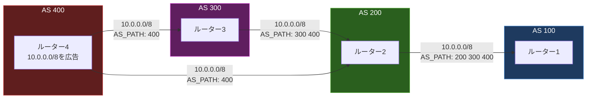
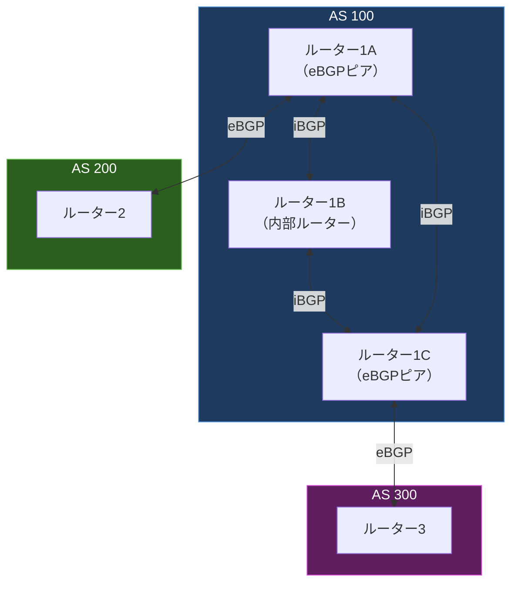

import { Aside } from '@astrojs/starlight/components';

## この節で学ぶこと

BGP（Border Gateway Protocol）は，インターネット上のAS間で経路情報を交換するための唯一の標準プロトコルである．
本節では，BGPがAS番号を用いてどのように経路を交換するか，経路ベクトル型アルゴリズムの仕組み，そしてeBGPとiBGPの違いを理解する．
BGPはインターネットの根幹を支えるプロトコルであり，その理解はネットワークエンジニアにとって不可欠である．

## 7.6.1 BGPとAS番号

### BGPの概要

BGP（Border Gateway Protocol）は現在バージョン4（BGP-4，RFC 4271）が広く使われており，AS間（EGP）のルーティングプロトコルとしてインターネット全体の経路制御を担っている．

BGPの主な特徴:
- TCPポート179番を使用して信頼性のある通信を確保
- 経路ベクトル型（Path-Vector）アルゴリズムを使用
- ポリシーベースの経路選択が可能
- 増分更新（変更のあった経路のみを通知）
- 大量の経路情報を扱える（現在のインターネットでは約100万経路以上）

### AS番号とBGP

BGPでは各ASを一意に識別するためにAS番号（ASN）を使用する．
AS番号はRIR（Regional Internet Registry）を通じて割り当てられる:

- 16ビットAS番号: 1〜65535（うち64512〜65534はプライベートAS番号）
- 32ビットAS番号: 65536〜4294967295（RFC 6793で定義）

プライベートAS番号は，インターネットに直接経路を広告しない内部利用向けに使用される．

### BGPピアリング

BGPでは，経路情報を交換するルーター同士を「BGPピア」または「BGPネイバー」と呼ぶ．
BGPピアリングは手動で設定する必要があり，OSPFのような自動的なネイバー検出機能はない．

BGPピアリングの確立手順:
1. 管理者が相手のIPアドレスとAS番号を手動で設定する
2. TCPコネクション（ポート179）を確立する
3. OPENメッセージを交換してパラメータをネゴシエーションする
4. BGPセッションが確立され，UPDATEメッセージで経路情報を交換する
5. KEEPALIVEメッセージ（デフォルト60秒間隔）でセッションを維持する

### BGPメッセージの種類

- OPEN: セッション確立時にパラメータ（AS番号，ルーターID，ホールドタイマーなど）を交換
- UPDATE: 新規経路の広告，または既存経路の取り下げ
- KEEPALIVE: セッションの生存確認
- NOTIFICATION: エラー発生時の通知とセッション切断

## 7.6.2 BGPは経路ベクトル

### 経路ベクトル型の仕組み

BGPは「経路ベクトル型（Path-Vector）」のルーティングプロトコルである．
距離ベクトル型と異なり，BGPは宛先ネットワークまでのAS経由経路の一覧（AS_PATH）を含む豊富な属性情報を持つ経路情報を交換する．

上の例では，ルーター1はAS 400の10.0.0.0/8に到達するために2つの経路を学習する:
- 経路1: AS_PATH = 200 300 400（3つのASを経由）
- 経路2: AS_PATH = 200 400（2つのASを経由）

AS_PATHの長さが短い方が優先されるため，経路2が選択される．

### BGPパス属性

BGPの経路選択では，AS_PATHだけでなく，さまざまなパス属性が使用される:

主要なパス属性:
- AS_PATH: 宛先までに経由するASの一覧．ループ防止にも使用
- NEXT_HOP: 宛先ネットワークへの次のホップのIPアドレス
- LOCAL_PREF: AS内での経路の優先度（値が大きいほど優先）
- MED（Multi-Exit Discriminator）: 隣接ASへの経路の優先度提案（値が小さいほど優先）
- ORIGIN: 経路の起源（IGP，EGP，Incomplete）
- COMMUNITY: 経路にタグを付与してグループ化するための属性

### BGPの経路選択プロセス

BGPは以下の順序で最適経路を選択する（実装により多少異なる場合がある）:

1. NEXT_HOPに到達可能であること
2. LOCAL_PREFが最も大きい経路
3. AS_PATHが最も短い経路
4. ORIGINの値が最も小さい経路（IGP < EGP < Incomplete）
5. MEDが最も小さい経路
6. eBGPで学習した経路をiBGPより優先
7. IGPメトリックが最も小さい経路（NEXT_HOPへの内部コスト）
8. BGPルーターIDが最も小さいピアからの経路

### eBGPとiBGP

BGPには2つの動作モードがある:

- eBGP（External BGP）: 異なるAS間で経路情報を交換する．通常，物理的に直接接続されたルーター間で使用
- iBGP（Internal BGP）: 同一AS内でBGP経路情報を伝播する．AS内のBGPルーター間で使用

### iBGPのフルメッシュ問題とルートリフレクタ

iBGPでは，iBGPピアから学習した経路を別のiBGPピアに再広告しないというルールがある．
そのため，AS内のすべてのBGPルーター間でiBGPのフルメッシュ接続が必要になる（n台の場合n(n-1)/2のセッション）．

この問題を解決するために，ルートリフレクタ（Route Reflector）という仕組みが使われる．
ルートリフレクタは，iBGPピア（クライアント）から受け取った経路を他のiBGPピアに反映（リフレクト）する．
これにより，フルメッシュを構成する必要がなくなり，iBGPのスケーラビリティが向上する．

### BGPのセキュリティ

BGPは本来，AS間の信頼関係に基づいて設計されており，経路情報の正当性を検証する仕組みが弱い．
以下のようなセキュリティ脅威が存在する:

- BGPハイジャック: 不正なAS番号やプレフィックスの広告による経路奪取
- 経路リーク: 意図しない経路の広告による通信障害

これらの対策として，以下の技術が導入されている:
- RPKI（Resource Public Key Infrastructure）: 経路広告の正当性をデジタル証明書で検証
- BGPsec: BGPのUPDATEメッセージにデジタル署名を付加して改ざんを防止
- IRR（Internet Routing Registry）フィルタリング: 登録されたルーティングポリシーに基づく経路フィルタリング

<Aside type="tip" title="FDE実務での活用">
CDN（Content Delivery Network）を活用したAIサービスのグローバル配信では，BGPの理解が重要である．
例えば，CloudflareやAkamaiなどのCDNプロバイダは，自社のASから複数のPoPを通じてAnycastでIPプレフィックスを広告し，ユーザーに最も近いエッジサーバーへトラフィックを誘導する．
AIモデルのAPI（例えばOpenAI APIやAnthropic API）も，BGPとAnycastを組み合わせてグローバルに低レイテンシなアクセスを実現している．
また，マルチクラウド構成では，各クラウドプロバイダのASとオンプレミスASの間でBGPセッションを構成し，最適な経路で通信を制御する．
BGPハイジャック事件（2018年のAmazon Route 53ハイジャックなど）は，AIサービスの可用性に直結するリスクであり，RPKIの導入状況を把握しておくことが推奨される．
</Aside>

## まとめ

- BGPはAS間の経路交換を担う唯一の標準プロトコルであり，TCPポート179を使用する
- 各ASはAS番号で一意に識別され，BGPピアリングは手動で設定する
- 経路ベクトル型アルゴリズムにより，AS_PATHを含む豊富なパス属性で経路を交換する
- BGPの経路選択はLOCAL_PREF，AS_PATH長，MED，ORIGIN，IGPメトリックなど複数の基準で行われる
- eBGPはAS間，iBGPはAS内で使用され，iBGPのスケーラビリティはルートリフレクタで確保する
- BGPハイジャックなどのセキュリティ脅威に対して，RPKIやBGPsecによる対策が進められている

## 理解度チェック

Q1: BGPが経路ベクトル型と呼ばれる理由を説明してください．

BGPは宛先ネットワークへの経路情報に，そのネットワークに到達するまでに経由するASの一覧（AS_PATH）を含めて交換する．
単なる距離（ホップ数など）ではなく，経路の全体像（パス）を知ることができるため，「経路ベクトル型（Path-Vector）」と呼ばれる．
AS_PATHにより，自AS番号が含まれる経路を破棄してループを防止でき，またAS_PATHの長さやポリシーに基づいた柔軟な経路選択が可能になる．

Q2: eBGPとiBGPの違いを説明してください．

eBGP（External BGP）は異なるAS間で経路情報を交換するために使用され，通常は物理的に直接接続されたルーター間でセッションを確立する．
iBGP（Internal BGP）は同一AS内でBGP経路情報を伝播するために使用される．
iBGPの重要なルールとして，iBGPピアから学習した経路を別のiBGPピアに再広告しないという制約がある．
このため，AS内のBGPルーター間でフルメッシュのiBGPセッションが必要になるが，ルートリフレクタを使用することでこの制約を緩和できる．

Q3: BGPの経路選択プロセスにおいて，LOCAL_PREFとMEDの違いを説明してください．

LOCAL_PREFはAS内で使用される属性であり，iBGPピアに対して「このASから外部への出口経路としてどれを優先するか」を示す．
値が大きいほど優先される．LOCAL_PREFは自AS内でのみ有効であり，eBGPピアには伝達されない．

MEDはAS間で使用される属性であり，隣接ASに対して「このASに入ってくるトラフィックにどの入口を使ってほしいか」を提案する．
値が小さいほど優先される．MEDは隣接ASへの提案であり，受け入れるかどうかは隣接ASのポリシー次第である．

つまり，LOCAL_PREFは「出口の優先度」，MEDは「入口の優先度の提案」という違いがある．

Q4: BGPハイジャックとは何ですか？その対策を説明してください．

BGPハイジャックとは，悪意のある（または設定を誤った）ASが，本来自分のものではないIPプレフィックスをBGPで広告することにより，そのプレフィックス宛のトラフィックを自分のASに引き込む攻撃（または事故）である．
これにより，通信の盗聴，改ざん，サービス不能などの被害が発生する可能性がある．

対策として，以下の技術が導入されている:
1. RPKI（Resource Public Key Infrastructure）: IPプレフィックスとAS番号の正当な紐付けをデジタル証明書で証明し，不正な経路広告を検出・拒否する
2. BGPsec: UPDATEメッセージにデジタル署名を付加して，経路情報の改ざんを防止する
3. IRRフィルタリング: インターネットルーティングレジストリに登録されたポリシーに基づいて経路をフィルタリングする

