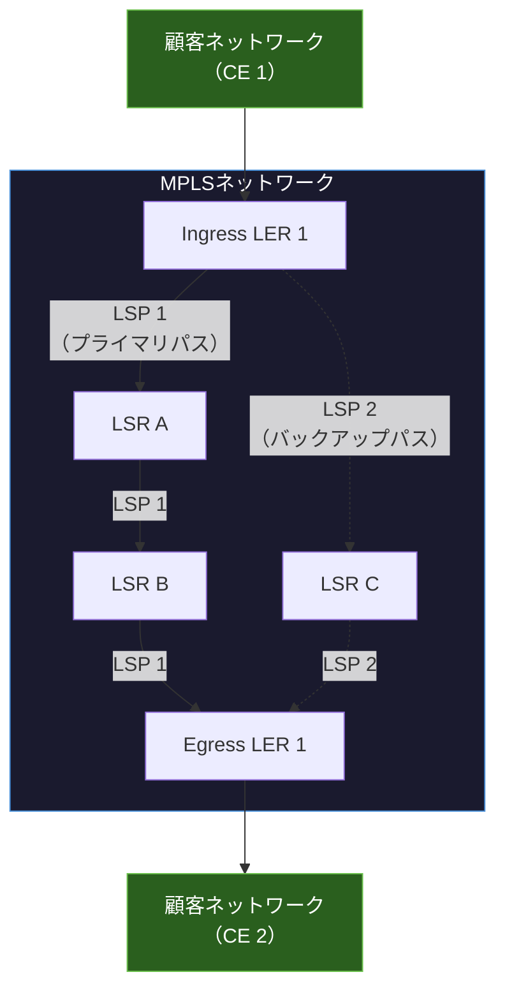

import { Aside } from '@astrojs/starlight/components';

## この節で学ぶこと

MPLS（Multi-Protocol Label Switching）は，IPパケットに「ラベル」と呼ばれる短い固定長の識別子を付加し，ラベルに基づいてパケットを高速に転送する技術である．
本節では，MPLSネットワークの動作原理（ラベルの付加・交換・除去），LSP（Label Switched Path）の概念，およびMPLSがもたらすトラフィックエンジニアリングやVPNサービスなどの利点を理解する．

## 7.7.1 MPLSネットワークの動作

### MPLSの基本概念

従来のIPルーティングでは，各ルーターがパケットを受け取るたびにIPヘッダの宛先アドレスを参照し，ルーティングテーブルの最長一致検索（ロンゲストマッチ）を行って転送先を決定する．
ネットワーク規模が大きくなると，この検索処理がルーターの負荷となる．

MPLSでは，パケットがネットワークに入る際に短い固定長のラベル（20ビット）を付加し，ネットワーク内部ではラベルのみを参照してパケットを転送する．
ラベルの検索は完全一致で行えるため，ロンゲストマッチ検索よりも高速である．

### MPLSの構成要素

- LER（Label Edge Router）: MPLSネットワークの境界に位置するルーター．パケットへのラベル付加（Push）とラベル除去（Pop）を行う
  - Ingress LER: MPLSネットワークの入口．IPパケットにラベルを付加する
  - Egress LER: MPLSネットワークの出口．ラベルを除去してIPパケットとして転送する
- LSR（Label Switching Router）: MPLSネットワーク内部のルーター．ラベルの交換（Swap）を行う
- FEC（Forwarding Equivalence Class）: 同じ転送処理を受けるパケットのグループ．宛先プレフィックス，QoSクラスなどで分類される

### ラベルスイッチングの動作

MPLSのパケット転送は，ラベルに対する3つの基本操作で行われる:

1. Push（プッシュ）: Ingress LERがIPパケットにMPLSラベルを付加する
2. Swap（スワップ）: LSRが受信パケットのラベルを別のラベルに交換して転送する
3. Pop（ポップ）: Egress LERがラベルを除去し，通常のIPパケットとして転送する

### MPLSラベルの構造

MPLSラベルは，IPヘッダとレイヤ2ヘッダの間に挿入される「シム（Shim）ヘッダ」として実装される（32ビット）:

- ラベル値（20ビット）: 転送先の識別に使用
- EXP/TC（3ビット）: QoS（サービス品質）の優先度指定に使用
- Sビット（1ビット）: ラベルスタックの最下層を示すフラグ
- TTL（8ビット）: ループ防止のためのTime To Live

### LSP（Label Switched Path）

LSP（Label Switched Path）は，MPLSネットワーク内でIngress LERからEgress LERまでのラベルスイッチングによる転送経路である．
LSPは一方向の経路であり，双方向の通信には2つのLSPが必要である．

### ラベル配布プロトコル

LSPを確立するために，各LSR間でラベルとFECの対応関係を配布するプロトコルが必要である:

- LDP（Label Distribution Protocol）: IGPに基づいてラベルを自動的に配布する標準プロトコル
- RSVP-TE（Resource Reservation Protocol - Traffic Engineering）: トラフィックエンジニアリング用に帯域予約とラベル配布を行うプロトコル
- BGP: VPNラベルの配布にも使用される（MP-BGP）

### PHP（Penultimate Hop Popping）

PHPは，Egress LERの1つ手前のLSRでラベルを除去する最適化手法である．
これにより，Egress LERはラベルの除去とIPルーティングテーブルの検索を同時に行う必要がなくなり，処理効率が向上する．

## 7.7.2 MPLSの利点

### トラフィックエンジニアリング

通常のIPルーティングでは，SPF（最短パス優先）に基づいて経路が決定されるため，特定のリンクにトラフィックが集中する場合がある．
MPLSのトラフィックエンジニアリング（MPLS-TE）では，ネットワーク全体の帯域利用率を考慮してLSPの経路を明示的に指定できる．

これにより:
- 混雑したリンクを迂回する経路を設定できる
- 帯域の利用効率をネットワーク全体で最適化できる
- 重要なトラフィックに対して帯域を予約できる

### MPLS-VPN

MPLSの最も広く利用されている応用がMPLS-VPNである．
キャリアのMPLSバックボーン上に，複数の顧客のプライベートネットワークを論理的に分離して構築できる．

主な方式:
- L3VPN（レイヤ3 VPN）: BGP/MPLS VPN（RFC 4364）．顧客のIPルーティングをキャリアが管理する．VRF（Virtual Routing and Forwarding）を使用してルーティングテーブルを分離する
- L2VPN（レイヤ2 VPN）: VPLS（Virtual Private LAN Service）やPWE3（Pseudowire Emulation Edge-to-Edge）．レイヤ2フレームをMPLSで転送する

### 高速障害復旧（MPLS Fast Reroute）

MPLS Fast Reroute（FRR）は，リンクやノードの障害が発生した際に，50ミリ秒以内に代替LSPへ切り替える高速障害復旧機能である．
IGPのコンバージェンスを待つ必要がないため，音声やビデオなどのリアルタイム通信の品質を維持できる．

### QoS（Quality of Service）

MPLSラベルのEXP/TCフィールドを使用して，パケットのQoSクラスを識別し，優先度に基づいた転送処理を行える．
これにより，音声・ビデオ・データなど異なる品質要件を持つトラフィックを，同一のネットワーク上で適切に扱うことができる．

### セグメントルーティング

MPLSの発展形として，セグメントルーティング（Segment Routing，SR）が注目されている．
SRは，経路上の各セグメント（ノードやリンク）にラベル（SID: Segment Identifier）を割り当て，送信元でラベルスタックとして経路を指定する技術である．

SRの利点:
- LDPやRSVP-TEが不要になり，制御プレーンが簡素化される
- ネットワークの状態に応じた柔軟なトラフィックエンジニアリングが可能
- SDN（Software-Defined Networking）との親和性が高い

<Aside type="tip" title="FDE実務での活用">
キャリアネットワーク上でAIサービスを提供する際，MPLSの理解は重要である．
例えば，AIモデルの学習データを複数のデータセンター間で転送する場合，キャリアが提供するMPLS-VPNサービスを利用して，セキュアかつ帯域保証された通信経路を確保することが一般的である．
また，AIサービスのAPI通信がキャリアのMPLSバックボーンを通る場合，MPLS-TEによる帯域制御やFRRによる高速障害復旧が，サービスのSLA（Service Level Agreement）を支えている．
GPUクラスタの拠点間接続（例: 東京DC ↔ 大阪DC間のDR構成）でも，MPLS-VPNが広く利用されている．
最近では，セグメントルーティング（SR-MPLS）を採用するキャリアが増えており，SDNコントローラとの連携により，AIワークロードのトラフィック特性に応じた動的な経路制御が実現されつつある．
</Aside>

## まとめ

- MPLSは短い固定長のラベルを使ってパケットを高速に転送する技術であり，Push・Swap・Popの3つの基本操作で動作する
- LER（境界ルーター）がラベルの付加・除去を行い，LSR（内部ルーター）がラベルの交換を行う
- LSPはIngress LERからEgress LERまでの一方向のラベル転送経路であり，LDPやRSVP-TEで確立される
- MPLS-TEにより，最短経路だけでなく帯域利用率を考慮した柔軟な経路制御が可能になる
- MPLS-VPNはキャリアネットワーク上に顧客ごとの仮想プライベートネットワークを構築する最も広く利用されている応用である
- MPLS Fast Rerouteにより50ミリ秒以内の高速障害復旧を実現し，リアルタイム通信の品質を維持できる

## 理解度チェック

Q1: MPLSの3つの基本操作（Push，Swap，Pop）をそれぞれ説明してください．

- Push（プッシュ）: Ingress LER（入口の境界ルーター）がIPパケットにMPLSラベルを付加する操作．パケットがMPLSネットワークに入る際に行われ，FECに基づいて適切なラベルが選択される
- Swap（スワップ）: LSR（内部ルーター）が受信パケットのラベルを参照し，ラベル転送テーブルに基づいて別のラベルに交換して次のルーターへ転送する操作．MPLSネットワーク内部でのパケット転送の基本操作である
- Pop（ポップ）: Egress LER（出口の境界ルーター）がMPLSラベルを除去し，通常のIPパケットとして宛先ネットワークへ転送する操作．なお，PHPの場合は出口の1つ手前のルーターでPopが行われる

Q2: MPLSがIPルーティングに比べて高速にパケットを転送できる理由を説明してください．

従来のIPルーティングでは，各ルーターがパケットの宛先IPアドレスを参照し，ルーティングテーブルの最長一致検索（ロンゲストマッチ）を行って転送先を決定する．
プレフィックス長の異なる複数のエントリから最も具体的なものを選択するため，検索処理に時間がかかる（特に経路数が多い場合）．

一方，MPLSでは固定長（20ビット）のラベルのみを参照し，完全一致検索でラベル転送テーブルを引くため，検索が高速である．
ただし，現代のルーターではハードウェアベースの高速なルーティングテーブル検索が実装されているため，純粋な転送速度の差は小さくなっている．
MPLSの主な利点は，転送速度よりもトラフィックエンジニアリングやVPNなどの付加価値機能にある．

Q3: MPLS-VPNとは何ですか？L3VPNの基本的な仕組みを説明してください．

MPLS-VPNは，キャリアのMPLSバックボーン上に複数の顧客のプライベートネットワークを論理的に分離して構築する技術である．
L3VPN（BGP/MPLS VPN）では，以下の仕組みで顧客ネットワークを分離する:

1. 各顧客のルーティングテーブルをVRF（Virtual Routing and Forwarding）で分離し，異なる顧客間でIPアドレスが重複しても問題なく動作する
2. PE（Provider Edge）ルーターが顧客の経路情報をMP-BGP（Multi-Protocol BGP）でVPNラベルとともに交換する
3. パケット転送時は，外側のMPLSラベル（トランスポートラベル）でMPLSネットワーク内の転送先を，内側のMPLSラベル（VPNラベル）で顧客のVRFを識別する

Q4: MPLS Fast Reroute（FRR）の目的と仕組みを説明してください．

MPLS Fast Reroute（FRR）の目的は，リンクやノードの障害が発生した際に，IGPのコンバージェンスを待たずに50ミリ秒以内で代替LSPへ切り替えることである．
これにより，音声やビデオなどのリアルタイム通信の品質を維持できる．

仕組みとしては，あらかじめ障害発生時に使用するバックアップLSP（保護パス）を計算・確立しておく．
障害を検出したルーターは，即座にトラフィックをバックアップLSPへ切り替える．
この間にIGPのコンバージェンスが進行し，最終的に最適な経路に収束する．

主な方式として，ファシリティバックアップ（障害箇所を迂回するバイパストンネルを使用）とワンツーワンバックアップ（各LSPに個別のバックアップパスを用意）がある．

