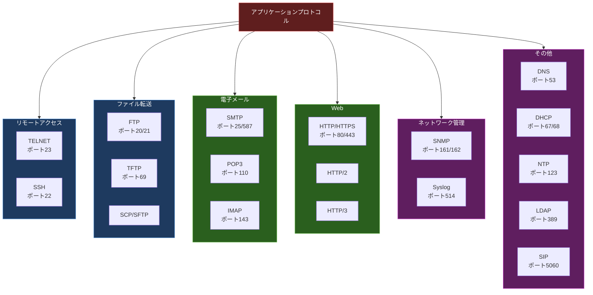
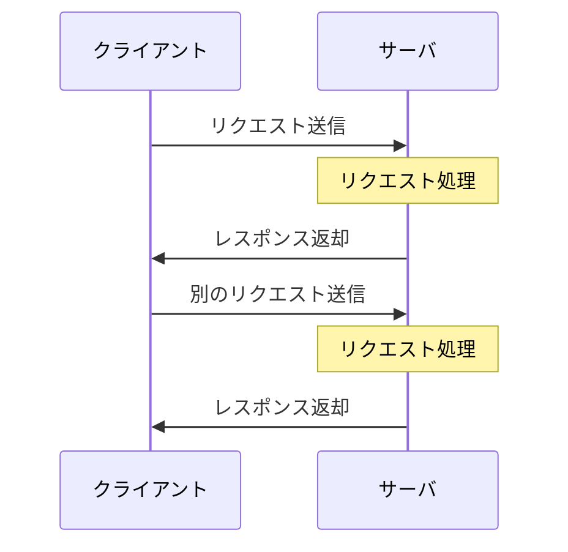
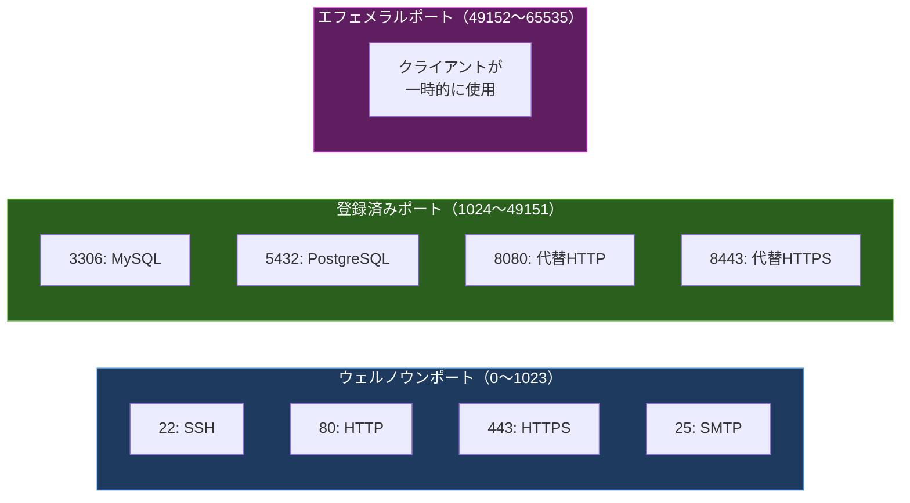

import { Aside } from '@astrojs/starlight/components';

## この節で学ぶこと

アプリケーションプロトコルとは何か，その役割と位置づけを理解します．
TCP/IPの階層モデルにおけるアプリケーション層の機能を整理し，主要なプロトコルの用途別分類を学びます．
クライアント/サーバモデルやピアツーピアモデルなど，アプリケーション層の通信モデルについても把握します．

## アプリケーション層の役割

TCP/IPの4層モデルにおいて，アプリケーション層は最上位に位置します．OSI参照モデルではセッション層（第5層），プレゼンテーション層（第6層），アプリケーション層（第7層）に対応する部分を包括的に担当します．

アプリケーション層のプロトコルは，下位層が提供する通信機能（IPによるルーティング，TCPによる信頼性のある通信，UDPによる軽量な通信）を利用して，ユーザーやアプリケーションに直接サービスを提供します．

アプリケーション層の主な責務は以下の通りです:

- ユーザーインタフェースの提供: Webブラウザ，メールクライアントなどの通信基盤
- データフォーマットの変換: 文字コード，画像形式，暗号化などのデータ表現
- セッション管理: 通信の開始・維持・終了の制御
- アプリケーション固有の処理: ファイル転送，名前解決，リモートアクセスなど

## アプリケーションプロトコルの全体マップ

アプリケーション層で動作するプロトコルは，その用途に応じて大きく分類できます．

## クライアント/サーバモデル

アプリケーション層のプロトコルの多くは，クライアント/サーバモデルに基づいて設計されています．クライアント（サービスの利用者）がサーバ（サービスの提供者）にリクエストを送り，サーバがレスポンスを返すという基本的な構造です．

このモデルの特徴は以下の通りです:

- サーバは特定のポート番号でリクエストを待ち受ける（ウェルノウンポート）
- クライアントはエフェメラルポート（一時ポート）を使用する
- サーバは複数のクライアントからの同時接続を処理できる
- サーバは常時稼働し，クライアントは必要なときだけ接続する

一方，P2P（Peer to Peer）モデルでは，各ノードがクライアントとサーバの両方の役割を持ちます．ファイル共有やビデオ通話などで使用されるこのモデルについては，8.7節で詳しく説明します．

## トランスポート層との関係

アプリケーションプロトコルは，用途に応じてTCPまたはUDPを使い分けます．

| プロトコル | トランスポート層 | 理由 |
|:---:|:---:|:---|
| HTTP/HTTPS | TCP | Webコンテンツの確実な配信が必要 |
| FTP | TCP | ファイルデータの完全性が必要 |
| SMTP/POP3/IMAP | TCP | メールの確実な送受信が必要 |
| SSH | TCP | セキュアなセッション維持が必要 |
| DNS | UDP（主）/TCP | 小さなクエリは高速なUDP，ゾーン転送はTCP |
| SNMP | UDP | 軽量な管理通信 |
| NTP | UDP | 時刻同期は軽量で十分 |
| DHCP | UDP | ブロードキャストベースの設定配布 |
| HTTP/3 | QUIC（UDP上） | 高速なWebアクセスのためQUICを採用 |

TCPを選択するプロトコルは信頼性（データの完全性）を重視し，UDPを選択するプロトコルは速度や軽量さを重視する傾向があります．近年ではQUIC（UDP上に構築された新しいトランスポートプロトコル）を利用するHTTP/3のような新しい組み合わせも登場しています．

## ウェルノウンポート番号

アプリケーションプロトコルには，IANAが管理するウェルノウンポート番号（0〜1023）が割り当てられています．主要なポート番号を以下にまとめます:

| ポート番号 | プロトコル | 用途 |
|:---:|:---:|:---|
| 20/21 | FTP | ファイル転送（データ/制御） |
| 22 | SSH | セキュアリモートアクセス |
| 23 | TELNET | リモートアクセス（非暗号化） |
| 25 | SMTP | メール送信 |
| 53 | DNS | 名前解決 |
| 80 | HTTP | Web通信 |
| 110 | POP3 | メール受信 |
| 123 | NTP | 時刻同期 |
| 143 | IMAP | メール受信（サーバ管理） |
| 161/162 | SNMP | ネットワーク管理 |
| 443 | HTTPS | 暗号化Web通信 |
| 587 | SMTP（Submission） | メール投稿 |

<Aside type="tip" title="FDE実務での活用">
FDEとしてAIサービスの構築・運用に携わる際，アプリケーションプロトコルの全体像を把握しておくことは極めて重要です．例えば，AIモデルの推論APIはHTTP/HTTPSで公開され，学習データの転送にはSCP/SFTPが使われ，GPUサーバへのアクセスにはSSHが利用されます．監視にはSNMP（またはPrometheus等の現代的な代替手段）を使い，認証基盤にはLDAPが使われることもあります．このように，AIサービスの各コンポーネントが依存するプロトコルを理解することで，トラブルシューティングやアーキテクチャ設計の精度が大きく向上します．
</Aside>

## まとめ

- アプリケーション層はTCP/IPモデルの最上位に位置し，ユーザーに直接サービスを提供する
- アプリケーションプロトコルはリモートアクセス，ファイル転送，電子メール，Web，ネットワーク管理などの用途別に分類できる
- 多くのプロトコルはクライアント/サーバモデルに基づいて動作する
- 各プロトコルは用途に応じてTCPまたはUDPを使い分ける
- ウェルノウンポート番号により，各プロトコルが使用するポートが標準化されている

## 理解度チェック

Q1: アプリケーション層はOSI参照モデルのどの層に対応しますか？

OSI参照モデルの第5層（セッション層），第6層（プレゼンテーション層），第7層（アプリケーション層）に対応します．TCP/IPモデルではこれらを包括的にアプリケーション層として扱います．

Q2: DNSがTCPとUDPの両方を使用するのはなぜですか？

通常の名前解決クエリは高速性を重視してUDPを使用します（応答データが512バイト以下の場合）．一方，ゾーン転送（DNSサーバ間でのゾーンデータの同期）や，応答データが大きい場合はTCPを使用して信頼性を確保します．

Q3: クライアント/サーバモデルとP2Pモデルの主な違いは何ですか？

クライアント/サーバモデルでは，サーバが特定のポートで待ち受けてサービスを提供し，クライアントがリクエストを送信する明確な役割分担があります．P2Pモデルでは，各ノードがクライアントとサーバの両方の役割を持ち，対等な関係でデータを送受信します．P2Pは中央サーバに依存しないため耐障害性が高い反面，管理が難しいという特徴があります．

Q4: HTTP/3がTCPではなくQUIC（UDP上）を採用した理由は何ですか？

TCPでは接続確立に3ウェイハンドシェイクが必要で，TLSのネゴシエーションも加わるとさらに時間がかかります．QUICはUDP上に構築され，接続確立と暗号化を同時に行うことで遅延を大幅に削減します．また，TCPのヘッドオブラインブロッキング（1つのパケットロスが全ストリームに影響する問題）を解消し，ストリーム単位の独立した制御が可能です．

