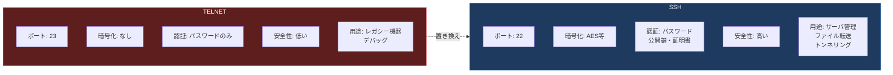

import { Aside } from '@astrojs/starlight/components';

## この節で学ぶこと

遠隔ログインの概念と必要性を理解します．
TELNETの仕組みと，なぜ現在では使用が推奨されないかを学びます．
SSHの暗号化通信の仕組み，公開鍵認証，ポートフォワーディングなどの機能を理解します．
TELNETとSSHの違いを比較し，セキュアな遠隔アクセスの重要性を認識します．

## 遠隔ログインとは

遠隔ログイン（リモートログイン）とは，ネットワークを介して離れた場所にあるコンピュータにログインし，あたかもそのコンピュータの端末から直接操作しているかのように利用する技術です．サーバの管理，クラウドインスタンスの操作，組み込みデバイスの設定など，幅広い場面で使用されます．

## 8.2.1 TELNET

TELNET（Teletype Network）は，1969年にRFC 15として最初に定義された最も古い遠隔ログインプロトコルの一つです．TCPのポート23を使用します．

TELNETの基本的な動作は以下の通りです:

1. クライアントがサーバのポート23にTCP接続を確立する
2. NVT（Network Virtual Terminal）と呼ばれる仮想端末を介して通信する
3. クライアントで入力した文字がサーバに送信される
4. サーバでの処理結果がクライアントに返される

NVTは，異なるOS間でも共通の端末インタフェースを提供するための仮想的な端末装置です．これにより，クライアントとサーバのOS（Windows，Unix，Linuxなど）が異なっていても通信が可能になります．

TELNETの最大の問題点はセキュリティです:

- 通信が暗号化されない: ユーザー名，パスワード，操作内容のすべてが平文（クリアテキスト）で送受信される
- 盗聴のリスク: ネットワーク上のパケットキャプチャにより，認証情報が容易に漏洩する
- 改ざんのリスク: 通信内容を途中で書き換える中間者攻撃に対する防御がない
- 認証の脆弱性: パスワード認証のみで，より強固な認証方式を利用できない

これらの理由から，現在のインターネット環境ではTELNETの使用は強く非推奨とされています．ただし，閉じたネットワーク内でのネットワーク機器の初期設定や，デバッグ目的でHTTPやSMTPの通信をテストする場合に限定的に利用されることがあります．

## 8.2.2 SSH

SSH（Secure Shell）は，暗号化された安全な通信チャネルを提供する遠隔ログインプロトコルです．TCPのポート22を使用し，TELNETの持つセキュリティ上の問題をすべて解決します．現在広く使われているのはSSH-2（バージョン2）です．

### SSH接続のシーケンス

SSH接続は以下のステップで確立されます:

```mermaid
sequenceDiagram
    participant C as SSHクライアント
    participant S as SSHサーバ

    rect rgb(30, 58, 95)
        Note over C,S: 1. TCP接続確立
        C->>S: TCP 3ウェイハンドシェイク
        S->>C: TCP接続完了
    end

    rect rgb(42, 95, 30)
        Note over C,S: 2. プロトコルバージョン交換
        C->>S: SSH-2.0-クライアント情報
        S->>C: SSH-2.0-サーバ情報
    end

    rect rgb(95, 30, 95)
        Note over C,S: 3. 鍵交換（Diffie-Hellman等）
        C->>S: 鍵交換アルゴリズム提案
        S->>C: アルゴリズム選択
        C->>S: 公開パラメータ送信
        S->>C: 公開パラメータ送信
        Note over C,S: 共通セッション鍵を独立に計算
    end

    rect rgb(95, 60, 30)
        Note over C,S: 4. ユーザー認証
        C->>S: 認証リクエスト（公開鍵 or パスワード）
        S->>C: 認証成功
    end

    rect rgb(30, 95, 95)
        Note over C,S: 5. 暗号化セッション開始
        C->>S: 暗号化されたコマンド
        S->>C: 暗号化された実行結果
    end
```

### SSHの主要機能

SSHは単なる遠隔ログインにとどまらず，以下の機能を提供します:

- 暗号化通信: AES，ChaCha20等の共通鍵暗号で全通信を暗号化
- 公開鍵認証: パスワードに依存しない，より安全な認証方式
- ホスト認証: 接続先サーバが正当であることを検証（なりすまし防止）
- ポートフォワーディング: SSHトンネルを介して他のプロトコルの通信を暗号化
- SCP/SFTP: SSH上でのセキュアなファイル転送
- X11フォワーディング: リモートのGUIアプリケーションをローカルに表示
- エージェントフォワーディング: 秘密鍵をリモートホストに持ち出さずに多段SSH接続

### 公開鍵認証の仕組み

パスワード認証よりも安全な公開鍵認証の流れは以下の通りです:

1. クライアントが鍵ペア（秘密鍵と公開鍵）を生成する
2. 公開鍵をサーバの `~/.ssh/authorized_keys` に登録する
3. 接続時，クライアントが秘密鍵で署名を作成してサーバに送る
4. サーバが登録済みの公開鍵で署名を検証する
5. 検証が成功すればログインが許可される

秘密鍵はクライアント側にのみ保存され，ネットワーク上に送信されることはありません．

### ポートフォワーディング

SSHポートフォワーディング（SSHトンネル）を使用すると，暗号化されていないプロトコルの通信をSSH経由で安全に転送できます．

- ローカルフォワーディング（`-L`）: ローカルポートへの接続をリモートサーバ経由で転送
- リモートフォワーディング（`-R`）: リモートポートへの接続をローカルマシン経由で転送
- ダイナミックフォワーディング（`-D`）: SOCKSプロキシとして動作

## TELNET vs SSH比較

| 項目 | TELNET | SSH |
|:---|:---|:---|
| ポート番号 | 23 | 22 |
| 暗号化 | なし（平文） | あり（AES，ChaCha20等） |
| 認証方式 | パスワードのみ | パスワード，公開鍵，証明書，多要素認証 |
| データ完全性 | なし | HMAC等で保証 |
| ファイル転送 | 非対応 | SCP/SFTPに対応 |
| ポートフォワーディング | 非対応 | 対応 |
| 現在の利用状況 | ほぼ廃止 | 標準的に利用 |

<Aside type="tip" title="FDE実務での活用">
FDEとしてGPUサーバやクラウドインスタンスにアクセスする際，SSHは最も基本的かつ重要なツールです．公開鍵認証の設定は必須であり，パスワード認証は無効化するのがベストプラクティスです．また，SSHポートフォワーディングを利用すれば，リモートサーバ上のJupyter Notebookやtensorboard（`ssh -L 8888:localhost:8888 gpu-server`）に安全にアクセスできます．複数のGPUサーバを管理する場合は，`~/.ssh/config` で接続先ごとの設定をまとめ，SSHエージェントフォワーディングを設定することで，踏み台サーバ経由の多段接続も効率的に行えます．
</Aside>

## まとめ

- TELNETは最も古い遠隔ログインプロトコルだが，通信が暗号化されないため現在は非推奨
- SSHはTELNETの問題を解決し，暗号化通信・公開鍵認証・ポートフォワーディング等の機能を提供する
- SSH接続は鍵交換→認証→暗号化セッションの順で確立される
- 公開鍵認証では秘密鍵がネットワーク上に送信されないため，パスワード認証より安全
- SSHポートフォワーディングにより，他のプロトコルの通信も安全に暗号化できる

## 理解度チェック

Q1: TELNETの最大の問題点は何ですか？

通信内容が暗号化されず，すべてが平文（クリアテキスト）で送受信されることです．これにより，ネットワーク上でパケットをキャプチャされると，ユーザー名，パスワード，操作内容が容易に漏洩します．

Q2: SSHの公開鍵認証において，秘密鍵はどこに保管されますか？なぜ安全なのですか？

秘密鍵はクライアント側にのみ保管されます．認証時には秘密鍵そのものを送信するのではなく，秘密鍵で作成した署名をサーバに送信し，サーバは登録済みの公開鍵で検証します．秘密鍵がネットワーク上を流れないため，盗聴されても認証情報が漏洩しません．

Q3: SSHポートフォワーディングはどのような場面で役立ちますか？

ファイアウォールの内側にあるサービスにアクセスしたい場合や，暗号化に対応していないプロトコルの通信をSSH経由で暗号化したい場合に役立ちます．例えば，リモートサーバ上のデータベース（ポート3306）にローカルポート経由でアクセスしたり，Jupyter NotebookのWebインタフェースをローカルに転送したりする場合に使用します．

Q4: SSH接続確立時の鍵交換で「Diffie-Hellman」が使われる理由は何ですか？

Diffie-Hellman鍵交換を使うことで，暗号化に使う共通の秘密鍵（セッション鍵）を，秘密情報をネットワーク上に送信することなく安全に共有できます．クライアントとサーバが互いに公開パラメータを交換するだけで，同一のセッション鍵を独立に計算できるため，盗聴者が通信を傍受しても鍵を復元できません．

