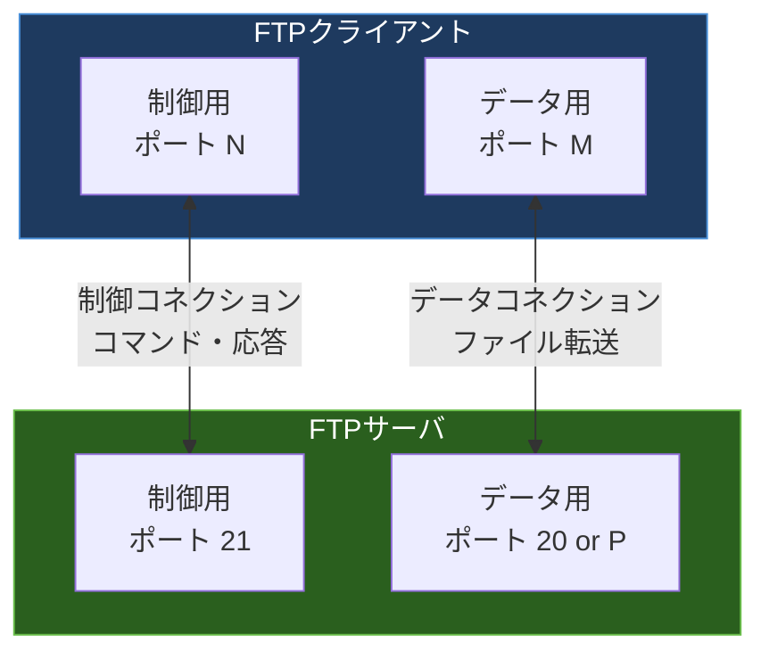
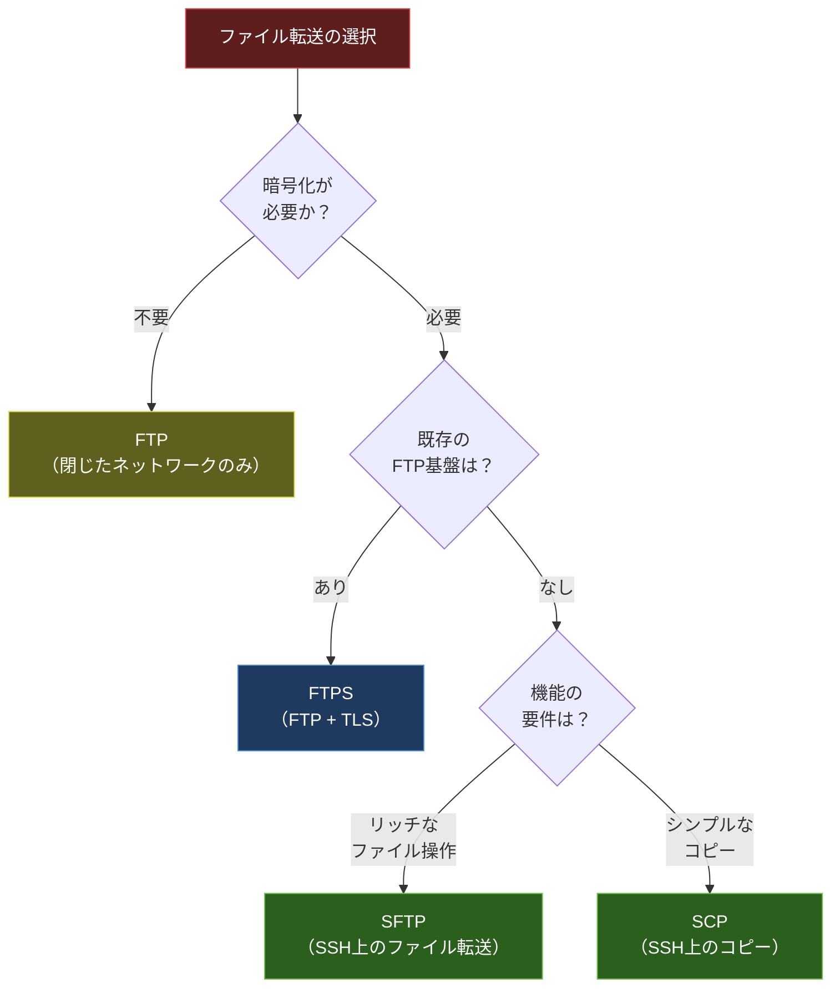

import { Aside } from '@astrojs/starlight/components';

## この節で学ぶこと

FTP（File Transfer Protocol）の基本的な仕組みと特徴を理解します．
制御コネクションとデータコネクションの2本のコネクションを使い分ける仕組みを学びます．
アクティブモードとパッシブモードの違いを理解し，NAT/ファイアウォール環境での注意点を把握します．
FTPのセキュリティ上の問題点と，SCP/SFTP/FTPS等のセキュアな代替手段を理解します．

## FTPの概要

FTP（File Transfer Protocol）は，ネットワークを介してファイルを転送するためのプロトコルです．RFC 959で定義されており，TCPを使用します．FTPの最大の特徴は，制御用とデータ転送用の2本のTCPコネクションを使用する点です．

- 制御コネクション（ポート21）: ユーザー認証，コマンドの送受信に使用
- データコネクション（ポート20またはランダム）: 実際のファイルデータやディレクトリリストの転送に使用

制御コネクションはFTPセッション全体を通じて維持されますが，データコネクションはファイル転送のたびに確立・切断されます．

## FTPコマンドと応答

FTPの制御コネクションでは，テキストベースのコマンドと3桁の数値コードによる応答が交換されます．

主なFTPコマンド:

| コマンド | 機能 |
|:---|:---|
| USER | ユーザー名の送信 |
| PASS | パスワードの送信 |
| LIST | ファイル一覧の取得 |
| RETR | ファイルのダウンロード |
| STOR | ファイルのアップロード |
| CWD | ディレクトリの変更 |
| PASV | パッシブモードへの切替 |
| PORT | アクティブモードのデータポート指定 |
| QUIT | セッションの終了 |

応答コードの分類:

- 1xx: 肯定的中間応答（処理中）
- 2xx: 肯定的完了応答（成功）
- 3xx: 肯定的中間応答（追加情報が必要）
- 4xx: 一時的な否定応答（再試行可能）
- 5xx: 永続的な否定応答（エラー）

## アクティブモードとパッシブモード

FTPには，データコネクションの確立方法が異なる2つのモードがあります．

```mermaid
sequenceDiagram
    participant C as FTPクライアント
    participant S as FTPサーバ

    rect rgb(30, 58, 95)
        Note over C,S: アクティブモード
        C->>S: PORT N+1（データ受信ポート通知）
        C->>S: RETR file.txt
        S->>C: サーバ（ポート20）→クライアント（ポートN+1）<br/>データコネクション確立
        S->>C: ファイルデータ転送
    end

    Note over C,S: ─────────────────────

    rect rgb(42, 95, 30)
        Note over C,S: パッシブモード
        C->>S: PASV
        S->>C: 227 Entering Passive Mode (h1,h2,h3,h4,p1,p2)
        C->>S: RETR file.txt
        C->>S: クライアント→サーバ（ポートP）<br/>データコネクション確立
        S->>C: ファイルデータ転送
    end
```

### アクティブモード

- クライアントがPORTコマンドで自分のデータ受信ポートをサーバに通知する
- サーバがポート20から，クライアントの指定ポートへ接続を確立する
- サーバ側からクライアント側への接続のため，クライアント側のファイアウォールやNATが問題になりやすい

### パッシブモード

- クライアントがPASVコマンドを送信する
- サーバが自身のデータポート番号をクライアントに通知する
- クライアントからサーバの指定ポートへ接続を確立する
- クライアントからの接続のため，NAT/ファイアウォール環境でも動作しやすい
- 現在はパッシブモードが主流

### モード選択の判断基準

| 観点 | アクティブモード | パッシブモード |
|:---|:---|:---|
| データコネクションの方向 | サーバ→クライアント | クライアント→サーバ |
| サーバ側のポート | 20（固定） | ランダム（高番号） |
| NAT/FW対応 | クライアント側で問題あり | サーバ側のポート開放が必要 |
| 現在の主流 | レガシー環境 | 推奨 |

## FTPのセキュリティ問題

FTPはTELNETと同様に，通信が暗号化されません．

- ユーザー名とパスワードが平文で送信される
- ファイルデータも暗号化されない
- 中間者攻撃に対する防御がない

これらの問題を解決するために，以下のセキュアな代替手段が利用されています:

| プロトコル | 概要 |
|:---|:---|
| FTPS（FTP over TLS） | FTPをTLS/SSLで暗号化．ポート990（暗黙的）またはポート21（明示的） |
| SFTP（SSH File Transfer Protocol） | SSHプロトコル上で動作するファイル転送．ポート22 |
| SCP（Secure Copy Protocol） | SSH上でファイルをコピー．ポート22 |

## 匿名FTP（Anonymous FTP）

匿名FTP（Anonymous FTP）は，ユーザー名「anonymous」でログインできるFTPサービスです．パスワードにはメールアドレスを入力する慣習がありますが，実際には検証されません．ソフトウェアの配布やパッチの公開などに利用されてきましたが，現在はHTTP/HTTPSによるダウンロードに置き換えられつつあります．

<Aside type="tip" title="FDE実務での活用">
FDEの現場では，大容量のAIモデルファイル（数GB〜数百GB）を転送する場面が頻繁にあります．FTPは使用せず，SCP/SFTPを使用するのが基本です．例えば，`scp model.pth gpu-server:/data/models/` のようにSSH経由で安全にモデルを転送します．さらに大容量の場合は `rsync -avz --progress` を使えば，転送の中断・再開や差分転送が可能です．クラウド環境では `aws s3 cp` や `gsutil cp` など，クラウドストレージ経由の転送が主流です．ファイアウォール設定の際，FTPのアクティブモード/パッシブモードの仕組みを理解していると，ポート開放のトラブルシューティングに役立ちます．
</Aside>

## まとめ

- FTPは制御コネクション（ポート21）とデータコネクション（ポート20/ランダム）の2本を使用する
- アクティブモードではサーバからクライアントへ，パッシブモードではクライアントからサーバへデータコネクションを確立する
- 現在はNAT/ファイアウォール対応のパッシブモードが主流
- FTPは暗号化されないため，SFTP/SCP/FTPSなどのセキュアな代替手段を使用すべき
- 大容量ファイルの転送にはrsyncやクラウドストレージも有効な選択肢

## 理解度チェック

Q1: FTPが制御コネクションとデータコネクションを分離している理由は何ですか？

制御コネクションを分離することで，ファイル転送中でもコマンドの送受信が可能になります．例えば，大きなファイルの転送中に転送を中断（ABOR）したり，転送状況を確認したりできます．また，データコネクションは転送ごとに作成・切断されるため，異なるファイルの転送を順次実行できます．

Q2: パッシブモードがNAT環境で有利な理由を説明してください．

アクティブモードでは，サーバからクライアントへの接続が必要ですが，クライアントがNATの背後にいる場合，外部からの接続が到達できません．パッシブモードでは，クライアントからサーバへの接続のみで済むため，NATの背後からでもファイル転送が可能です．

Q3: SFTP，SCP，FTPSの違いを簡潔に説明してください．

SFTPはSSHプロトコル上で動作するファイル転送プロトコルで，ディレクトリ操作やファイル一覧取得などのリッチな機能を持ちます．SCPはSSH上でのシンプルなファイルコピーです．FTPSは従来のFTPをTLS/SSLで暗号化したもので，既存のFTP基盤との互換性があります．SFTPとSCPはSSHのポート22のみで動作しますが，FTPSは制御ポートとデータポートの両方でTLS暗号化が必要です．

Q4: FTPの応答コード「227」は何を意味しますか？

「227 Entering Passive Mode」はパッシブモードへの移行を示す応答です．サーバは応答メッセージ内に，クライアントが接続すべきIPアドレスとポート番号を `(h1,h2,h3,h4,p1,p2)` の形式で通知します．ポート番号は `p1 × 256 + p2` で計算されます．

