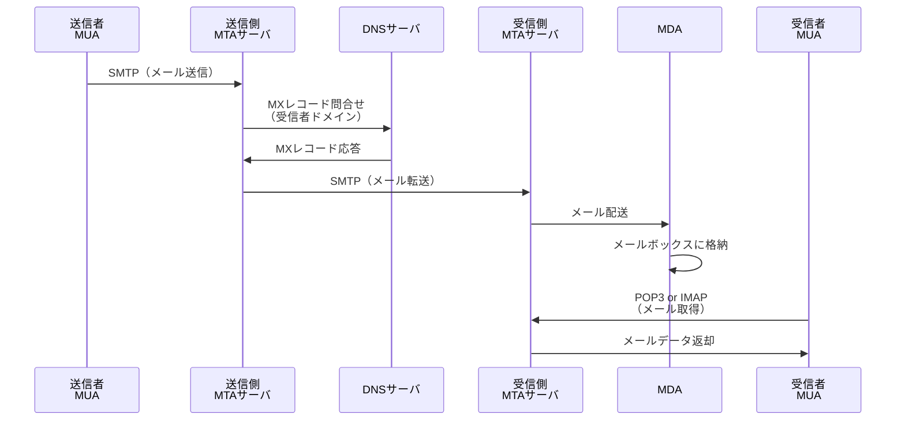
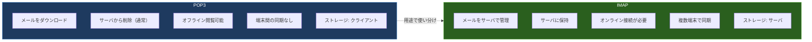

import { Aside } from '@astrojs/starlight/components';

## この節で学ぶこと

電子メールの送信から受信までの全体フローを理解します．
メールアドレスの構造とDNSのMXレコードの役割を学びます．
MIMEによるマルチメディアデータの取り扱いを理解します．
SMTP，POP3，IMAPの各プロトコルの役割と違いを学びます．

## 8.4.1 電子メールの仕組み

電子メール（E-Mail）は，ネットワークを介してメッセージを送受信する仕組みです．電子メールシステムは，いくつかの構成要素で成り立っています:

- MUA（Mail User Agent）: ユーザーが使うメールクライアント（Outlook，Thunderbird，Gmailなど）
- MTA（Mail Transfer Agent）: メールの転送を担当するサーバソフトウェア（Postfix，Sendmailなど）
- MDA（Mail Delivery Agent）: 受信したメールをユーザーのメールボックスに配送するソフトウェア
- メールボックス: ユーザーごとにメールを保管する領域

メール送信の全体フローは以下の通りです:

1. 送信者がMUA（メールクライアント）でメールを作成し送信する
2. MUAがSMTPで送信側MTAにメールを渡す
3. 送信側MTAが受信者ドメインのMXレコードをDNSに問い合わせる
4. MXレコードで示された受信側MTAにSMTPでメールを転送する
5. 受信側MTAがMDAを通じてメールボックスにメールを格納する
6. 受信者がPOP3またはIMAPでメールを取得する

## 8.4.2 メールアドレス

メールアドレスは「ローカルパート@ドメイン」の形式です．

- ローカルパート: メールボックスの名前（ユーザー名）
- @: 区切り記号
- ドメイン: メールサーバが属するドメイン名

例えば `user@example.com` の場合，`user` がローカルパート，`example.com` がドメインです．

メールの配送先を決定するために，DNSのMXレコード（Mail eXchanger Record）が使用されます．MXレコードは，あるドメイン宛のメールを受け付けるメールサーバのホスト名と優先度を指定します．優先度の値が小さいほど優先度が高くなります．

## 8.4.3 MIME（Multipurpose Internet Mail Extensions）

初期の電子メールはASCIIテキスト（7ビット文字）のみを扱えました．しかし，日本語などの多バイト文字，画像，音声，添付ファイルを送信するために，MIME（RFC 2045〜2049）が策定されました．

MIMEの主な機能:

- Content-Type: データの種類を指定（text/plain，image/jpeg，application/pdfなど）
- Content-Transfer-Encoding: 8ビットデータを7ビットASCIIに変換する方式を指定（Base64，Quoted-Printableなど）
- マルチパート: 1通のメールに複数の異なるコンテンツを含めることができる

主なMIMEタイプ:

| Content-Type | 説明 |
|:---|:---|
| text/plain | プレーンテキスト |
| text/html | HTMLメール |
| image/jpeg | JPEG画像 |
| image/png | PNG画像 |
| application/pdf | PDFドキュメント |
| application/octet-stream | バイナリデータ |
| multipart/mixed | 本文と添付ファイルの混合 |
| multipart/alternative | 同一内容の異なる表現（テキスト版とHTML版） |

## 8.4.4 SMTP（Simple Mail Transfer Protocol）

SMTP（RFC 5321）は，メールの送信と転送に使用されるプロトコルです．TCPのポート25（MTA間転送）またはポート587（Submission，MUAからMTAへの送信）を使用します．

SMTPの基本的な通信の流れ:

1. TCP接続の確立
2. EHLO（またはHELO）コマンドでクライアントの識別
3. MAIL FROM: 送信者アドレスの指定
4. RCPT TO: 受信者アドレスの指定
5. DATA: メール本文の送信開始
6. メール本文の送信（`.` のみの行で終了）
7. QUIT: 接続の終了

現在のSMTPでは，以下のセキュリティ機能が追加されています:

- SMTP AUTH: ユーザー認証（不正利用防止）
- STARTTLS: 通信の暗号化（盗聴防止）
- SPF/DKIM/DMARC: 送信者認証（なりすまし防止）
- OP25B（Outbound Port 25 Blocking）: 迷惑メール対策

## 8.4.5 POP（Post Office Protocol）

POP3（Post Office Protocol version 3，RFC 1939）は，メールサーバからメールをダウンロードするためのプロトコルです．TCPのポート110（暗号化なし）またはポート995（POP3S，TLS暗号化）を使用します．

POP3の特徴:

- メールをクライアントにダウンロードして閲覧する
- ダウンロード後にサーバからメールを削除するのが基本動作（設定で保持も可能）
- シンプルなプロトコルで実装が容易
- オフラインでもダウンロード済みメールを閲覧できる
- 複数端末での同期には向かない

## 8.4.6 IMAP（Internet Message Access Protocol）

IMAP4（Internet Message Access Protocol version 4rev1，RFC 3501）は，メールをサーバ上で管理・閲覧するプロトコルです．TCPのポート143（暗号化なし）またはポート993（IMAPS，TLS暗号化）を使用します．

IMAPの特徴:

- メールをサーバ上で管理し，必要なときにアクセスする
- フォルダ管理，検索，メッセージフラグ（既読/未読）をサーバ側で維持
- 複数端末から同じメールボックスにアクセスして同期できる
- メールの一部（ヘッダのみ，本文のみ）を取得できる
- サーバ側のストレージを継続的に消費する

| 項目 | POP3 | IMAP |
|:---|:---|:---|
| ポート番号 | 110（995: TLS） | 143（993: TLS） |
| メール保存先 | クライアント | サーバ |
| 複数端末同期 | 困難 | 対応 |
| オフライン閲覧 | ダウンロード済みは可能 | キャッシュが必要 |
| サーバ負荷 | 低い | 高い |
| フォルダ管理 | クライアント側 | サーバ側 |
| 主な利用場面 | 単一端末 | PC・スマホの併用 |

<Aside type="tip" title="FDE実務での活用">
AIサービスの通知システムを構築する際，メールプロトコルの理解は重要です．例えば，モデルの学習完了通知やエラーアラートをメールで送信する場合，SMTPライブラリを使ってプログラムからメールを送信します．SMTP AUTHとSTARTTLSの設定は必須です．また，SendGridやAmazon SESなどのメール配信サービスのAPIを利用する場合でも，SPF/DKIM/DMARCの設定を理解していないとメールが迷惑メールに分類される恐れがあります．MLOpsパイプラインの監視通知では，メールだけでなくSlack WebhookやPagerDutyとの連携も一般的です．
</Aside>

## まとめ

- 電子メールはMUA→MTA→MDA→メールボックス→MUAの流れで送受信される
- MXレコードにより受信側メールサーバが特定される
- MIMEにより，テキスト以外のデータ（画像，添付ファイル等）をメールで送信できる
- SMTPはメールの送信・転送を担当し，SMTP AUTHやSTARTTLSでセキュリティを確保する
- POP3はメールをダウンロードして管理し，IMAPはサーバ上でメールを管理する
- 複数端末での利用が主流の現在は，IMAPが一般的に使用される

## 理解度チェック

Q1: SMTPのポート25とポート587の違いは何ですか？

ポート25はMTA間のメール転送に使用されます．ポート587はSubmissionポートと呼ばれ，MUA（メールクライアント）からMTAへのメール送信に使用されます．ポート587ではSMTP AUTHによるユーザー認証が必須であり，STARTTLSによる暗号化も一般的です．迷惑メール対策のOP25B（Outbound Port 25 Blocking）により，一般ユーザーのポート25からの送信がISPで遮断されるため，ポート587の使用が推奨されています．

Q2: MIMEのBase64エンコーディングはなぜ必要ですか？

SMTPは元々7ビットASCII文字のみを扱う設計でした．画像やPDFなどのバイナリデータはそのままでは転送できないため，Base64エンコーディングで8ビットのバイナリデータを7ビットASCII文字列に変換します．ただし，Base64エンコードにより，データサイズは元の約4/3倍（約33%増加）になります．

Q3: POP3よりIMAPが適している状況を説明してください．

PC，スマートフォン，タブレットなど複数の端末からメールにアクセスする場合，IMAPが適しています．IMAPではメールがサーバ上で管理されるため，どの端末からアクセスしても同じメールボックスの状態（既読/未読，フォルダ構成）が共有されます．POP3では各端末にダウンロードされたメールは独立しているため，同期が困難です．

Q4: SPF，DKIM，DMARCはそれぞれどのような役割を持っていますか？

SPF（Sender Policy Framework）は，送信ドメインのDNSレコードに正当なメールサーバのIPアドレスを登録し，受信側がそれを検証します．DKIM（DomainKeys Identified Mail）は，送信メールに電子署名を付与し，受信側が公開鍵で署名を検証してメールの改ざんを検出します．DMARC（Domain-based Message Authentication, Reporting and Conformance）は，SPFとDKIMの検証結果に基づくポリシーを定義し，認証に失敗したメールの処理方法（許可，隔離，拒否）を指定します．

