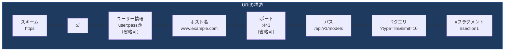
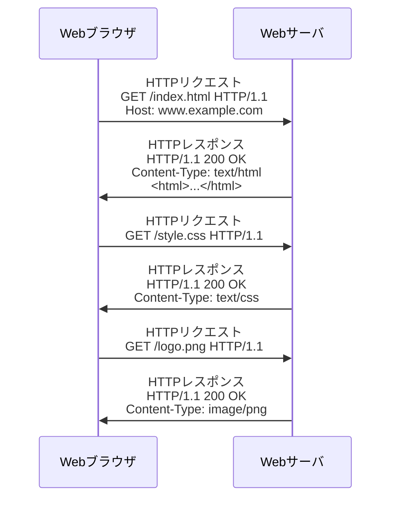
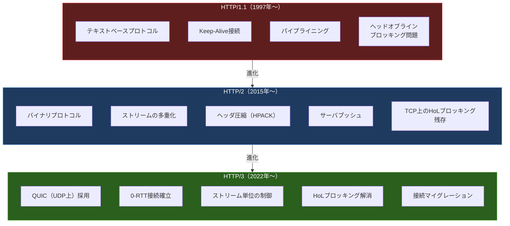
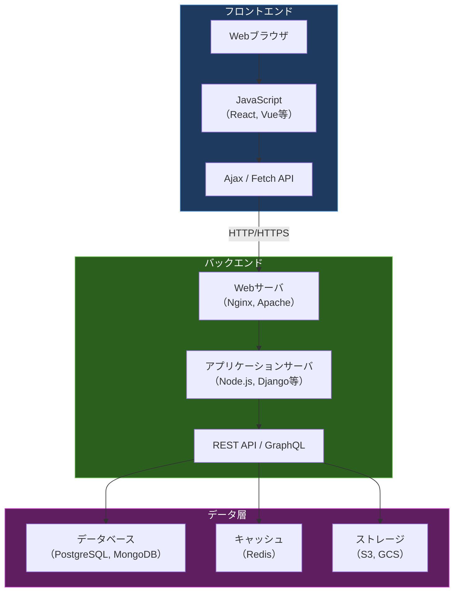

import { Aside } from '@astrojs/starlight/components';

## この節で学ぶこと

WWW（World Wide Web）の基本概念とハイパーテキストの考え方を理解します．
URI（Uniform Resource Identifier）の構造と役割を学びます．
HTMLによるWebページの記述方法を理解します．
HTTP/1.1，HTTP/2，HTTP/3の仕組みと進化を学びます．
Webアプリケーションの構成要素（REST API，CGI，Ajax等）を理解します．

## 8.5.1 インターネットブームの火付け役

WWW（World Wide Web）は，1989年にCERN（欧州原子核研究機構）のティム・バーナーズ＝リーによって考案されました．当初は研究者間での論文共有を目的としていましたが，1993年にMosaicブラウザが登場すると一般に広まり，インターネットの爆発的な普及を牽引しました．

WWWは以下の3つの技術要素で構成されています:

- URI: リソースの場所と識別方法
- HTML: リソースの記述言語
- HTTP: リソースの転送プロトコル

## 8.5.2 WWWの基本概念

WWWの基本的な考え方は「ハイパーテキスト」です．ハイパーテキストとは，テキスト内にリンク（ハイパーリンク）を埋め込み，他の文書を参照できるようにした仕組みです．これにより，世界中に分散した情報を相互に結び付け，ネットワーク上の「情報の蜘蛛の巣」（Web）を形成します．

WWWのアーキテクチャ:

- クライアント（Webブラウザ）がサーバにリクエストを送信する
- サーバ（Webサーバ）がリクエストされたリソースを返送する
- リソースはURIで一意に識別される
- クライアントはHTMLを解釈してレンダリングし，ユーザーに表示する

## 8.5.3 URI（Uniform Resource Identifier）

URI（Uniform Resource Identifier，RFC 3986）は，インターネット上のリソースを一意に識別するための文字列です．URLはURIのサブセットで，リソースの「場所」を示します．

URIの各構成要素:

| 要素 | 説明 | 例 |
|:---|:---|:---|
| スキーム | プロトコルを指定 | http，https，ftp，ssh |
| ホスト名 | サーバのドメイン名またはIPアドレス | www.example.com |
| ポート番号 | 接続先のポート（省略時はスキームのデフォルト） | 443（HTTPS） |
| パス | サーバ上のリソースの場所 | /api/v1/models |
| クエリ文字列 | リソースへのパラメータ | ?type=llm&limit=10 |
| フラグメント | ドキュメント内の特定位置 | #section1 |

## 8.5.4 HTML（HyperText Markup Language）

HTML（HyperText Markup Language）は，Webページを記述するためのマークアップ言語です．タグ（要素）を使って文書の構造と意味を定義します．

現在の標準はHTML Living Standard（WHATWGにより継続的に更新）です．HTMLの進化に伴い，以下のような機能が追加されてきました:

- セマンティック要素: `<header>`，`<nav>`，`<article>`，`<section>`，`<footer>` など意味を持つタグ
- マルチメディア: `<video>`，`<audio>` によるプラグインなしのメディア再生
- Canvas/WebGL: `<canvas>` による2D/3Dグラフィックス描画
- フォームの強化: 入力バリデーション，日付・色選択など
- WebSocket: サーバとの双方向リアルタイム通信

HTMLはCSS（Cascading Style Sheets）と組み合わせてデザインを制御し，JavaScript（ECMAScript）と組み合わせて動的な振る舞いを実現します．

## 8.5.5 HTTP（HyperText Transfer Protocol）

HTTPは，WebブラウザとWebサーバ間でデータを転送するためのプロトコルです．リクエスト/レスポンスモデルに基づき，TCPのポート80（HTTP）またはポート443（HTTPS）を使用します．

### HTTPリクエストとレスポンス

主なHTTPメソッド:

| メソッド | 用途 | 安全性 | べき等性 |
|:---|:---|:---:|:---:|
| GET | リソースの取得 | あり | あり |
| POST | リソースの作成・データ送信 | なし | なし |
| PUT | リソースの更新（全体） | なし | あり |
| PATCH | リソースの部分更新 | なし | なし |
| DELETE | リソースの削除 | なし | あり |
| HEAD | ヘッダのみ取得 | あり | あり |
| OPTIONS | 利用可能なメソッドの確認 | あり | あり |

主なHTTPステータスコード:

| コード | 意味 | 説明 |
|:---|:---|:---|
| 200 | OK | リクエスト成功 |
| 301 | Moved Permanently | リソースの恒久的な移動 |
| 302 | Found | リソースの一時的な移動 |
| 304 | Not Modified | キャッシュ利用可能 |
| 400 | Bad Request | リクエストの構文エラー |
| 401 | Unauthorized | 認証が必要 |
| 403 | Forbidden | アクセス権なし |
| 404 | Not Found | リソースが存在しない |
| 500 | Internal Server Error | サーバ内部エラー |
| 503 | Service Unavailable | サービス利用不可 |

### HTTP/1.1，HTTP/2，HTTP/3の比較

| 項目 | HTTP/1.1 | HTTP/2 | HTTP/3 |
|:---|:---|:---|:---|
| 策定年 | 1997年 | 2015年 | 2022年 |
| トランスポート | TCP | TCP | QUIC（UDP上） |
| フォーマット | テキスト | バイナリ | バイナリ |
| 多重化 | なし | ストリーム多重化 | ストリーム多重化 |
| ヘッダ圧縮 | なし | HPACK | QPACK |
| 暗号化 | オプション | 事実上必須 | 必須（TLS 1.3内蔵） |
| HoLブロッキング | あり | TCP層で残存 | 解消 |
| 接続確立 | TCP + TLS | TCP + TLS | 0-RTT可能 |

### HTTPSとTLS

HTTPS（HTTP over TLS）は，HTTPの通信をTLS（Transport Layer Security）で暗号化したものです．ポート443を使用し，通信の暗号化，サーバの認証（デジタル証明書），データの完全性検証を提供します．現在はHTTPSの使用が事実上の標準であり，主要なWebブラウザはHTTPサイトに対して警告を表示します．

## 8.5.6 Webアプリケーション

現代のWebは静的なHTMLページの表示にとどまらず，動的なWebアプリケーションのプラットフォームとなっています．

主要なWebアプリケーション技術:

- CGI（Common Gateway Interface）: Webサーバから外部プログラムを起動してコンテンツを動的に生成する仕組み（歴史的技術）
- Ajax（Asynchronous JavaScript and XML）: ページ全体を再読み込みせずに，非同期通信でサーバとデータを送受信する技術
- REST API: HTTPメソッドを活用し，リソースをCRUD操作するAPIの設計スタイル
- GraphQL: クライアントが必要なデータのみを指定して取得できるクエリ言語
- WebSocket: クライアントとサーバ間の双方向リアルタイム通信プロトコル
- SSE（Server-Sent Events）: サーバからクライアントへの一方向リアルタイム通信

REST APIの設計原則:

- リソースをURIで識別する（例: `/api/v1/models/gpt-4`）
- HTTPメソッドで操作を表現する（GET=取得，POST=作成，PUT=更新，DELETE=削除）
- ステートレス: リクエストは独立しており，サーバは前回のリクエスト情報を保持しない
- レスポンスはJSONまたはXMLで返却する

<Aside type="tip" title="FDE実務での活用">
FDEとしてAIサービスを構築する際，HTTPは最も重要なプロトコルです．AIモデルの推論APIは通常REST APIとして設計され，`POST /api/v1/inference` のようなエンドポイントでリクエストを受け付けます．GraphQLを使えば，クライアントが必要なフィールドだけを指定して効率的にデータを取得できます．大規模言語モデル（LLM）のストリーミング応答には，SSE（Server-Sent Events）やWebSocketが使用されます．例えば，ChatGPTのようなインタフェースでは，SSEを使ってトークンが生成されるたびにクライアントに逐次配信します．HTTP/2やHTTP/3の多重化機能は，複数のAPI呼び出しを並行して行う場合にレイテンシを削減します．
</Aside>

## まとめ

- WWWはURI，HTML，HTTPの3つの技術要素で構成される
- URIはインターネット上のリソースを一意に識別するための文字列
- HTMLはWebページを記述するマークアップ言語で，CSS・JavaScriptと連携して動的なコンテンツを実現する
- HTTPはリクエスト/レスポンスモデルに基づくプロトコルで，HTTP/1.1→HTTP/2→HTTP/3と進化してきた
- HTTP/3はQUIC上で動作し，接続確立の高速化やHoLブロッキングの解消を実現した
- 現代のWebアプリケーションはREST API，GraphQL，WebSocket等を活用した動的なシステムとなっている

## 理解度チェック

Q1: HTTP/2がHTTP/1.1に対して改善した主な点は何ですか？

HTTP/2の主な改善点は以下の通りです．（1）バイナリプロトコル化により解析が効率化された．（2）ストリームの多重化により，1つのTCP接続上で複数のリクエスト/レスポンスを並行して処理できるようになった．（3）HPACKによるヘッダ圧縮でオーバーヘッドが削減された．（4）サーバプッシュにより，クライアントのリクエスト前にリソースを送信できるようになった．

Q2: REST APIの設計において「べき等性」とは何ですか？なぜ重要ですか？

べき等性（idempotency）とは，同じ操作を何度実行しても結果が変わらない性質です．例えば，GETやPUTはべき等ですが，POSTはべき等ではありません．べき等性はネットワーク障害時のリトライ処理で重要です．べき等な操作はリクエストが重複しても安全ですが，べき等でない操作（POSTなど）を重複実行すると，データの二重登録などの問題が発生する可能性があります．

Q3: WebSocketとSSE（Server-Sent Events）の違いは何ですか？

WebSocketはクライアントとサーバ間の双方向リアルタイム通信プロトコルです．一度接続が確立されると，両方向にデータを送受信できます．SSEはサーバからクライアントへの一方向（サーバプッシュ）のみをサポートします．SSEはHTTP/HTTPSの上で動作するため，既存のインフラとの互換性が高く，実装もシンプルです．LLMのストリーミング応答のように，サーバからの一方向配信で十分な場合はSSEが適しています．

Q4: HTTPSが必要とされる理由を3つ挙げてください．

（1）通信の暗号化: TLSにより，通信内容が第三者に盗聴されても解読できない．（2）サーバの認証: デジタル証明書により，接続先サーバが正当であることを検証し，フィッシングサイトへの誘導を防ぐ．（3）データの完全性: 通信途中でのデータ改ざんを検出でき，中間者攻撃を防ぐ．

Q5: HTTP/3がTCPではなくQUIC（UDP上）を採用した技術的な理由は何ですか？

HTTP/2まではTCPを使用していましたが，TCPにはヘッドオブラインブロッキング（HoLブロッキング）の問題がありました．TCP上で多重化されたストリームのうち1つのパケットが欠落すると，TCPの順序保証のため全ストリームの配信が停止します．QUICはUDP上に構築され，ストリームごとに独立した損失回復を行うため，この問題を解消しました．また，QUICはTLS 1.3を内蔵しており，0-RTTでの接続確立やコネクションマイグレーション（Wi-Fiからモバイル回線への切替時も接続を維持）も実現しています．

