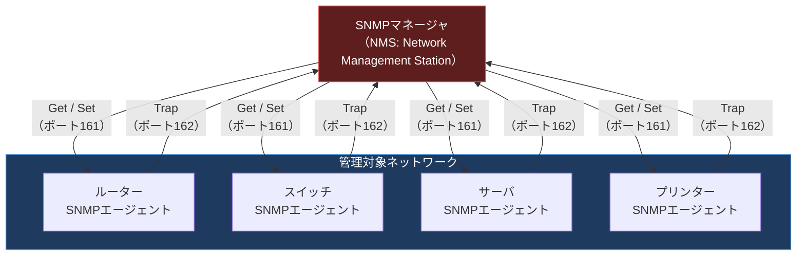
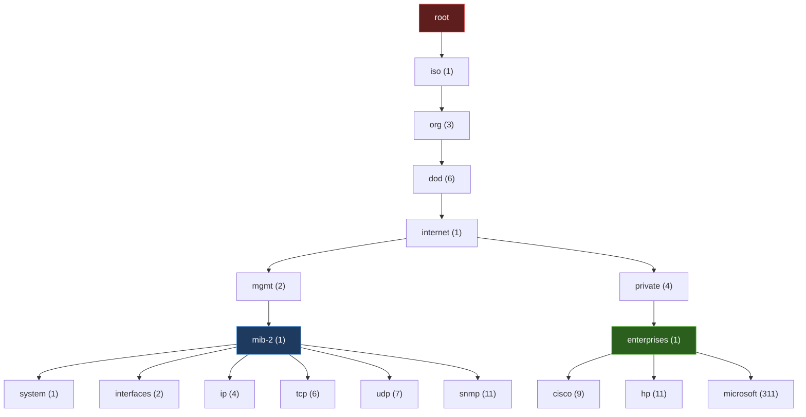

import { Aside } from '@astrojs/starlight/components';

## この節で学ぶこと

ネットワーク管理の必要性とSNMPの基本概念を理解します．
マネージャ/エージェントモデルとSNMPの通信パターンを学びます．
MIB（管理情報ベース）の構造とOIDの仕組みを理解します．
RMON（Remote Monitoring）の役割を把握します．
SNMPを活用した監視の実践例を学びます．

## ネットワーク管理の必要性

ネットワークが大規模化・複雑化するにつれ，ルーター，スイッチ，サーバ，プリンターなど多数の機器を効率的に監視・管理する必要が生じます．手動で個々の機器にログインして状態を確認するのは現実的ではありません．

ネットワーク管理に求められる機能:

- 障害管理: 障害の検知，通知，切り分け，復旧
- 構成管理: 機器の設定情報の収集と管理
- 性能管理: トラフィック量，CPU使用率，メモリ使用率などの監視
- セキュリティ管理: 不正アクセスの検知，アクセス制御
- 課金管理: ネットワーク利用量の記録

## 8.6.1 SNMP（Simple Network Management Protocol）

SNMP（Simple Network Management Protocol）は，ネットワーク機器の管理・監視のための標準プロトコルです．UDPを使用し，ポート161（エージェントへの問い合わせ）とポート162（Trap通知の受信）を使用します．

SNMPのバージョンの変遷:

| バージョン | 策定年 | 主な特徴 |
|:---|:---|:---|
| SNMPv1 | 1988年 | 基本的なGet/Set/Trap操作．コミュニティ名による簡易認証 |
| SNMPv2c | 1996年 | GetBulk追加でパフォーマンス向上．認証は変わらず |
| SNMPv3 | 2004年 | 認証と暗号化に対応．USM/VACMによるセキュリティ |

### マネージャ/エージェントモデル

SNMPは，マネージャとエージェントの2つの役割で構成されます．

- SNMPマネージャ（NMS）: 管理ステーション．エージェントに情報を問い合わせたり，設定を変更したりする
- SNMPエージェント: 管理対象機器上で動作し，マネージャからの要求に応答する．異常時にはTrapを自発的に送信する

### SNMP操作の種類

```mermaid
sequenceDiagram
    participant M as SNMPマネージャ
    participant A as SNMPエージェント

    rect rgb(30, 58, 95)
        Note over M,A: ポーリング（マネージャ主導）
        M->>A: GetRequest（特定OIDの値を取得）
        A->>M: GetResponse（値を返却）
    end

    rect rgb(42, 95, 30)
        Note over M,A: 一括取得
        M->>A: GetNextRequest（次のOIDの値を取得）
        A->>M: GetResponse（値を返却）
        M->>A: GetBulkRequest（複数OIDを一括取得）
        A->>M: GetResponse（複数の値を返却）
    end

    rect rgb(95, 30, 95)
        Note over M,A: 設定変更
        M->>A: SetRequest（OIDの値を変更）
        A->>M: GetResponse（変更結果）
    end

    rect rgb(95, 60, 30)
        Note over M,A: Trap（エージェント主導）
        Note over A: 異常検知！
        A->>M: Trap / InformRequest（異常を通知）
        Note right of M: アラート発報
    end
```

| 操作 | 方向 | 説明 |
|:---|:---|:---|
| GetRequest | マネージャ→エージェント | 指定したOIDの値を取得 |
| GetNextRequest | マネージャ→エージェント | 指定OIDの次のOIDの値を取得（テーブルの走査に利用） |
| GetBulkRequest | マネージャ→エージェント | 複数のOIDの値を一括取得（SNMPv2c以降） |
| SetRequest | マネージャ→エージェント | 指定したOIDの値を変更 |
| Trap | エージェント→マネージャ | 異常発生時にエージェントが自発的に通知 |
| InformRequest | エージェント→マネージャ | Trapの確認応答付きバージョン（SNMPv2c以降） |

## 8.6.2 MIB（Management Information Base）

MIB（Management Information Base）は，SNMPエージェントが管理する情報の集まりです．各情報はOID（Object Identifier）と呼ばれる階層的な数値で識別されます．

OIDの表記例:

- `1.3.6.1.2.1.1.1` → iso.org.dod.internet.mgmt.mib-2.system.sysDescr（システムの説明）
- `1.3.6.1.2.1.2.2.1.10` → ifInOctets（インタフェースの受信バイト数）

MIB-2の主要なグループ:

| グループ | OID | 内容 |
|:---|:---|:---|
| system | 1.3.6.1.2.1.1 | システム情報（名前，説明，稼働時間） |
| interfaces | 1.3.6.1.2.1.2 | ネットワークインタフェース情報 |
| ip | 1.3.6.1.2.1.4 | IP統計情報 |
| tcp | 1.3.6.1.2.1.6 | TCP統計情報 |
| udp | 1.3.6.1.2.1.7 | UDP統計情報 |
| snmp | 1.3.6.1.2.1.11 | SNMP統計情報 |

ベンダー固有の拡張MIBは `1.3.6.1.4.1.{企業ID}` の下に定義されます．

## 8.6.3 RMON（Remote Monitoring MIB）

RMON（Remote Monitoring MIB）は，ネットワークセグメントのトラフィックをリモートから監視するための拡張MIBです．

通常のSNMPでは各機器の個別情報のみを取得しますが，RMONでは「ネットワークセグメント全体」のトラフィック統計，エラー率，トップN通信ホストなどを収集できます．

RMONの主なグループ:

- statistics: セグメント全体の統計情報（パケット数，エラー数等）
- history: 統計情報の時系列記録
- alarm: しきい値に基づくアラーム設定
- host: ホストごとの通信統計
- hostTopN: 通信量上位のホストランキング
- matrix: ホストペア間の通信マトリクス
- filter: パケットフィルタリング条件
- capture: フィルタに一致したパケットのキャプチャ
- event: アラーム発生時のイベント処理

RMON2はOSI参照モデルの上位層（ネットワーク層〜アプリケーション層）の監視に対応しています．

## 8.6.4 SNMPを利用したアプリケーションの例

SNMPは実際のネットワーク管理で以下のように活用されます:

- ネットワーク監視ツール: Zabbix，Nagios，CactiなどがエージェントからSNMPで情報を収集し，グラフ表示やアラート発報を行う
- トラフィック分析: インタフェースの送受信バイト数を定期的にポーリングし，帯域使用率を監視する
- 障害検出: 機器のダウン，インタフェースのリンクダウンなどをTrapで即座に検知する
- 容量計画: CPU使用率，メモリ使用率のトレンドを分析し，将来の増設計画に活用する
- 構成管理: ネットワーク機器のファームウェアバージョンやシリアル番号をSNMPで収集し，資産管理を行う

<Aside type="tip" title="FDE実務での活用">
AIインフラの監視において，SNMPは伝統的なネットワーク機器の監視に引き続き使用されますが，GPUサーバやコンテナ環境の監視には，より現代的なObservability（可観測性）スタックが併用されます．具体的には，Prometheus + Grafanaによるメトリクス監視，OpenTelemetryによるトレーシングとログの統合管理が一般的です．GPU使用率の監視にはNVIDIA DCGM（Data Center GPU Manager）やnvidia-smi Exporterを使い，Prometheusでスクレイピングします．ネットワーク帯域の監視にはSNMP（ifInOctets/ifOutOctets）が依然として有用です．アラート設定にはAlertmanagerを使い，GPU温度の異常上昇やネットワーク帯域の逼迫を即座に通知できる体制を構築します．
</Aside>

## まとめ

- SNMPはネットワーク機器の監視・管理のための標準プロトコルで，UDPを使用する
- マネージャ/エージェントモデルで動作し，ポーリング（Get）とイベント通知（Trap）の2つの方式がある
- MIBは管理情報の階層構造で，各情報はOIDで一意に識別される
- SNMPv3でセキュリティ（認証・暗号化）が大幅に強化された
- RMONはネットワークセグメント全体のトラフィック監視を可能にする拡張MIB
- 現代のインフラ監視ではSNMPに加え，Prometheus/OpenTelemetry等のObservabilityスタックが併用される

## 理解度チェック

Q1: SNMPのポーリングとTrapの違いは何ですか？それぞれの利点は何ですか？

ポーリングは，マネージャが定期的にエージェントに問い合わせる方式です．マネージャ側で取得タイミングを制御でき，計画的なデータ収集に向いています．ただし，障害検知にポーリング間隔分の遅延が生じます．Trapは，エージェントが異常を検知したときに自発的にマネージャに通知する方式です．リアルタイムな障害検知が可能ですが，UDPのため通知が確実に届く保証がありません．実際の運用では両方を組み合わせて使用します．

Q2: OID「1.3.6.1.2.1.1.3」はMIBツリーのどこに位置しますか？

`1.3.6.1.2.1.1.3` は `iso.org.dod.internet.mgmt.mib-2.system.sysUpTime` に対応します．これはシステムの稼働時間（エージェントが最後に再初期化されてからの経過時間）を示すオブジェクトです．

Q3: SNMPv1/v2cとSNMPv3のセキュリティ面での最大の違いは何ですか？

SNMPv1/v2cではコミュニティ名（文字列）による簡易認証のみで，通信は暗号化されません．コミュニティ名が平文で送信されるため，盗聴されると容易に不正アクセスされます．SNMPv3ではUSM（User-based Security Model）による認証（MD5/SHA）と暗号化（DES/AES），VACM（View-based Access Control Model）によるアクセス制御が導入され，本格的なセキュリティが実現されました．

Q4: RMONが通常のSNMPポーリングと比べて有利な点は何ですか？

通常のSNMPポーリングでは個々の機器の情報しか取得できませんが，RMONではネットワークセグメント全体のトラフィック統計を収集できます．また，RMONプローブが機器上でローカルにデータを蓄積・分析するため，マネージャとエージェント間の通信トラフィックを削減でき，過去のデータ（history）やトップN分析もリモートから取得できます．

