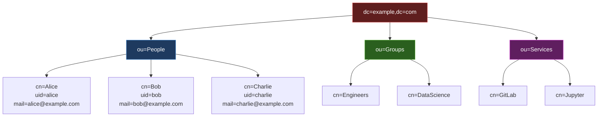
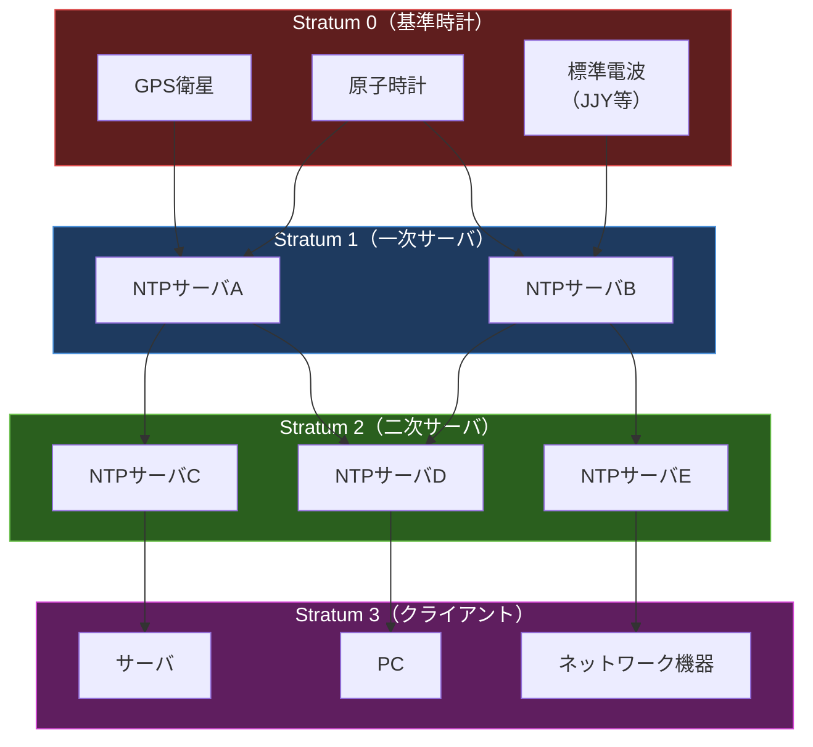

import { Aside } from '@astrojs/starlight/components';

## この節で学ぶこと

マルチメディア通信を実現するH.323，SIP，RTPの仕組みを理解します．
P2P（Peer to Peer）通信の特徴とアーキテクチャを学びます．
LDAP（Lightweight Directory Access Protocol）によるディレクトリサービスを理解します．
NTP（Network Time Protocol）による時刻同期の仕組みと重要性を学びます．
制御システムで使用されるプロトコル（OPC UA，MQTT等）の概要を把握します．

## 8.7.1 マルチメディア通信を実現する技術（H.323，SIP，RTP）

### VoIPとマルチメディア通信

VoIP（Voice over IP）は，IPネットワーク上で音声通話を行う技術です．従来の電話回線網（PSTN）を介さずに，インターネットやIP網で音声やビデオを伝送します．VoIPを実現するための主要なプロトコルとして，H.323とSIPがあります．

### H.323

H.323は，ITU-T（国際電気通信連合）が策定したマルチメディア通信のためのプロトコル群です．音声，映像，データの統合的な通信を可能にします．

H.323の構成要素:

- 端末: 音声/映像通信を行うクライアント
- ゲートキーパー: 呼制御，アドレス解決，帯域管理を行う
- ゲートウェイ: H.323ネットワークとPSTNなど他のネットワークを接続する
- MCU（Multipoint Control Unit）: 3者以上の多地点通信を制御する

### SIP（Session Initiation Protocol）

SIP（RFC 3261）は，IETFが策定したセッション制御プロトコルです．H.323に比べてシンプルで拡張性が高く，現在のVoIPやビデオ通話の主流となっています．

SIPの特徴:

- テキストベースのプロトコル（HTTPに類似した構文）
- URIベースのアドレス体系（sip:user@domain）
- プロキシサーバ，リダイレクトサーバ，レジストラサーバで構成
- UDP/TCPの両方で動作可能（ポート5060，TLSの場合は5061）

```mermaid
sequenceDiagram
    participant A as 発信者<br/>(Alice)
    participant PS as SIPプロキシ<br/>サーバ
    participant B as 着信者<br/>(Bob)

    A->>PS: INVITE sip:bob@example.com
    PS->>B: INVITE sip:bob@example.com
    B->>PS: 100 Trying
    PS->>A: 100 Trying
    B->>PS: 180 Ringing
    PS->>A: 180 Ringing

    Note over B: ユーザーが応答
    B->>PS: 200 OK（SDP: メディア情報）
    PS->>A: 200 OK（SDP: メディア情報）
    A->>PS: ACK
    PS->>B: ACK

    rect rgb(42, 95, 30)
        Note over A,B: RTPによる音声/映像データの直接通信
        A-->>B: RTPストリーム（音声/映像）
        B-->>A: RTPストリーム（音声/映像）
    end

    A->>PS: BYE
    PS->>B: BYE
    B->>PS: 200 OK
    PS->>A: 200 OK
```

### RTP（Real-time Transport Protocol）

RTP（RFC 3550）は，音声や映像などのリアルタイムデータを転送するためのプロトコルです．UDPの上で動作し，以下の機能を提供します:

- タイムスタンプ: 再生タイミングの制御
- シーケンス番号: パケット順序の管理（パケットロスの検出）
- ペイロードタイプ: コーデック（音声/映像の符号化方式）の識別
- RTCP: RTPの制御プロトコル．通信品質の監視とフィードバック

RTPはUDPを使用するため，パケットの再送は行いません．リアルタイム性を重視し，遅延パケットは破棄する設計です．

## 8.7.2 P2P（Peer To Peer）

P2P（Peer to Peer）は，ネットワーク上の各ノードがクライアントとサーバの両方の役割を果たす分散型の通信モデルです．

### P2Pのアーキテクチャ

- 純粋P2P（Pure P2P）: 中央サーバを持たない完全な分散型（例: 初期のGnutella）
- ハイブリッドP2P: インデックスサーバを持ち，ファイルの所在情報を管理する（例: 初期のNapster）
- 構造化P2P: DHT（Distributed Hash Table）を使って効率的にノードとデータを管理する（例: BitTorrent，Kademlia）

P2Pの利点:

- 中央サーバに依存しないため耐障害性が高い
- 参加ノードが増えるほど全体の処理能力・帯域が向上する（スケーラビリティ）
- サーバの運用コストが低い

P2Pの課題:

- 通信経路やコンテンツの管理が難しい
- 不正コンテンツの流通リスク
- NAT越えの問題
- ネットワークトラフィックの予測が困難

代表的なP2Pプロトコルとしては，BitTorrent（ファイル共有），WebRTC（ブラウザ間リアルタイム通信），Bitcoin/Ethereum（ブロックチェーン）などがあります．

## 8.7.3 LDAP（Lightweight Directory Access Protocol）

LDAP（Lightweight Directory Access Protocol，RFC 4511）は，ディレクトリサービスにアクセスするためのプロトコルです．TCPのポート389（暗号化なし）またはポート636（LDAPS，TLS暗号化）を使用します．

ディレクトリサービスとは，組織内のユーザー，グループ，デバイス，サービスなどの情報をツリー構造で管理するデータベースです．

LDAPの主要な概念:

- DN（Distinguished Name）: エントリを一意に識別する名前（例: `cn=Alice,ou=People,dc=example,dc=com`）
- エントリ: ディレクトリ内の1つのオブジェクト
- 属性: エントリが持つ情報（cn，uid，mail，memberOf等）
- オブジェクトクラス: エントリの種類を定義するスキーマ
- 検索フィルタ: `(&(objectClass=person)(department=Engineering))` のような条件式

LDAPの主な用途:

- ユーザー認証・認可の一元管理
- SSO（Single Sign-On）の認証基盤
- アドレス帳・組織図の管理
- メールサーバのアカウント管理

Active Directory（Microsoft）やOpenLDAPなどの実装があり，企業のIT基盤として広く使用されています．

## 8.7.4 NTP（Network Time Protocol）

NTP（Network Time Protocol，RFC 5905）は，ネットワーク上のコンピュータの時刻を正確に同期するためのプロトコルです．UDPのポート123を使用します．

### なぜ時刻同期が重要か

- ログの時刻が揃わないと障害の原因分析が困難
- 認証プロトコル（Kerberos等）は時刻差の許容範囲が厳しい
- 分散システムでのイベント順序の保証
- 金融取引やログ監査での法的要件
- TLS証明書の有効期間の検証

### Stratum構成

NTPは階層構造（Stratum）で時刻を配信します:

- Stratum 0: 基準時計（GPS衛星，原子時計，標準電波）
- Stratum 1: Stratum 0に直接接続されたNTPサーバ（一次サーバ）
- Stratum 2: Stratum 1から時刻を取得するNTPサーバ（二次サーバ）
- Stratum 3以降: さらに下位のサーバ/クライアント
- Stratum 15が最下位，Stratum 16は「同期していない」ことを示す

NTPの同期精度はLAN内で1ミリ秒以下，インターネット経由でも数十ミリ秒以内を実現します．

NTPの簡易版であるSNTP（Simple NTP）は，精度はNTPに劣りますが，実装がシンプルで組み込みデバイスなどで使用されます．

## 8.7.5 制御システムのプロトコル

産業用制御システム（ICS: Industrial Control Systems）やIoT（Internet of Things）の分野では，専用のアプリケーションプロトコルが使用されています．

### Modbus

Modbus（1979年策定）は，産業用機器間の通信で最も広く使用されるプロトコルの一つです．シンプルなマスター/スレーブ方式で，PLCやセンサーとの通信に使用されます．Modbus/TCPはTCPのポート502を使用します．

### OPC UA（Open Platform Communications Unified Architecture）

OPC UA（IEC 62541）は，産業用通信の標準プロトコルで，以下の特徴を持ちます:

- プラットフォーム非依存（Windows，Linux，組み込みOS）
- セキュリティ機能内蔵（認証，暗号化，署名）
- 情報モデルによるデータの意味（セマンティクス）の表現
- Pub/Sub通信モデルにも対応

### MQTT（Message Queuing Telemetry Transport）

MQTT（ISO/IEC 20922）は，軽量なPub/Sub型メッセージングプロトコルです．TCPのポート1883（暗号化なし）またはポート8883（TLS暗号化）を使用します．

MQTTの特徴:

- 極めて軽量（ヘッダが2バイトから）
- Pub/Sub（発行/購読）モデル
- QoS（Quality of Service）レベル: 0（最大1回），1（最低1回），2（正確に1回）
- ブローカー（仲介サーバ）を介してメッセージを配信
- IoTデバイスや帯域の限られた環境に最適

### CoAP（Constrained Application Protocol）

CoAP（RFC 7252）は，リソースが制約されたIoTデバイス向けのWebプロトコルです．UDPのポート5683を使用し，HTTPに似たREST風のインタフェースを提供しますが，より軽量に設計されています．

<Aside type="tip" title="FDE実務での活用">
FDEの実務では，これらのプロトコルがさまざまな場面で関係してきます．LDAPはActive DirectoryやOpenLDAPを通じたSSO認証基盤として，AIプラットフォームのアクセス管理に使用されます．SAML 2.0やOpenID Connectと連携し，JupyterHub，MLflow，Airflow等のツールへのシングルサインオンを実現します．NTPによる時刻同期は，分散学習のログ分析やモデルのバージョン管理で不可欠です．時刻がずれると，複数ノードのログを突き合わせた障害分析が正確にできなくなります．産業用AIにおいては，OPC UAやMQTTが工場の設備データをリアルタイムに収集し，AIモデルに入力するためのデータパイプラインとして使用されます．例えば，製造ラインの振動センサーのデータをMQTTで収集し，異常検知モデルに入力するといったユースケースが一般的です．
</Aside>

## まとめ

- SIPはVoIPの主流プロトコルで，セッションの確立・終了を制御し，実際の音声/映像データはRTPで転送される
- P2Pは中央サーバに依存しない分散型通信モデルで，スケーラビリティと耐障害性に優れる
- LDAPはディレクトリサービスのプロトコルで，ユーザー認証やSSO基盤として広く使用される
- NTPは階層的なStratum構成で時刻同期を行い，分散システムやセキュリティにおいて不可欠
- 産業用制御の分野では，OPC UA，MQTT，CoAP等の専用プロトコルが使用される

## 理解度チェック

Q1: SIPにおいて，音声/映像データの転送にSIPではなくRTPが使用される理由は何ですか？

SIPはセッション（通話）の確立，変更，終了を制御するシグナリングプロトコルであり，データ転送の機能は持っていません．音声/映像データはリアルタイム性が求められるため，UDPベースのRTPで転送されます．RTPはタイムスタンプやシーケンス番号を持ち，リアルタイムデータの再生制御に特化しています．

Q2: LDAPのDN「cn=Alice,ou=People,dc=example,dc=com」の各要素の意味を説明してください．

`cn=Alice` はCommon Name（一般名）で，エントリの名前です．`ou=People` はOrganizational Unit（組織単位）で，ユーザーが所属するグループを示します．`dc=example,dc=com` はDomain Component（ドメイン構成要素）で，ディレクトリのルートドメインを示します．DNは葉（エントリ）から根（ドメイン）に向かって記述されます．

Q3: NTPのStratum構成で，なぜ階層構造が必要なのですか？

すべてのクライアントがStratum 1サーバに直接問い合わせると，一次サーバに負荷が集中して処理しきれなくなります．階層構造にすることで，Stratum 2，Stratum 3のサーバがキャッシュ的に時刻情報を配布し，負荷を分散します．また，複数の上位サーバを参照して相互検証を行うことで，信頼性と精度を向上させています．

Q4: MQTTが IoTデバイスに適している理由を3つ挙げてください．

（1）プロトコルのヘッダが最小2バイトと極めて軽量で，処理能力の低いデバイスでも実装できる．（2）Pub/Subモデルにより，デバイスは特定のトピックにメッセージを発行するだけでよく，受信側の管理が不要．（3）QoSレベルを選択でき，ネットワークの信頼性が低い環境でもメッセージの確実な配信を保証できる．

Q5: P2Pモデルとクライアント/サーバモデルを比較し，P2Pの利点と課題をそれぞれ2つ挙げてください．

利点:（1）中央サーバがないため単一障害点が存在せず，耐障害性が高い．（2）参加ノードが増えるほど全体の処理能力と帯域が向上し，スケーラビリティに優れる．
課題:（1）通信経路やコンテンツの管理が難しく，不正コンテンツの流通を防ぎにくい．（2）NATやファイアウォール越えの問題があり，すべてのノードが直接通信できるとは限らない．

