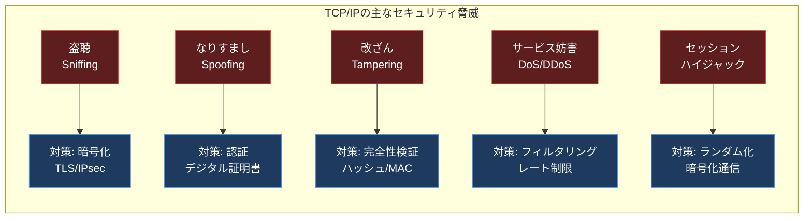
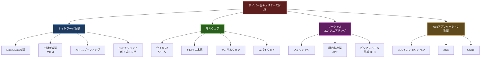
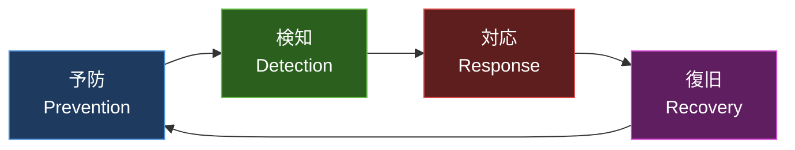

import { Aside } from '@astrojs/starlight/components';

## この節で学ぶこと

TCP/IPプロトコルが本来持つセキュリティ上の脆弱性と，それに対する基本的な考え方を学びます．
サイバーセキュリティにおける主な脅威の種類と分類を理解し，ネットワークを安全に運用するための基礎知識を身につけます．

## 9.1.1 TCP/IPとセキュリティ

TCP/IPは1970年代に設計されたプロトコルスイートであり，当初は信頼できるネットワーク環境での利用を前提としていました．そのため，セキュリティに関する機能はプロトコル設計に組み込まれていませんでした．

TCP/IPプロトコルには以下のような本質的なセキュリティ上の問題があります:

- 盗聴（Sniffing）: パケットは平文で送信されるため，通信経路上で容易に傍受できる
- なりすまし（Spoofing）: IPアドレスやMACアドレスを偽装して，別のホストになりすますことが可能
- 改ざん（Tampering）: 通信途中でパケットの内容を書き換えることができる
- サービス妨害（DoS）: 大量のパケットを送りつけてサービスを停止させる攻撃が可能
- セッションハイジャック: TCP接続のシーケンス番号を推測し，確立済みのセッションを乗っ取る

インターネットが商用化された1990年代以降，TCP/IPの脆弱性を悪用した攻撃が急増しました．これを受けて，IPsec，TLS/SSL，SSHなど，セキュリティを強化するプロトコルが次々と開発されました．

現在のネットワークセキュリティは，TCP/IPの弱点を補う追加のプロトコルやメカニズムを「後付け」で実装するアプローチが主流です．この「多層防御」の考え方は，ネットワーク層だけでなく，アプリケーション層までの各層でセキュリティ対策を施すことを意味します．

### セキュリティの3要素（CIA）

ネットワークセキュリティにおいて保護すべき3つの要素があります:

- 機密性（Confidentiality）: 許可されたユーザーだけが情報にアクセスできること
- 完全性（Integrity）: 情報が改ざんされていないことを保証すること
- 可用性（Availability）: 必要なときに情報やサービスを利用できること

これらは頭文字をとって「CIA」と呼ばれ，セキュリティ対策の基本方針を決定する際の指針となります．

## 9.1.2 サイバーセキュリティ

サイバーセキュリティとは，コンピュータシステム，ネットワーク，データを不正アクセスや攻撃から保護するための技術・プロセス・対策の総称です．

サイバー攻撃は年々高度化・組織化しており，その脅威は個人から企業，国家にまで及んでいます．以下に主なサイバーセキュリティの脅威を分類します．

### 主なサイバー攻撃の手法

ネットワーク層への攻撃として，DoS/DDoS攻撃はサーバーやネットワーク機器に大量のトラフィックを送りつけてサービスを停止させます．SYN Flood攻撃はTCPの3ウェイハンドシェイクを悪用し，大量のSYNパケットを送信して接続テーブルを枯渇させます．

中間者攻撃（MITM: Man-In-The-Middle）は，通信経路上に攻撃者が割り込み，通信内容の盗聴や改ざんを行います．ARPスプーフィングやDNSキャッシュポイズニングは，この中間者攻撃を実現するための具体的な手法です．

マルウェアの脅威も深刻です．ランサムウェアはファイルを暗号化して身代金を要求し，企業活動に甚大な被害を与えます．標的型攻撃（APT: Advanced Persistent Threat）は特定の組織を狙い，長期間にわたって潜伏しながら情報を窃取する高度な攻撃です．

### セキュリティ対策のアプローチ

セキュリティ対策は「予防」「検知」「対応」「復旧」の4段階で考えます:

- 予防（Prevention）: ファイアウォール，暗号化，アクセス制御により脅威を未然に防ぐ
- 検知（Detection）: IDS/IPS，ログ監視により攻撃を早期に発見する
- 対応（Response）: インシデント発生時に被害を最小化するための手順を整備する
- 復旧（Recovery）: システムを正常な状態に戻し，再発防止策を講じる

この4段階のサイクルを継続的に回すことが，効果的なセキュリティ運用の鍵です．

<Aside type="tip" title="FDE実務での活用">
AIサービスのデプロイにおいてセキュリティは最重要課題です．LLM APIへのリクエストには機密データが含まれることが多く，通信の暗号化は必須です．また，AIモデルを提供するエンドポイントが攻撃されると，サービス全体が停止するリスクがあります．FDEとして顧客のセキュリティポリシーを理解し，ネットワーク層からアプリケーション層まで一貫したセキュリティ対策を提案できることが求められます．特にプロンプトインジェクションのようなAI固有の脅威にも注意が必要で，これはSQLインジェクションなどの従来のWebアプリケーション攻撃と本質的に似た構造を持っています．
</Aside>

## まとめ

- TCP/IPは設計当初にセキュリティが考慮されておらず，盗聴・なりすまし・改ざん・DoSなどの脅威が存在する
- セキュリティの3要素（CIA）は機密性・完全性・可用性であり，これらを総合的に保護することが重要
- サイバー攻撃はネットワーク攻撃・マルウェア・ソーシャルエンジニアリング・Webアプリケーション攻撃に分類される
- セキュリティ対策は予防・検知・対応・復旧の4段階サイクルで運用する
- 現在のネットワークセキュリティはTCP/IPの弱点を補う多層防御アプローチが主流

## 理解度チェック

Q1: TCP/IPプロトコルが本質的に持つセキュリティ上の問題を3つ挙げてください．

1. 盗聴（Sniffing）: パケットが平文で送信されるため，通信経路上で傍受可能
2. なりすまし（Spoofing）: IPアドレスやMACアドレスを偽装できる
3. 改ざん（Tampering）: 通信途中でパケット内容を書き換え可能

その他にも，DoS攻撃やセッションハイジャックなどがあります．

Q2: セキュリティの3要素（CIA）とは何ですか？それぞれの意味を説明してください．

- 機密性（Confidentiality）: 許可されたユーザーだけが情報にアクセスできること
- 完全性（Integrity）: 情報が改ざんされていないことを保証すること
- 可用性（Availability）: 必要なときに情報やサービスを利用できること

この3つの要素をバランスよく保護することが，セキュリティ対策の基本方針です．

Q3: SYN Flood攻撃はTCPのどのような仕組みを悪用していますか？

SYN Flood攻撃は，TCPの3ウェイハンドシェイクを悪用しています．攻撃者は大量のSYNパケットを送信しますが，サーバーからのSYN+ACKに対してACKを返しません．サーバーはハーフオープン状態のコネクションを保持し続け，接続テーブルが枯渇して正常なクライアントからの接続を受け付けられなくなります．

Q4: セキュリティ対策の4段階サイクルを順番に説明してください．

1. 予防（Prevention）: ファイアウォール，暗号化，アクセス制御で脅威を未然に防ぐ
2. 検知（Detection）: IDS/IPS，ログ監視で攻撃を早期に発見する
3. 対応（Response）: インシデント発生時に被害を最小化する手順を実行する
4. 復旧（Recovery）: システムを正常な状態に戻し，再発防止策を講じる

このサイクルを継続的に回すことで，セキュリティレベルを向上させます．

