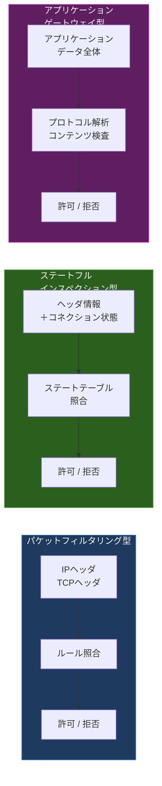
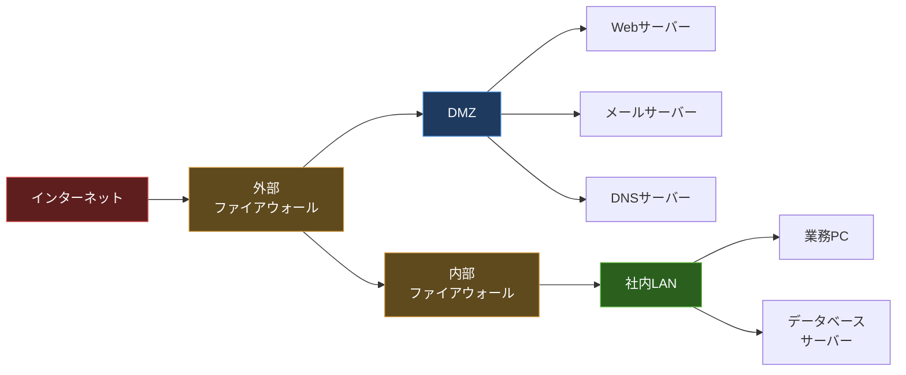
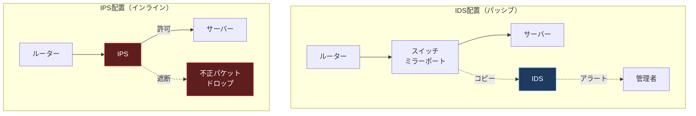

import { Aside } from '@astrojs/starlight/components';

## この節で学ぶこと

ネットワークセキュリティを構成する主要な技術要素を学びます．
ファイアウォール，IDS/IPS，アンチウイルス，コンテンツセキュリティの役割と仕組みを理解し，これらがどのように連携してネットワークを防御するかを把握します．

## 9.2.1 ファイアウォール

ファイアウォールは，ネットワーク間の境界に設置され，通過するパケットを検査し，事前に定義されたルール（ポリシー）に基づいてパケットの通過を許可または拒否するセキュリティ装置です．

ファイアウォールには主に以下の方式があります:

### パケットフィルタリング型

パケットのヘッダ情報（送信元/宛先IPアドレス，送信元/宛先ポート番号，プロトコル番号）を検査し，ルールに一致するパケットを許可または拒否します．OSI参照モデルのネットワーク層からトランスポート層までの情報で判断します．

- 処理が高速でネットワーク性能への影響が少ない
- ルールの設定がシンプル
- パケットの内容（ペイロード）は検査しないため，アプリケーション層の攻撃は検知できない

### ステートフルインスペクション型

パケットフィルタリングに加え，TCP/UDPのコネクション状態を追跡（ステートテーブルで管理）します．確立済みのコネクションに属するパケットかどうかを判断するため，より精密な制御が可能です．

### アプリケーションゲートウェイ型（プロキシ型）

アプリケーション層のプロトコル（HTTP，FTP，SMTPなど）の内容を解析し，フィルタリングを行います．内部ネットワークと外部ネットワークの間でプロキシとして動作します．

- アプリケーション層の内容を検査できるため，高い安全性
- 内部ネットワークの構造を外部から隠蔽できる
- 処理負荷が大きく，対応プロトコルが限定される

### DMZ（DeMilitarized Zone）

DMZ（非武装地帯）は，外部ネットワーク（インターネット）と内部ネットワーク（社内LAN）の間に設けられたセグメントです．Webサーバー，メールサーバー，DNSサーバーなど，外部からアクセスが必要なサーバーをDMZに配置します．

DMZを構成することで，外部に公開するサーバーが攻撃を受けた場合でも，内部ネットワークへの直接的な侵入を防ぐことができます．

## 9.2.2 IDS/IPS（侵入検知システム/侵入防止システム）

### IDS（Intrusion Detection System: 侵入検知システム）

IDSはネットワークトラフィックやシステムの動作を監視し，不正なアクティビティや攻撃の兆候を検知するシステムです．検知した場合は管理者に通知（アラート）しますが，パケットの遮断は行いません．

IDSの検知方式には以下があります:

- シグネチャ型（Signature-based）: 既知の攻撃パターン（シグネチャ）とトラフィックを照合して検知する方式．高い精度で既知の攻撃を検知できるが，未知の攻撃には対応できない
- アノマリ型（Anomaly-based）: 正常なトラフィックパターンからの逸脱を検知する方式．未知の攻撃も検知できる可能性があるが，誤検知（フォールスポジティブ）が発生しやすい

### IPS（Intrusion Prevention System: 侵入防止システム）

IPSはIDSの機能に加え，検知した不正なパケットを自動的に遮断する機能を持ちます．ネットワークのインラインに設置され，リアルタイムで攻撃を防御します．

- IDSはネットワークのミラーポートなどに接続し，トラフィックのコピーを検査（パッシブ）
- IPSはネットワーク経路上にインラインで設置され，パケットを直接検査・遮断（アクティブ）

## 9.2.3 アンチウイルス／パーソナルファイアウォール

### アンチウイルスソフトウェア

アンチウイルスソフトウェアは，コンピュータをマルウェア（ウイルス，ワーム，トロイの木馬，ランサムウェアなど）から保護するためのソフトウェアです．

主な検知手法は以下のとおりです:

- パターンマッチング: マルウェアのシグネチャ（特徴的なバイト列）をデータベースと照合する方式
- ヒューリスティック分析: プログラムの動作パターンを解析し，未知のマルウェアも検知する方式
- サンドボックス分析: 隔離された仮想環境でプログラムを実行し，不正な動作を検出する方式
- 機械学習ベース: 大量のマルウェア/正常プログラムのサンプルから学習したモデルで判定する方式

### パーソナルファイアウォール

パーソナルファイアウォールは，個々のコンピュータにインストールされるソフトウェアベースのファイアウォールです．ネットワーク境界のファイアウォールとは異なり，エンドポイントレベルで通信を制御します．

- アプリケーション単位で通信の許可/拒否を設定できる
- インバウンド（外部からの着信）とアウトバウンド（内部からの送信）の両方を制御
- ネットワークファイアウォールを通過した攻撃に対する最終防衛線として機能

## 9.2.4 コンテンツセキュリティ（E-mail，Web）

### メールセキュリティ

電子メールはサイバー攻撃の主要な侵入経路です．メールセキュリティ対策には以下があります:

- スパムフィルタ: 不要な広告メールや詐欺メールを自動的にフィルタリング
- アンチウイルススキャン: 添付ファイルのマルウェア検査
- SPF/DKIM/DMARC: 送信元ドメインの認証により，なりすましメールを検知
- サンドボックス: 添付ファイルを仮想環境で実行し，不正な動作を検出

### Webセキュリティ

Web通信に対するセキュリティ対策として以下の技術が使われます:

- URLフィルタリング: 悪意のあるWebサイトへのアクセスを遮断
- Webアプリケーションファイアウォール（WAF）: SQLインジェクション，XSSなどのWebアプリケーション攻撃を検知・遮断
- プロキシサーバー: Web通信を中継し，コンテンツの検査やキャッシュを行う
- SSL/TLSインスペクション: 暗号化されたHTTPS通信の内容を復号して検査

<Aside type="tip" title="FDE実務での活用">
クラウド環境でAIサービスをデプロイする際，セキュリティグループとネットワークACL（Access Control List）の設定は必須です．AWS/GCPなどのクラウドプラットフォームでは，ファイアウォールの概念がセキュリティグループとして仮想化されています．AIサービスのAPIエンドポイントに対しては，必要最小限のポート（通常443/tcp）だけを開放し，送信元IPを制限します．また，プロンプトインジェクション対策はWAFのSQLインジェクション対策と構造的に類似しており，入力値のバリデーションとサニタイズが共通の防御策となります．
</Aside>

## まとめ

- ファイアウォールはパケットフィルタリング型，ステートフルインスペクション型，アプリケーションゲートウェイ型の3方式がある
- DMZは外部公開サーバーを配置し，内部ネットワークを保護するためのセグメントである
- IDSはトラフィックの監視と攻撃の検知を行い，IPSは検知に加えて自動遮断を行う
- アンチウイルスはパターンマッチング，ヒューリスティック分析，サンドボックスなどでマルウェアを検知する
- コンテンツセキュリティはメールとWebの両方で多層的な防御策を実装する

## 理解度チェック

Q1: パケットフィルタリング型とアプリケーションゲートウェイ型ファイアウォールの違いを説明してください．

パケットフィルタリング型はIPヘッダやTCPヘッダの情報（IPアドレス，ポート番号，プロトコル番号）のみを検査します．処理が高速ですが，パケットの内容は検査しません．

アプリケーションゲートウェイ型はアプリケーション層のプロトコル内容を解析してフィルタリングします．高い安全性を提供しますが，処理負荷が大きく，対応プロトコルが限定されます．

Q2: IDSとIPSの主な違いは何ですか？

IDSは不正なアクティビティを検知して管理者にアラートを送信しますが，パケットの遮断は行いません（パッシブ）．IPSは検知に加えて，不正なパケットを自動的に遮断する機能を持ちます（アクティブ）．IDSはミラーポートに接続されますが，IPSはネットワーク経路上にインラインで設置されます．

Q3: DMZ（非武装地帯）を設ける目的と，そこに配置するサーバーの例を挙げてください．

DMZは外部ネットワーク（インターネット）と内部ネットワーク（社内LAN）の間に設けられるセグメントで，外部からのアクセスが必要なサーバーが攻撃を受けても内部ネットワークへの直接的な侵入を防ぐことが目的です．DMZに配置するサーバーの例として，Webサーバー，メールサーバー，DNSサーバーなどがあります．

Q4: SPF，DKIM，DMARCはそれぞれどのようなメールセキュリティ技術ですか？

- SPF（Sender Policy Framework）: ドメインの管理者が，そのドメインからメールを送信できるサーバーのIPアドレスをDNSに登録し，受信側が送信元の正当性を検証する仕組み
- DKIM（DomainKeys Identified Mail）: 送信メールにデジタル署名を付与し，受信側がDNSに公開された公開鍵で署名を検証することでメールの改ざんとなりすましを検知する仕組み
- DMARC（Domain-based Message Authentication, Reporting and Conformance）: SPFとDKIMの検証結果に基づき，認証に失敗したメールの処理ポリシー（拒否，隔離，何もしない）をドメイン管理者が指定する仕組み

