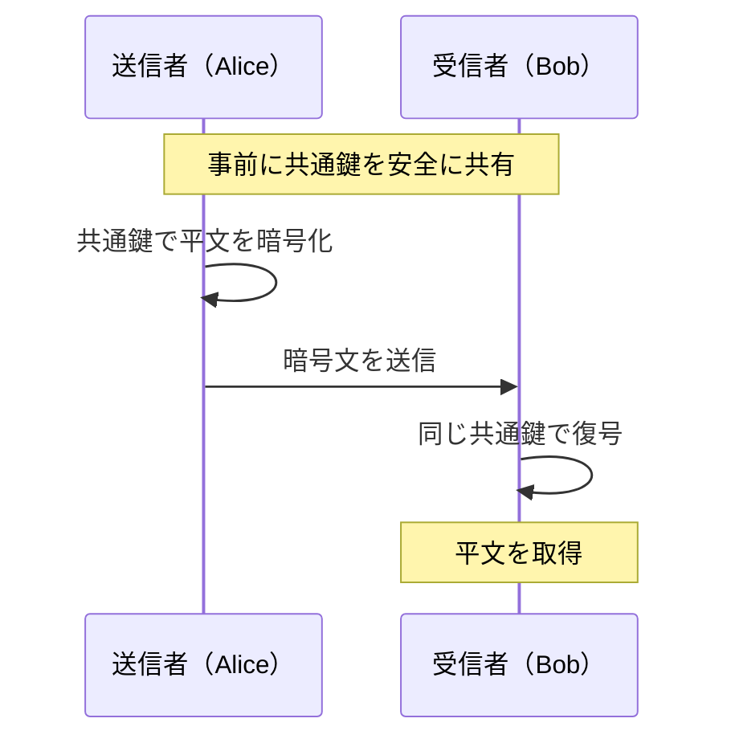
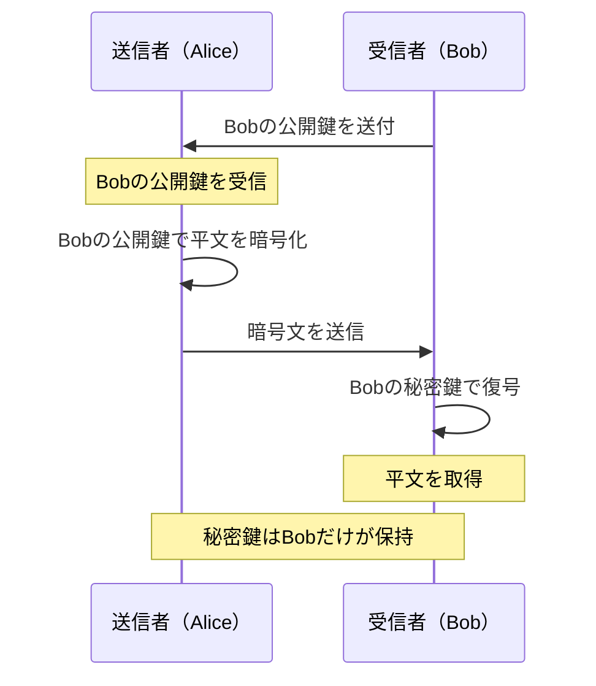
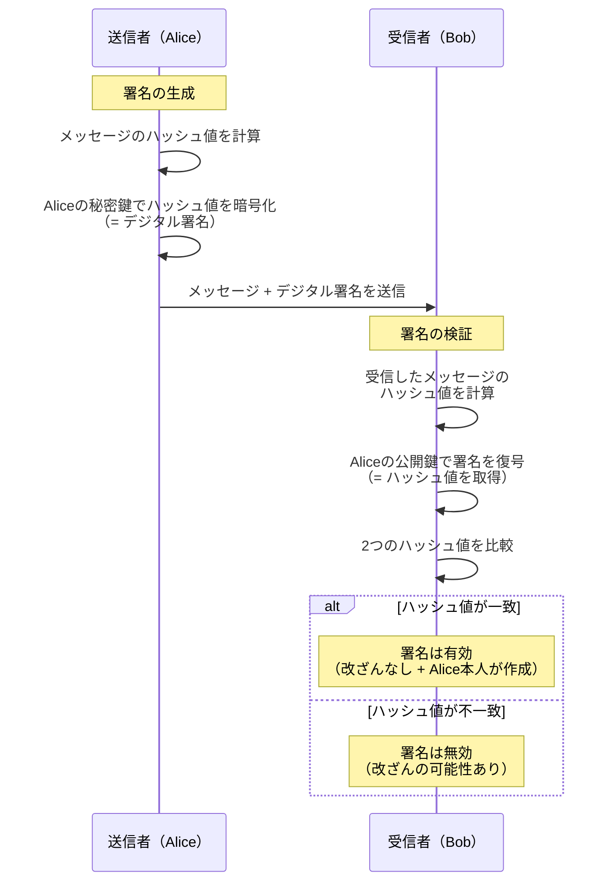
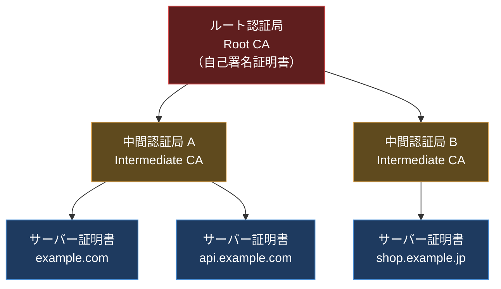

import { Aside } from '@astrojs/starlight/components';

## この節で学ぶこと

ネットワーク通信を保護するための暗号化技術の基礎を学びます．
共通鍵暗号方式と公開鍵暗号方式の仕組みと使い分け，デジタル署名，認証局（CA）による証明書の仕組みを理解します．

## 9.3.1 共通鍵暗号方式と公開鍵暗号方式

暗号化とは，平文（元のデータ）を暗号文（第三者が読めないデータ）に変換することです．暗号化されたデータを元の平文に戻すことを復号と呼びます．

### 共通鍵暗号方式（対称鍵暗号）

共通鍵暗号方式は，暗号化と復号に同じ鍵（共通鍵，秘密鍵）を使用する方式です．



代表的な共通鍵暗号アルゴリズムには以下があります:

- DES（Data Encryption Standard）: 56ビットの鍵長で，現在は安全とはみなされていない
- 3DES（Triple DES）: DESを3回適用することで安全性を向上させた方式
- AES（Advanced Encryption Standard）: 128/192/256ビットの鍵長を持ち，現在最も広く使われている共通鍵暗号
- ChaCha20: Googleが推進する高速なストリーム暗号．モバイル環境で広く利用

共通鍵暗号方式の特徴は以下のとおりです:

- 処理速度が速い（公開鍵暗号に比べて100〜1000倍高速）
- 鍵の配送問題: 通信相手と事前に安全な方法で鍵を共有する必要がある
- 通信相手の数だけ鍵が必要: N人のユーザー間では N(N-1)/2 個の鍵が必要

### 公開鍵暗号方式（非対称鍵暗号）

公開鍵暗号方式は，暗号化と復号に異なる鍵のペア（公開鍵と秘密鍵）を使用する方式です．公開鍵は誰にでも公開でき，秘密鍵は所有者だけが保持します．



代表的な公開鍵暗号アルゴリズムには以下があります:

- RSA: 大きな数の素因数分解の困難性に基づく方式．最も広く使われている
- 楕円曲線暗号（ECC）: 楕円曲線上の離散対数問題に基づく方式．RSAと同等の安全性をより短い鍵長で実現
- Diffie-Hellman鍵共有: 安全でない通信路上で共通の秘密鍵を生成するプロトコル

公開鍵暗号方式の特徴は以下のとおりです:

- 鍵の配送問題を解決: 公開鍵は誰に知られても安全
- 鍵の数が少ない: N人のユーザーでも 2N 個の鍵で済む
- 処理速度が遅い: 共通鍵暗号に比べて計算コストが高い

### ハイブリッド暗号方式

実際の通信では，共通鍵暗号と公開鍵暗号を組み合わせた「ハイブリッド暗号方式」が広く使われています．TLS/SSLがその代表例です．

1. 公開鍵暗号を使って共通鍵（セッション鍵）を安全に交換
2. 以降のデータ通信は高速な共通鍵暗号で暗号化

これにより，公開鍵暗号の鍵配送の利点と，共通鍵暗号の高速性を両立させています．

## 9.3.2 認証技術

### ハッシュ関数

ハッシュ関数は，任意の長さのデータから固定長のハッシュ値（メッセージダイジェスト）を生成する一方向関数です．以下の特性を持ちます:

- 一方向性: ハッシュ値から元のデータを復元することは計算上困難
- 衝突耐性: 異なるデータから同じハッシュ値が生成される確率が極めて低い
- 雪崩効果: 入力データのわずかな変更でハッシュ値が大きく変化する

代表的なハッシュアルゴリズムには SHA-256，SHA-3，MD5（現在は非推奨）などがあります．

### メッセージ認証コード（MAC）

MAC（Message Authentication Code）は，共通鍵とハッシュ関数を組み合わせてデータの完全性と送信者の認証を提供する仕組みです．HMAC（Hash-based MAC）が広く使われています．

### デジタル署名

デジタル署名は，公開鍵暗号の仕組みを利用して，データの完全性と送信者の認証（否認防止を含む）を実現する技術です．



デジタル署名は以下の3つを保証します:

- 完全性: メッセージが改ざんされていないこと
- 認証: 署名者が秘密鍵の所有者であること
- 否認防止: 署名者が後から「署名していない」と否定できないこと

### 認証局（CA）とデジタル証明書

公開鍵暗号の問題点は，公開鍵が本当にその人のものかどうかを確認できないことです（中間者攻撃のリスク）．この問題を解決するのが認証局（CA: Certificate Authority）とデジタル証明書です．

デジタル証明書（X.509証明書）には以下の情報が含まれます:

- 証明書の所有者の情報（ドメイン名，組織名など）
- 所有者の公開鍵
- 認証局の署名
- 有効期間
- シリアル番号

認証局は階層構造になっており，ルートCAから中間CAを経て，エンドエンティティ（サーバーなど）の証明書に至る「証明書チェーン」を構成します．



ブラウザやOSには信頼されたルートCAの証明書が事前にインストールされており，これを基点として証明書チェーンを検証することで，サーバー証明書の信頼性を判断します．

<Aside type="tip" title="FDE実務での活用">
AI APIとの通信はすべてTLSで暗号化されますが，証明書管理の不備はセキュリティインシデントの原因となります．FDEとしてよく遭遇するトラブルとして，証明書の期限切れ，中間証明書の未設定，自己署名証明書の検証エラーがあります．API GatewayやLoad Balancerでの証明書設定，Let's Encryptによる自動更新の仕組みを理解しておくことは実務上非常に重要です．また，mTLS（相互TLS認証）によるサービス間通信の保護も，マイクロサービスアーキテクチャでは標準的な手法です．
</Aside>

### TLS証明書エラーのトラブルシューティング

証明書関連のエラーが発生した場合，`openssl s_client` コマンドで詳細を確認できます:

```bash
# サーバーの証明書チェーンを確認
openssl s_client -connect example.com:443 -showcerts

# 証明書の有効期限を確認
openssl s_client -connect example.com:443 2>/dev/null | openssl x509 -noout -dates

# 証明書の詳細情報を表示
openssl s_client -connect example.com:443 2>/dev/null | openssl x509 -noout -text
```

よくあるTLS証明書エラーと対処法:

- `certificate has expired`: 証明書の有効期限が切れている → 証明書を更新する
- `unable to get local issuer certificate`: 中間証明書が不足している → 中間証明書をサーバーに設定する
- `self signed certificate`: 自己署名証明書を使用している → 正規のCAから証明書を取得するか，信頼ストアに追加する
- `certificate verify failed`: 証明書チェーンの検証に失敗 → 証明書チェーンが正しいか確認する

## まとめ

- 共通鍵暗号は高速だが鍵の配送問題があり，公開鍵暗号は鍵配送を解決するが処理速度が遅い
- ハイブリッド暗号方式は両方の利点を組み合わせた実用的な方式である
- ハッシュ関数はデータの完全性検証に使用され，SHA-256が現在の標準である
- デジタル署名は完全性・認証・否認防止の3つを保証する
- 認証局（CA）とデジタル証明書は公開鍵の信頼性を保証する仕組みであり，証明書チェーンで階層的に管理される

## 理解度チェック

<details>
<summary>Q1: 共通鍵暗号方式と公開鍵暗号方式の長所と短所をそれぞれ説明してください．</summary>

共通鍵暗号方式:
- 長所: 処理速度が速い（公開鍵暗号の100〜1000倍）
- 短所: 通信相手と事前に安全な方法で鍵を共有する必要がある（鍵の配送問題），N人のユーザー間で N(N-1)/2 個の鍵が必要

公開鍵暗号方式:
- 長所: 公開鍵は誰に知られても安全なため鍵配送問題がない，N人のユーザーでも 2N 個の鍵で済む
- 短所: 処理速度が遅い（計算コストが高い）
</details>

<details>
<summary>Q2: ハイブリッド暗号方式はなぜ広く使われているのですか？</summary>

ハイブリッド暗号方式は，公開鍵暗号の「鍵配送が安全」という利点と，共通鍵暗号の「処理が高速」という利点を組み合わせた方式です．まず公開鍵暗号を使って共通鍵（セッション鍵）を安全に交換し，以降の通信は高速な共通鍵暗号で暗号化します．TLS/SSLがこの方式の代表例です．
</details>

<details>
<summary>Q3: デジタル署名が保証する3つの要素は何ですか？</summary>

1. 完全性（Integrity）: メッセージが送信後に改ざんされていないこと
2. 認証（Authentication）: 署名者が秘密鍵の正当な所有者であること
3. 否認防止（Non-repudiation）: 署名者が後から「署名していない」と否定できないこと
</details>

<details>
<summary>Q4: 証明書チェーンとは何ですか？なぜ階層構造が必要なのですか？</summary>

証明書チェーンとは，ルートCAから中間CA，エンドエンティティ証明書に至る信頼の連鎖です．ルートCAが中間CAの証明書に署名し，中間CAがサーバー証明書に署名することで，ルートCAを信頼するだけでチェーン上のすべての証明書を検証できます．階層構造が必要な理由は，ルートCAの秘密鍵を保護するため（直接署名の頻度を減らす）と，証明書管理を委任することで大規模な証明書発行に対応するためです．
</details>

<details>
<summary>Q5: openssl s_clientコマンドでTLS証明書の有効期限を確認するにはどうしますか？</summary>

以下のコマンドで確認できます:

```bash
openssl s_client -connect example.com:443 2>/dev/null | openssl x509 -noout -dates
```

`notBefore`（有効開始日）と`notAfter`（有効終了日）が表示されます．
</details>
