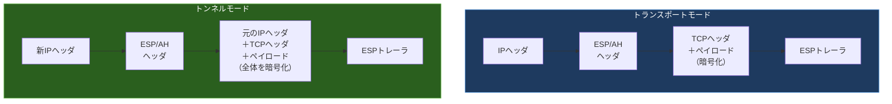
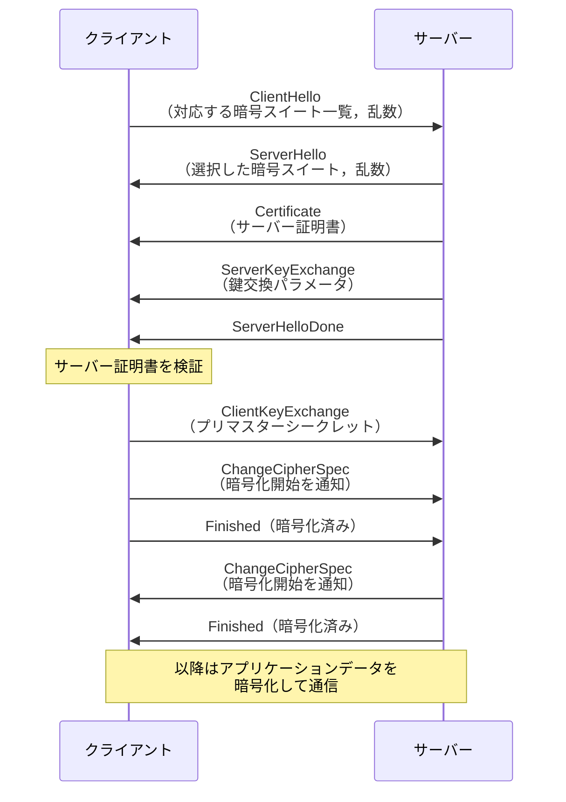
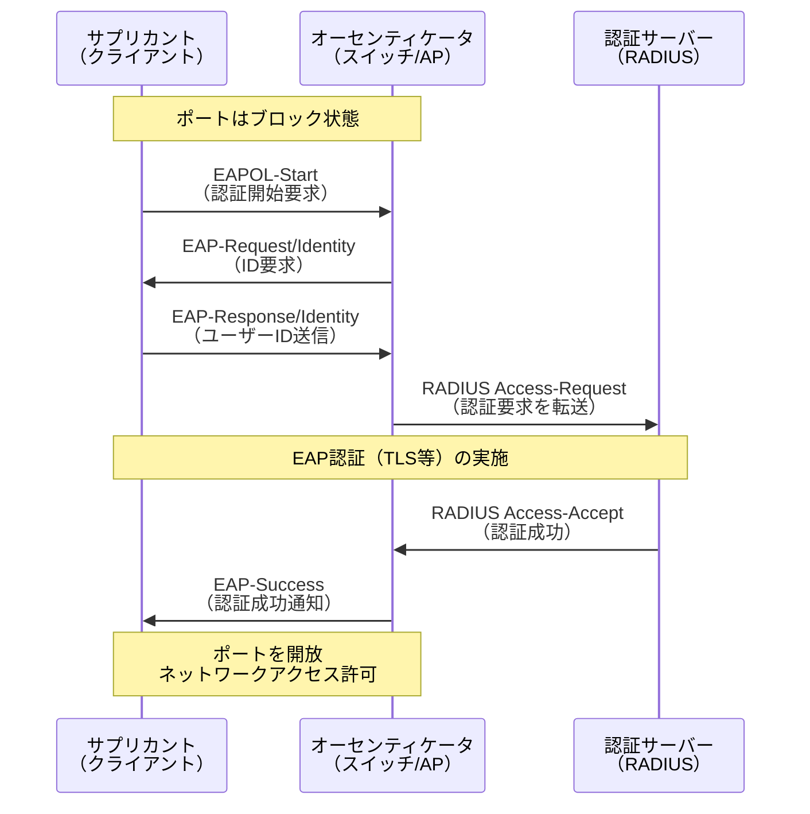

import { Aside } from '@astrojs/starlight/components';

## この節で学ぶこと

ネットワーク通信を保護するための主要なセキュリティプロトコルを学びます．
IPsecによるVPN，TLS/SSLによるHTTPS，IEEE802.1Xによるネットワークアクセス制御の仕組みと，それぞれの適用場面を理解します．

## 9.4.1 IPsecとVPN

### IPsec（Internet Protocol Security）

IPsecは，IP層（ネットワーク層）でパケットの暗号化・認証・完全性検証を行うプロトコルスイートです．IPv6では標準で組み込まれており，IPv4ではオプションとして利用できます．

IPsecは以下の2つのプロトコルで構成されます:

- AH（Authentication Header）: パケットの認証と完全性を提供するが，暗号化は行わない．IPヘッダを含むパケット全体の改ざんを検知できる
- ESP（Encapsulating Security Payload）: パケットの暗号化，認証，完全性を提供する．実際にはESPが主に使用される

### IPsecの動作モード

IPsecには2つの動作モードがあります:

- トランスポートモード: IPヘッダはそのまま残し，ペイロード部分のみを暗号化する．ホスト間の通信を保護する場合に使用
- トンネルモード: 元のIPパケット全体を暗号化し，新しいIPヘッダを付与する．VPNゲートウェイ間の通信で使用

### IKE（Internet Key Exchange）

IPsecの暗号化に必要な鍵の交換は，IKE（Internet Key Exchange）プロトコルで行います．IKEはDiffie-Hellman鍵共有をベースに，SA（Security Association）と呼ばれるセキュリティパラメータ（暗号アルゴリズム，鍵，有効期間など）のネゴシエーションを行います．

### VPN（Virtual Private Network）

VPNは，インターネットなどの公共ネットワーク上に，暗号化されたトンネルを構築して仮想的なプライベートネットワークを実現する技術です．

VPNの主な種類:

- IPsec VPN: IPsecのトンネルモードを使用し，拠点間を接続するサイト間VPN
- SSL/TLS VPN: TLSを使用したリモートアクセスVPN．Webブラウザから利用可能
- L2TP/IPsec: L2TP（Layer 2 Tunneling Protocol）とIPsecを組み合わせたVPN
- WireGuard: 新世代のVPNプロトコル．シンプルかつ高速

## 9.4.2 TLS/SSLとHTTPS

### SSL/TLSの概要

SSL（Secure Sockets Layer）は，Netscape社が開発したセキュリティプロトコルです．現在はIETFによって標準化されたTLS（Transport Layer Security）が使用されています．SSLは脆弱性が発見されており，SSL 3.0以前は使用すべきではありません．

TLSはトランスポート層とアプリケーション層の間で動作し，以下の機能を提供します:

- 暗号化: 通信内容を第三者が読めないように暗号化
- 認証: サーバー（およびオプションでクライアント）の身元を証明書で認証
- 完全性: 通信内容が改ざんされていないことを保証

### TLSハンドシェイク

TLS通信を開始する前に，クライアントとサーバー間でTLSハンドシェイクが行われます．以下はTLS 1.2のハンドシェイクの流れです:

TLS 1.3ではハンドシェイクが簡略化され，1-RTT（1往復）で完了するように改善されています．0-RTT（ゼロ往復）による再接続も可能ですが，リプレイ攻撃のリスクがあるため注意が必要です．

### HTTPS

HTTPS（HTTP over TLS）は，HTTP通信をTLSで暗号化したプロトコルです．デフォルトのポート番号は443/tcpです．

HTTPSにより以下が保証されます:

- 通信内容の暗号化（盗聴防止）
- サーバーの認証（なりすまし防止）
- データの完全性（改ざん防止）

現在では多くのWebサイトがHTTPSを標準採用しており，主要なブラウザはHTTPサイトに対して警告を表示するようになっています．

### 暗号スイート

TLS通信で使用する暗号アルゴリズムの組み合わせを「暗号スイート（Cipher Suite）」と呼びます．例えば:

`TLS_ECDHE_RSA_WITH_AES_256_GCM_SHA384`

この例では以下のアルゴリズムが使われます:
- ECDHE: 鍵交換アルゴリズム（楕円曲線Diffie-Hellman）
- RSA: 認証アルゴリズム
- AES_256_GCM: データ暗号化アルゴリズム（AES 256ビット，GCMモード）
- SHA384: ハッシュアルゴリズム

## 9.4.3 IEEE802.1X

IEEE802.1Xは，ネットワークに接続する端末を認証し，認証に成功した端末だけにネットワークアクセスを許可するための標準規格です．有線LANと無線LANの両方で使用されます．

### IEEE802.1Xの構成要素

IEEE802.1X認証には3つの構成要素があります:

- サプリカント（Supplicant）: 認証を要求するクライアント端末
- オーセンティケータ（Authenticator）: アクセスを制御するネットワーク機器（スイッチやアクセスポイント）
- 認証サーバー（Authentication Server）: 認証を行うサーバー（通常はRADIUSサーバー）

### EAP（Extensible Authentication Protocol）

IEEE802.1Xの認証では，EAP（Extensible Authentication Protocol）が使用されます．EAPは認証方式を抽象化するフレームワークであり，さまざまな認証方式をプラグインとして利用できます．

主なEAP方式:

- EAP-TLS: クライアント証明書とサーバー証明書の両方を使用する相互認証．最も安全
- EAP-TTLS: サーバー証明書でTLSトンネルを確立し，その中でクライアント認証を行う
- PEAP（Protected EAP）: EAP-TTLSと類似．Microsoft環境で広く利用
- EAP-FAST: Ciscoが開発した高速な認証方式

IEEE802.1Xにより，未認証の端末がネットワークに接続してもデータの送受信はできず，認証に成功して初めてネットワークへのアクセスが許可されます．これにより，不正な端末による内部ネットワークへの侵入を防ぎます．

<Aside type="tip" title="FDE実務での活用">
マイクロサービスアーキテクチャでAIサービスを構築する場合，サービス間通信の保護にmTLS（相互TLS認証）が広く採用されています．Istio等のサービスメッシュがmTLSを自動的に管理し，サービス間のすべての通信を暗号化・認証します．ゼロトラストアーキテクチャでは「ネットワーク内部であっても信頼しない」という原則に基づき，すべての通信を暗号化し，すべてのアクセスを認証・認可するアプローチをとります．VPNによる境界防御からゼロトラストへの移行は，クラウドネイティブなAIサービスの運用において重要なトレンドです．
</Aside>

## まとめ

- IPsecはIP層で暗号化・認証を行い，トランスポートモードとトンネルモードの2つの動作モードがある
- VPNはIPsec，TLS/SSL，WireGuardなどのプロトコルを使って安全なトンネルを構築する
- TLSはトランスポート層とアプリケーション層の間で暗号化・認証・完全性を提供し，HTTPSの基盤となる
- TLSハンドシェイクで暗号スイートの合意，証明書の検証，鍵交換が行われる
- IEEE802.1Xはサプリカント，オーセンティケータ，認証サーバーの3要素でネットワークアクセス制御を実現する

## 理解度チェック

Q1: IPsecのトランスポートモードとトンネルモードの違いを説明してください．

トランスポートモードは，IPヘッダはそのまま残し，ペイロード部分のみを暗号化します．ホスト間の直接通信を保護する場合に使用します．

トンネルモードは，元のIPパケット全体（IPヘッダ含む）を暗号化し，新しいIPヘッダを付与します．VPNゲートウェイ間の通信で使用され，内部ネットワークのIPアドレスを隠蔽できます．

Q2: TLSハンドシェイクの主な目的は何ですか？

TLSハンドシェイクの主な目的は以下の3つです:
1. 暗号スイートの合意: クライアントとサーバーが使用する暗号アルゴリズムの組み合わせを決定する
2. サーバー認証: サーバーのデジタル証明書を検証し，サーバーの身元を確認する
3. 鍵交換: 通信の暗号化に使用するセッション鍵を安全に共有する

Q3: IEEE802.1Xの3つの構成要素とそれぞれの役割を説明してください．

1. サプリカント（Supplicant）: 認証を要求するクライアント端末．ユーザーIDや証明書を提示する
2. オーセンティケータ（Authenticator）: アクセスを制御するネットワーク機器（スイッチやアクセスポイント）．認証が完了するまでポートをブロックし，認証成功後にポートを開放する
3. 認証サーバー（Authentication Server）: 実際の認証を行うサーバー（通常はRADIUSサーバー）．ユーザーの資格情報を検証し，認証の可否を判断する

Q4: ゼロトラストアーキテクチャの基本原則は何ですか？従来のVPNベースの境界防御とどう違いますか？

ゼロトラストの基本原則は「ネットワーク内部であっても信頼しない」です．すべての通信を暗号化し，すべてのアクセスに対して認証・認可を行います．

従来のVPNベースの境界防御は，「ファイアウォールの内側は安全」という前提に基づいています．しかし，一度VPNで内部ネットワークに入られると，横方向の移動（ラテラルムーブメント）を防ぐことが困難です．ゼロトラストはこの前提を排除し，内部のすべての通信に対してmTLSによる暗号化と認証を行うため，より堅牢なセキュリティを実現します．

