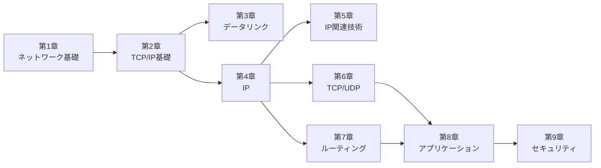

import { Card, CardGrid } from '@astrojs/starlight/components';

## 学習ロードマップ

## 各章の概要

<CardGrid stagger>
  <Card title="第1章 ネットワーク基礎知識" icon="document">
    コンピュータネットワークの基本概念，OSI参照モデル，プロトコルの階層化，通信方式の種類を学ぶ
  </Card>

  <Card title="第2章 TCP/IP基礎知識" icon="document">
    TCP/IPの歴史と標準化，インターネットの基礎知識，TCP/IPの階層モデルと通信の流れを理解する
  </Card>

  <Card title="第3章 データリンク" icon="document">
    イーサネット，無線LAN，PPPなどデータリンク層の技術とその仕組みを学ぶ
  </Card>

  <Card title="第4章 IP（Internet Protocol）" icon="document">
    IPアドレスの基礎，ルーティング，フラグメンテーション，IPv6の特徴を理解する
  </Card>

  <Card title="第5章 IPに関連する技術" icon="document">
    DNS，ARP，ICMP，DHCP，NATなど，IPを支える補助プロトコルの役割を学ぶ
  </Card>

  <Card title="第6章 TCPとUDP" icon="document">
    トランスポート層のプロトコル，信頼性の確保，フロー制御，ふくそう制御を理解する
  </Card>

  <Card title="第7章 ルーティングプロトコル" icon="document">
    RIP，OSPF，BGP，MPLSなどの経路制御プロトコルの仕組みと使い分けを学ぶ
  </Card>

  <Card title="第8章 アプリケーションプロトコル" icon="document">
    HTTP，SSH，FTP，SMTP，SNMP，WebSocketなどアプリケーション層のプロトコルを理解する
  </Card>

  <Card title="第9章 セキュリティ" icon="document">
    暗号化技術，TLS/SSL，IPsec，ファイアウォール，IDS/IPSなどネットワークセキュリティの基礎を学ぶ
  </Card>
</CardGrid>

## 対象読者

このサイトは，Forward Deployed Engineer（FDE）として AIアプリケーションの開発・デプロイに関わるエンジニアを主な対象としています．ネットワークの基礎から実務に必要な知識まで，体系的に学習できる構成になっています．

## 検索のヒント

サイト内検索は日本語に対応しています．複合語で検索する場合は，スペースで区切ると精度が向上します（例: 「毎月」→「毎 月」）．英語の略語（TCP，DNS等）はそのまま検索できます．
